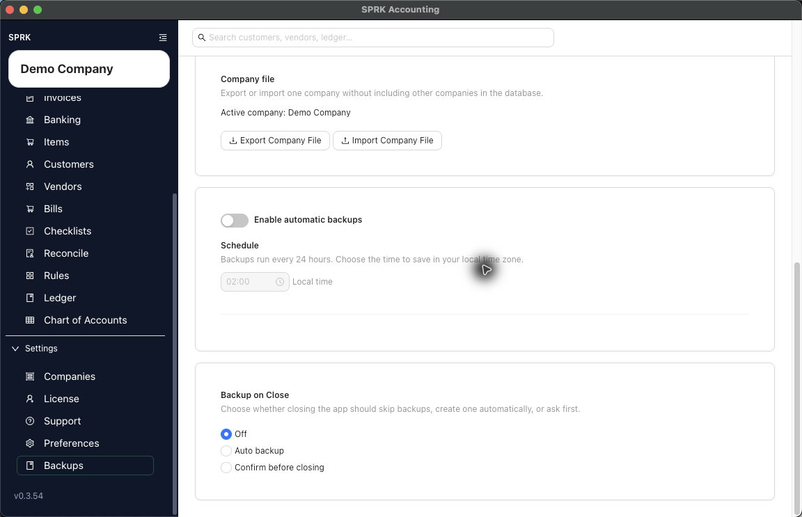

# Backups and Data Safety

Review backup settings, understand the automatic schedule, use on-demand backup controls, and export or import a company-scoped Company File when the visible product exposes that handoff path.

## In This Section

- [Understand backup schedule behavior](./understand-backup-schedule-behavior.md)
- [Review backup settings visible in the product](./review-backup-settings-visible-in-the-product.md)
- [Export and import Company Files](./export-and-import-company-files.md)
- [Understand restore guidance boundaries](./understand-restore-guidance-boundaries.md)
