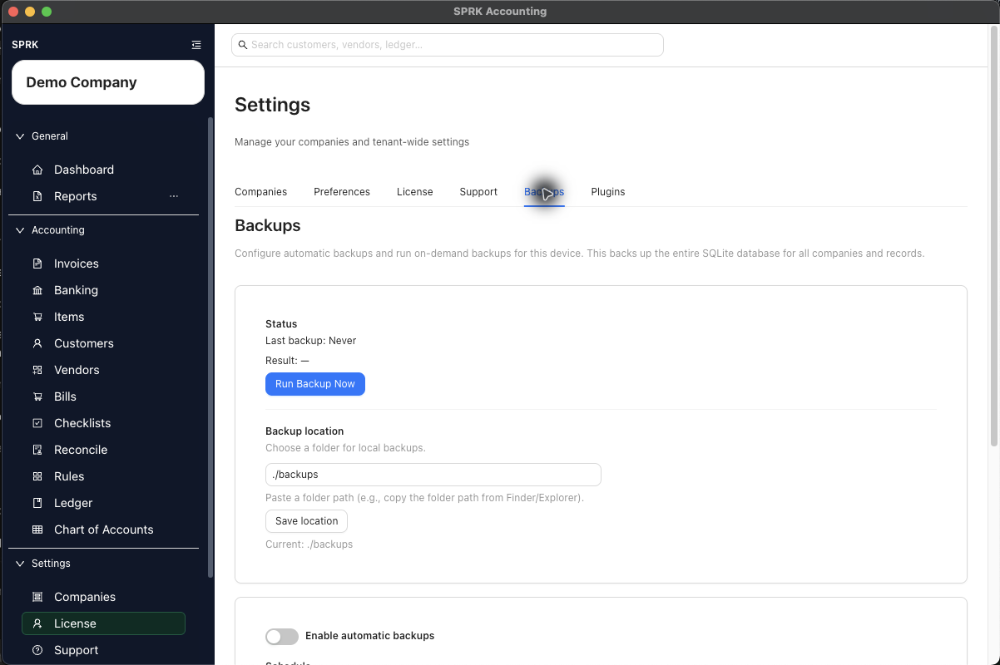

# Backups and company files

Review automatic backups and safely move one company with a Company File.

## Start here

- [Review backup settings and run a backup](./review-backup-settings-visible-in-the-product.md)
- [Understand backup schedule behavior](./understand-backup-schedule-behavior.md)

## Common tasks

- [Export and import Company Files](./export-and-import-company-files.md)

## Review or fix something

- [Get help recovering a backup](./understand-restore-guidance-boundaries.md)
- [Use the Support tab](../support-and-troubleshooting/use-the-support-tab.md)
