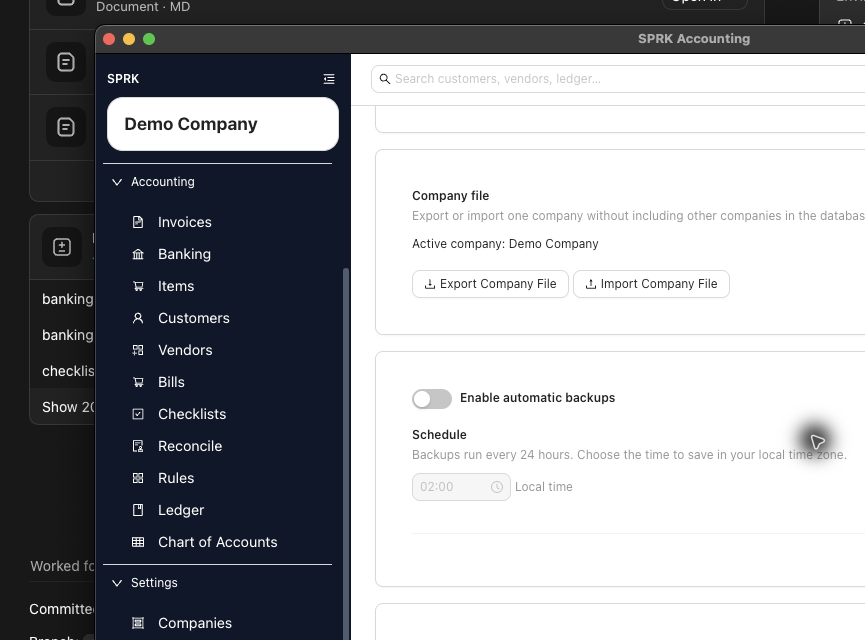
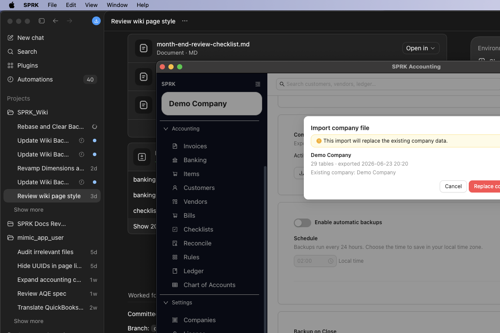

# Export and Import Company Files

Use `Company file` actions when you need to move or preserve one company without including every other company in the local SPRK database.

## When To Use This

Use this workflow when a firm needs a company-level handoff, support needs a complete company package for review, or you want a company-specific transfer path that is separate from routine device backups.

## Before You Start

- You are signed in to SPRK.
- The active company in the sidebar is the company you intend to export or import around.
- You understand whether you are only exporting a file or preparing to replace/import company data.

## Steps

1. Confirm the active company in the sidebar.
2. Open `Backups` from the `Settings` section.
3. Review routine backup controls separately from the `Company file` card.
4. In `Company file`, confirm the active company name shown by SPRK.
5. Use `Export Company File` when you need a non-destructive company-level file for handoff or safekeeping.
6. Use `Import Company File` only when you are ready to review a company-file import path.
7. If SPRK shows an import preview, read the company identity, validation messages, and any replace warning before continuing.
8. Do not confirm a replace/import step unless you are working in the intended company and have a current backup or exported company file.

## What Happens Next

You can distinguish a company-level handoff from device backup settings.

- Exporting a company file creates an outbound company package. It does not post, reverse, or edit journal entries.
- Importing or replacing from a company file can change which company data is available after the workflow completes, so treat confirmation steps as data-management actions rather than accounting entries.
- Routine backups still protect the local database for all companies; a company file is narrower and intentionally company-scoped.

## If Something Looks Wrong

- Treating `Run Backup Now` and `Export Company File` as the same action.
- Importing a company file into a production-like company before reading preview and replace language.
- Describing Company File as hosted collaboration or multi-user firm administration. It is a local company handoff/import path.
- Assuming legacy package or restore scripts are public workflows when the visible product directs users to `Company file`.

## Business Scenario: Company File Handoff And Replace Preview

Use this scenario to train firm staff on the company-scoped handoff path: export the active company, import the exported file back into SPRK for preview, and stop before the replace confirmation unless the replacement is intentional.

- Sample files:
  - [22-backup-company-file-export.csv](../sample-files/v1-validation/22-backup-company-file-export.csv)
  - [23-company-file-import-preview-replace.csv](../sample-files/v1-validation/23-company-file-import-preview-replace.csv)
  - [23-company-file-import-preview-replace.sprkcompany.zip](../sample-files/v1-validation/23-company-file-import-preview-replace.sprkcompany.zip)
- Evidence:

The walkthrough exported the active Demo Company, selected the exported `.sprkcompany.zip` file for import preview, and canceled before `Replace company`.

## Related

- [Review backup settings visible in the product](./review-backup-settings-visible-in-the-product.md)
- [Understand restore guidance boundaries](./understand-restore-guidance-boundaries.md)
- [Understand import and migration boundaries](../company-setup-and-migration/understand-import-and-migration-boundaries.md)
- [Collect the right details before contacting support](../support-and-troubleshooting/collect-the-right-details-before-contacting-support.md)
