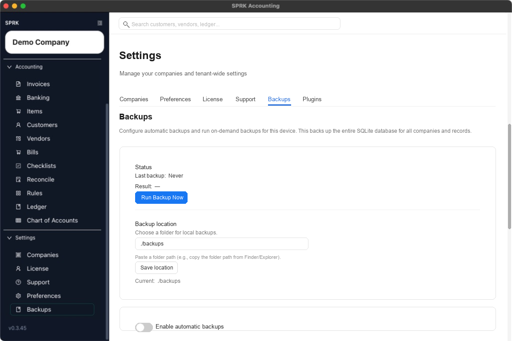

# Review Backup Settings Visible In The Product

Open the `Backups` tab to review the current automatic backup controls, backup location, recent status, and on-demand backup action.

## Purpose

Use this workflow when you want to confirm which backup settings are publicly available in the current SPRK app.

## Prerequisites

- You are signed in to SPRK.
- The active company shown in the sidebar is `Demo Company` for this validated workflow pass.

## Steps

1. Confirm the active company shown in the sidebar is `Demo Company`.
2. Open `Preferences` from the `System` section.
3. Select the `Backups` tab.
4. Review the automatic backup switch.
5. Review the daily schedule time shown in local time.
6. Review the `Backup location` field.
7. If you need to change the folder path, enter the new path and save the location.
8. Review the `Status` area for the last backup time and result.
9. Use `Run Backup Now` when you want to create an on-demand backup from the current device.

## Expected Result

You can review and manage the current backup controls that SPRK exposes publicly: enable or disable automatic backups, set the daily time, save a folder path, review the last result, and start a manual backup run. Current general ledger impact as of 2026-05-07:

- Saving a backup location does not create or modify any accounting entry.
- Running a backup creates a data copy for safekeeping; it does not post to income, expense, asset, liability, or equity accounts.
- The status area reports backup activity only and does not represent a financial transaction.

## Common Mistakes

- Treating the backup folder path as a company record instead of a device-level storage setting.
- Assuming `Run Backup Now` changes books or confirms pending work.
- Reading the status area as accounting activity rather than backup history.

## Related Articles

- [Understand backup schedule behavior](./understand-backup-schedule-behavior.md)
- [Understand restore guidance boundaries](./understand-restore-guidance-boundaries.md)

## Info

- App sections: `backups`
- Last validated: 2026-06-06
- Screenshot status: `captured`
