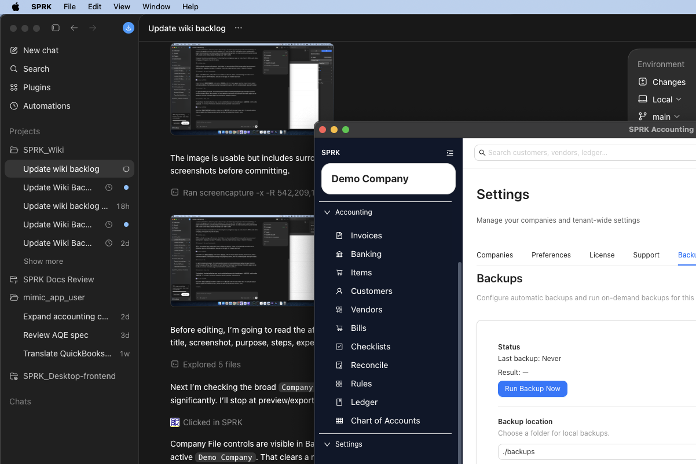

# Review Backup Settings Visible In The Product

Open the `Backups` tab to review the current automatic backup controls, backup location, recent status, on-demand backup action, and visible Company File handoff controls.

## Purpose

Use this workflow when you want to confirm which backup settings are publicly available in the current SPRK app.

## Prerequisites

- You are signed in to SPRK.
- The active company shown in the sidebar is `Demo Company` for this validated workflow pass.

## Steps

1. Confirm the active company shown in the sidebar is `Demo Company`.
2. Open `Backups` from the `Settings` section.
3. Confirm the `Backups` tab is selected.
4. Review the automatic backup switch.
5. Review the daily schedule time shown in local time.
6. Review the `Backup location` field.
7. If you need to change the folder path, enter the new path and save the location.
8. Review the `Status` area for the last backup time and result.
9. Use `Run Backup Now` when you want to create an on-demand backup from the current device.
10. Review the `Company file` card separately from routine backups:
   - `Export Company File` exports the active company only.
   - `Import Company File` starts the company-file import path.
   - The card shows the active company name so you can confirm the company context before continuing.

## Expected Result

You can review and manage the current backup controls that SPRK exposes publicly: enable or disable automatic backups, set the daily time, save a folder path, review the last result, start a manual backup run, and use company-scoped Company File handoff controls. Current general ledger impact as of 2026-06-17:

- Saving a backup location does not create or modify any accounting entry.
- Running a backup creates a data copy for safekeeping; it does not post to income, expense, asset, liability, or equity accounts.
- Exporting a Company File creates a company-level package and does not post accounting activity.
- Importing a Company File is a data-management workflow. Review preview and replace language before confirming any import.
- The status area reports backup activity only and does not represent a financial transaction.

## Common Mistakes

- Treating the backup folder path as a company record instead of a device-level storage setting.
- Assuming `Run Backup Now` changes books or confirms pending work.
- Confusing routine backups for all local companies with a company-scoped Company File export.
- Reading the status area as accounting activity rather than backup history.

## Related Articles

- [Understand backup schedule behavior](./understand-backup-schedule-behavior.md)
- [Export and import Company Files](./export-and-import-company-files.md)
- [Understand restore guidance boundaries](./understand-restore-guidance-boundaries.md)

## Info

- App sections: `backups`
- Last validated: 2026-06-17
- Screenshot status: `captured`
