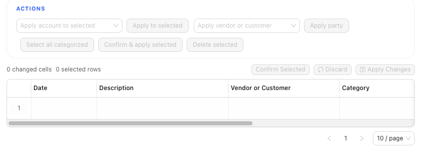

# Banking and Cash Management

Import bank activity, review pending transactions, assign GL account/category choices, confirm transactions when they are ready, and create or import rules for repeated patterns. Banking also supports bulk review paths, including selected-row actions and Grid Edit cleanup for pending transactions.

## In This Section

- [Understand the banking page](./understand-the-banking-page.md)
- [Choose bank and credit card accounts](./choose-bank-and-credit-card-accounts.md)
- [Review and classify bank transactions](./review-and-classify-bank-transactions.md)
- [Create and manage rules](./create-and-manage-rules.md)
- [Import bank transactions](./import-bank-transactions.md)

## Info

- App sections: `banking`, `rules`
- Last validated: 2026-06-05
- Screenshot status: `captured`
