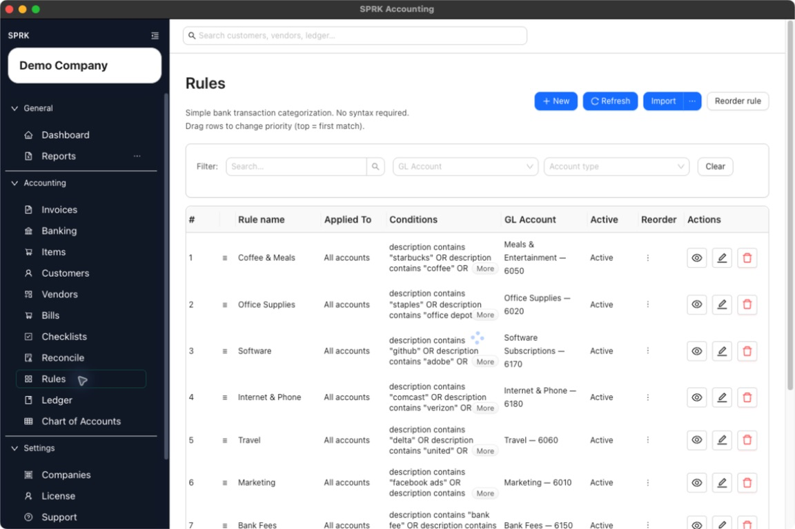
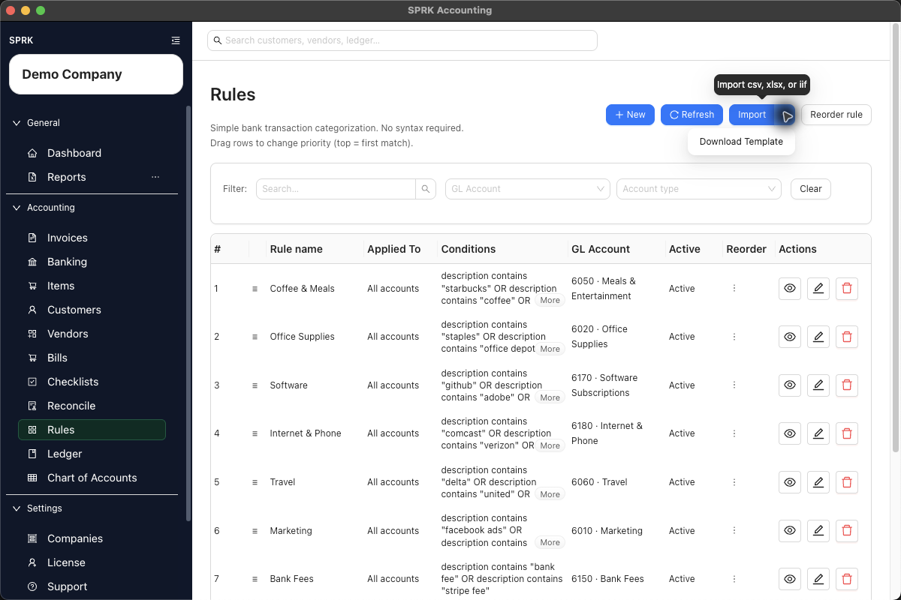
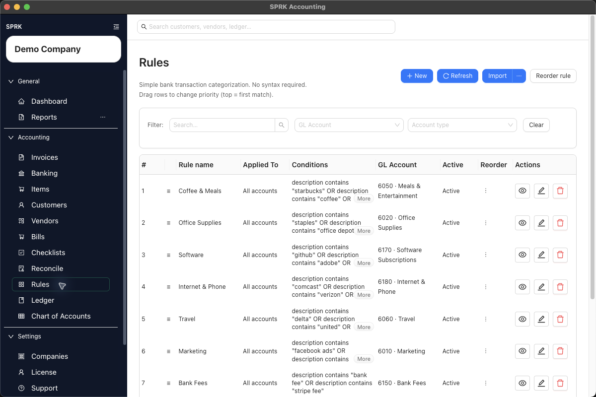
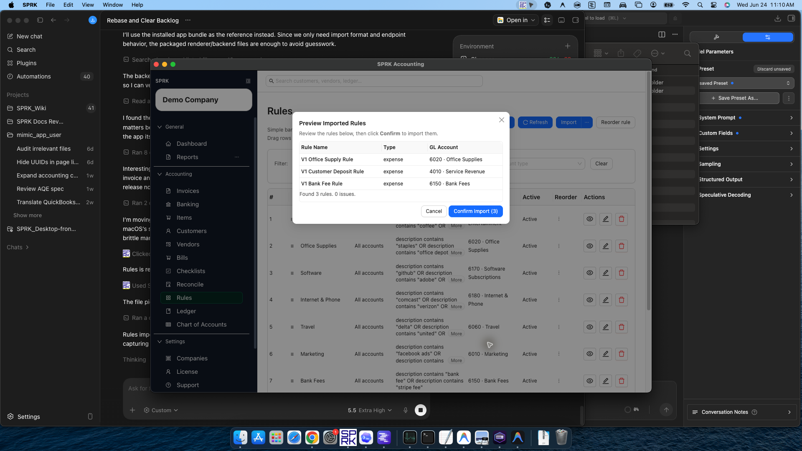
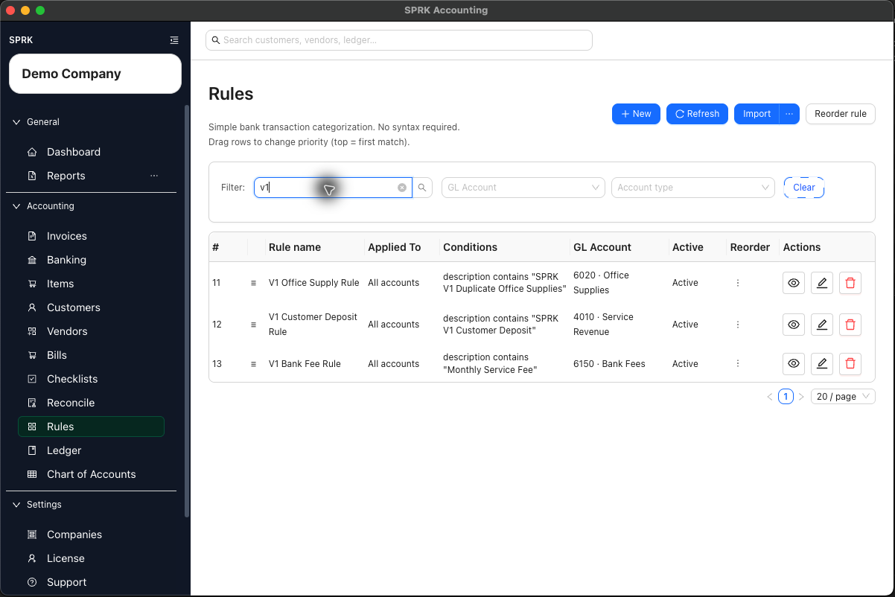

# Create and Manage Rules

Build rules that prefill GL account choices for repeated bank transaction patterns, then manage scope, priority, and imported rule sets from the Rules page.

## When To Use This

Use this workflow when the same bank or credit card transactions appear repeatedly and you want SPRK to suggest the right account, vendor, or split before you confirm them.

## Before You Start

- At least one bank or credit card account exists.
- The destination accounts you want rules to use are available. Nonposting summary accounts and restricted control accounts may be omitted from rule target selectors.
- You know the text pattern or amount pattern that should trigger the rule.

## Good Rule Examples

- A monthly software vendor that always posts to the same expense account.
- A merchant processor deposit that should post to a specific income or clearing account.
- A recurring bank fee with consistent description text.
- A payroll withdrawal that should be split across predictable accounts.

## Risky Rule Examples

- A broad description such as `Amazon`, `Check`, or `Transfer` without more conditions.
- A rule that applies to all bank accounts when only one account has that pattern.
- A fixed-dollar split when the transaction amount changes often.
- A rule that sends unclear deposits directly to income without review.

## Steps

1. Open `Rules` to manage rules centrally.
   - If you are already reviewing a pending bank transaction, you can also start from the row-level rule action in `Banking`.
2. Choose the rules tab that matches the result you want:
   - `Expense / COGS` for spending-side categorization patterns.
   - `Income` for deposit-side categorization patterns.
3. Select `New`.
4. Enter a clear `Rule name`.
5. In `Apply to accounts`, either:
   - leave the field blank to let the rule apply across all bank and credit card accounts, or
   - choose the specific bank or credit card accounts where the pattern should apply.
6. Choose the match logic:
   - `All conditions (AND)` means every condition must match.
   - `Any condition (OR)` means any one condition can match.
7. Add one or more conditions. The current rule builder supports:
   - `Description`
   - `Amount (Spent)`
   - `Amount (Received)`
8. Choose the operator and value for each condition.
   - Text operators include contains, does not contain, starts with, ends with, is, and is not.
   - Numeric operators include `>`, `<`, and `between`.
   - For `between`, enter the range as `min,max`.
9. Choose the categorization result:
   - Use `GL Account` when one destination account is enough.
   - Add split rows when the same pattern should be distributed across multiple accounts.
10. If you use a split rule:
   - Choose `%` when the split should total exactly `100%`.
   - Choose `$` when the rule should use fixed amounts.
   - For `$` splits, set `Balance to` so SPRK knows where any remaining amount should go.
11. Save the rule.
12. Review the rule list and adjust priority when multiple rules could match the same pattern.
   - Drag rows to reorder them.
   - Use the row-level reorder action if you want to move a rule to the top, bottom, or a specific position.
   - Use `Reorder rule` when you want to move a rule by name and target position.
13. If you already maintain rules outside SPRK, use `Import` to preview and load a rules file.
   - The import modal shows the rule template expectations before you select a file.
   - Accepted formats are `.xlsx` and `.csv`.
   - QuickBooks rules exports are accepted as-is when they are saved as `.xlsx`.
   - Generic spreadsheet or CSV rule files should include `Conditions` and `Actions` columns.
   - Generic `Conditions` and `Actions` values can be plain text or JSON.
   - Plain-text examples include description-match wording for conditions and actions such as `set gl account` followed by an account name, code, or ID.
   - `Name` and `Description` are recommended so imported rules are easier to review later.
   - Review the preview and any reported issues before confirming the import.
   - SPRK blocks confirmation when the preview is empty.
   - Unresolved account labels remain visible for review instead of being silently dropped.
   - Legacy imported condition fields can still match when their capitalization differs, but new setup should use the visible current labels, including `GL Account`.
14. Edit, disable, or delete rules as your transaction patterns change.

## What Happens Next

The rule is saved and becomes available when SPRK evaluates pending bank transactions.

- Creating, editing, reordering, importing, disabling, or deleting rules does not post to the general ledger.
- Rules can prefill GL account/category choices or split instructions for pending bank transactions.
- A general ledger entry is created only later, when the bank transaction itself is confirmed from the Banking workflow.

## If Something Looks Wrong

- Assuming rule creation or rule import confirms existing pending transactions automatically.
- Leaving overlapping rules in the wrong order and then getting the wrong suggestion first.
- Forgetting that a blank `Apply to accounts` scope means the rule can apply across all bank and credit card accounts.
- Using percent splits that do not total exactly `100%`.
- Using fixed-amount splits without setting `Balance to`.
- Making the description match too broad and catching unrelated transactions.
- Uploading a generic rules file without `Conditions` and `Actions` columns.
- Assuming generic rule imports require JSON. Plain text is supported, but it still needs to resolve to a valid preview before confirmation.
- Confirming an empty rules preview. Add valid rows or fix the source file first.
- Ignoring unresolved account labels in the preview.
- Treating a QuickBooks rules export as a generic CSV. Save the export as `.xlsx` when you want SPRK to read it as a QuickBooks rules export.
- Letting rule suggestions replace accountant review. Confirming the bank transaction is still the posting step.

## Business Scenario: Import Rule Setup

Use this scenario to test whether a firm can load a reusable banking-rule CSV and review the resulting rule draft before applying it to bank activity.

- Sample file: [05-banking-rules-import.csv](../sample-files/v1-validation/05-banking-rules-import.csv)
- Evidence:

Validation note: this walkthrough was validated in SPRK v0.3.57. The CSV preview found three rule drafts with zero issues, and the imported V1 rules appeared in the rules grid after confirmation.

## Related

- [Understand the banking page](./understand-the-banking-page.md)
- [Review and classify bank transactions](./review-and-classify-bank-transactions.md)
- [Import bank transactions](./import-bank-transactions.md)
- [Month-end review checklist](../checklists-and-period-end-work/month-end-review-checklist.md)
