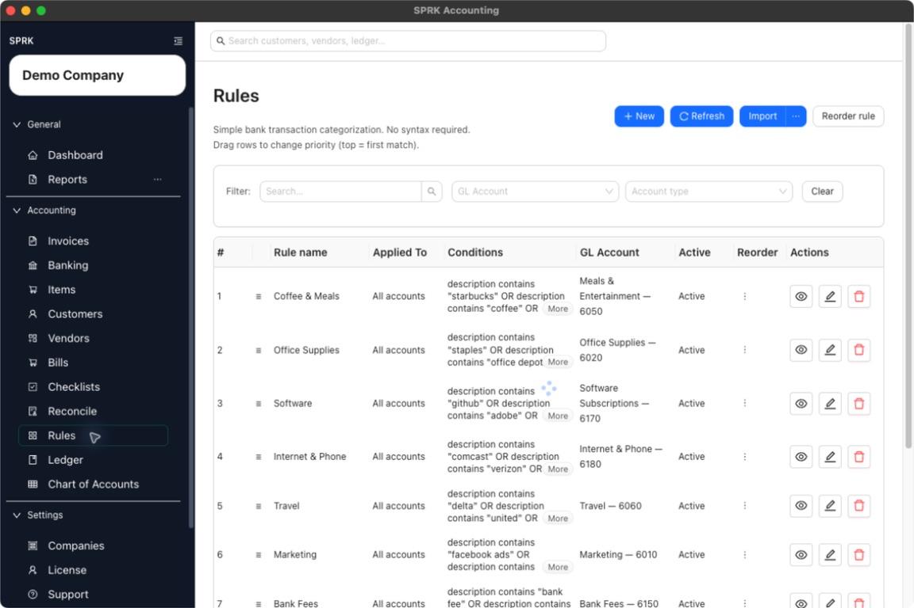
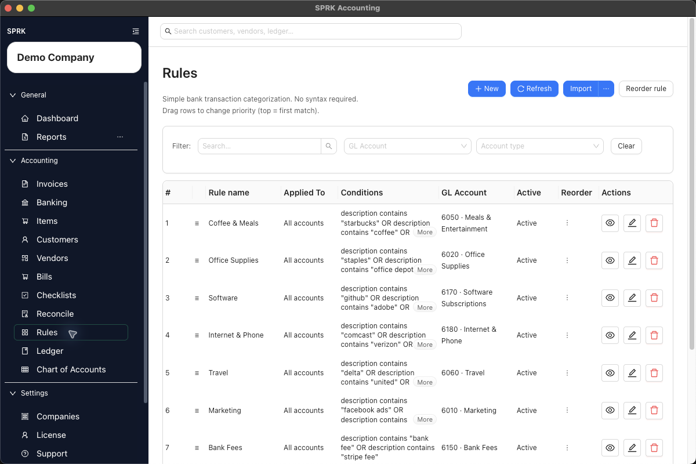
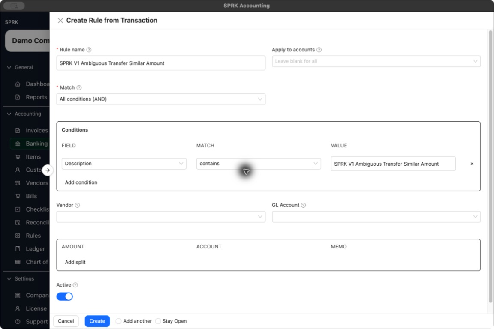

# Create and Manage Rules

<!-- Last validated: 2026-07-15 (SPRK 0.4.10, Demo Company) -->
<!-- Screenshot status: Current; row-level full-description rule draft captured 2026-07-15 -->

Build rules that prefill GL account choices for repeated bank transaction patterns, then manage scope, priority, and imported rule sets from the Rules page.

## When To Use This

Use this workflow when the same bank or credit card transactions appear repeatedly and you want SPRK to suggest the right account, vendor, or split before you confirm them.

## Before You Start

- At least one bank or credit card account exists.
- The destination accounts you want rules to use are available. Nonposting summary accounts and restricted control accounts may be omitted from rule target selectors.
- You know the text pattern or amount pattern that should trigger the rule.

## Good Rule Examples

- A monthly software vendor that always posts to the same expense account.
- A merchant processor deposit that should post to a specific income or clearing account.
- A recurring bank fee with consistent description text.
- A payroll withdrawal that should be split across predictable accounts.

## Risky Rule Examples

- A broad description such as `Amazon`, `Check`, or `Transfer` without more conditions.
- A rule that applies to all bank accounts when only one account has that pattern.
- A fixed-dollar split when the transaction amount changes often.
- A rule that sends unclear deposits directly to income without review.

## Steps

1. Open `Rules` to manage rules centrally.
   - If you are already reviewing a pending bank transaction, you can also start from the row-level rule action in `Banking`.
   - A row-level `Create rule` draft starts the `Rule name` and `Description` `contains` condition from the full normalized bank description. Review and narrow both values when the full description is too specific or would match unrelated future transactions.
2. Choose the rules tab that matches the result you want:
   - `Expense / COGS` for spending-side categorization patterns.
   - `Income` for deposit-side categorization patterns.
3. Select `New`.
4. Enter a clear `Rule name`.
5. In `Apply to accounts`, either:
   - leave the field blank to let the rule apply across all bank and credit card accounts, or
   - choose the specific bank or credit card accounts where the pattern should apply.
6. Choose the match logic:
   - `All conditions (AND)` means every condition must match.
   - `Any condition (OR)` means any one condition can match.
7. Add one or more conditions. The current rule builder supports:
   - `Description`
   - `Amount (Spent)`
   - `Amount (Received)`
8. Choose the operator and value for each condition.
   - Text operators include contains, does not contain, starts with, ends with, is, and is not.
   - Numeric operators include `>`, `<`, and `between`.
   - For `between`, enter the range as `min,max`.
9. Choose the categorization result:
   - Use `GL Account` when one destination account is enough.
   - Add split rows when the same pattern should be distributed across multiple accounts.
10. If you use a split rule:
   - Choose `%` when the split should total exactly `100%`.
   - Choose `$` when the rule should use fixed amounts.
   - For `$` splits, set `Balance to` so SPRK knows where any remaining amount should go.
11. Save the rule.
12. Review the rule list and adjust priority when multiple rules could match the same pattern.
   - Drag rows to reorder them.
   - Use the row-level reorder action if you want to move a rule to the top, bottom, or a specific position.
   - Use `Reorder rule` when you want to move a rule by name and target position.
13. If you already maintain rules outside SPRK, use [Import banking rules](./import-banking-rules.md) to preview and load a rules file before those rules affect bank review.
14. Edit, disable, or delete rules as your transaction patterns change.

## What Happens Next

The rule is saved and becomes available when SPRK evaluates pending bank transactions.

- Creating, editing, reordering, importing, disabling, or deleting rules does not post to the general ledger.
- Rules can prefill GL account/category choices or split instructions for pending bank transactions.
- A general ledger entry is created only later, when the bank transaction itself is confirmed from the Banking workflow.

## If Something Looks Wrong

| What You See | What To Check | What To Do Next |
|---|---|---|
| A rule suggestion appears on the wrong pending transaction | Whether the rule description or amount condition is too broad | Narrow the conditions or limit `Apply to accounts` before relying on the suggestion. |
| A row-level draft contains a long payment-network description | Whether the full text is stable enough for future matches | Shorten the rule name for readability and narrow the `Description` condition to the distinctive text you actually need. |
| The wrong rule suggestion appears first | Whether overlapping rules are ordered correctly | Move the more specific rule higher in the priority list. |
| A rule appears on every bank or credit card account | Whether `Apply to accounts` is blank | Choose the specific accounts where the rule should apply, or leave it blank only when the rule is intentionally shared. |
| A percent split cannot be saved | Whether the split rows total exactly `100%` | Adjust the split percentages before saving. |
| A fixed-amount split leaves an unassigned balance | Whether `Balance to` is set | Choose the account that should receive the remaining amount. |
| A rule is saved but reports have not changed | Whether the bank transaction has been confirmed from Banking | Confirm the pending transaction after reviewing the suggested category or split. |

## Related

- [Understand the banking page](./understand-the-banking-page.md)
- [Review and classify bank transactions](./review-and-classify-bank-transactions.md)
- [Import banking rules](./import-banking-rules.md)
- [Import bank transactions](./import-bank-transactions.md)
- [Month-end review checklist](../checklists-and-period-end-work/month-end-review-checklist.md)
