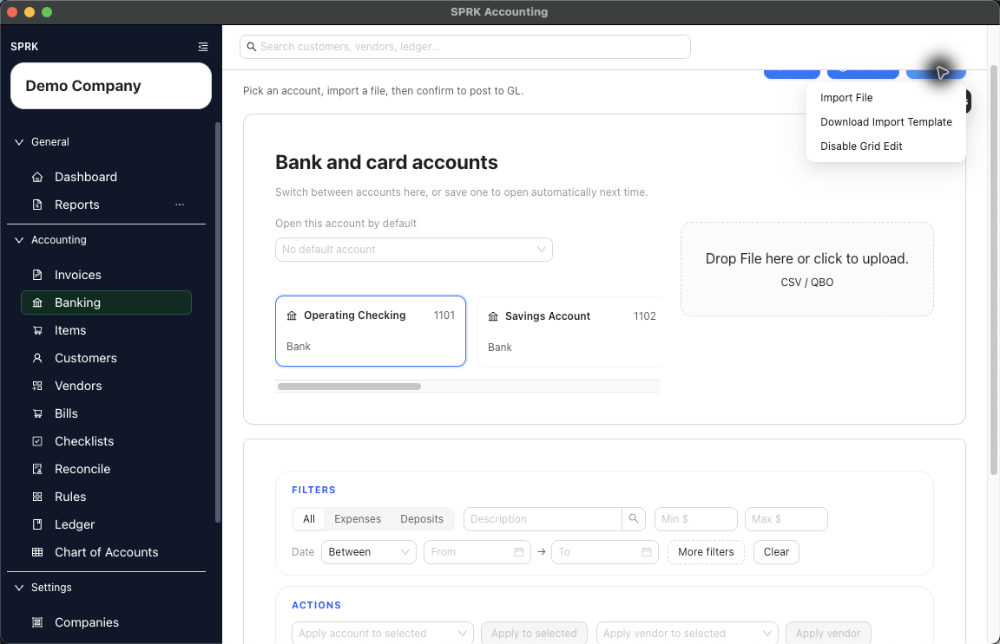
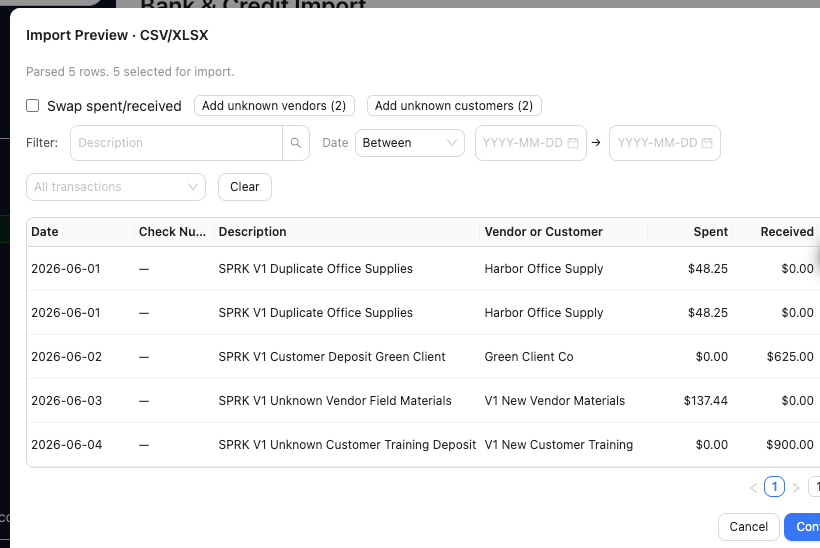
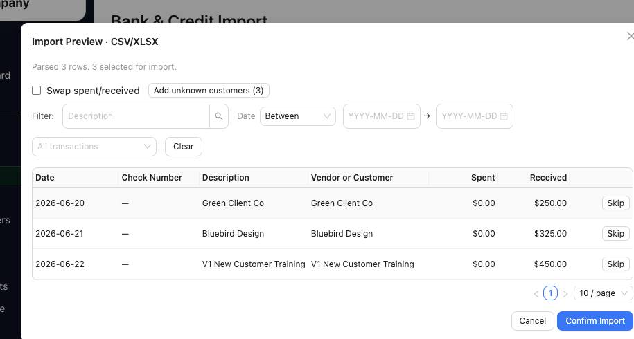
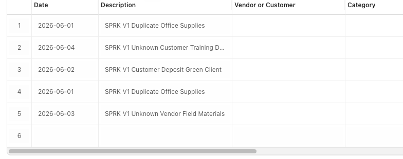

# Import Bank Transactions

Bring bank or credit card activity into SPRK from a supported file format, review the preview, and load the transactions into the pending queue for later confirmation.

## When To Use This

Use this workflow when you have external bank or credit card activity in a file and want to load it into SPRK for review.

## Before You Start

- The destination bank or credit card account exists in SPRK.
- You are signed in to SPRK and have an active company selected.
- You are ready to choose the specific bank or credit card account that should receive the import.
- Your file is one of the formats accepted by the Banking page.
- You are ready to review imported transactions before posting them.

## Steps

1. Open `Banking`.
2. Select the bank or credit card account that should receive the imported activity.
   - If no account is selected, SPRK keeps the importer disabled and prompts you to choose an account first.
   - If a default account opens automatically, confirm that it matches the account for the file you are about to import.
3. Open `More` -> `Import File`, or use the visible upload area beside the account cards if you already have the file ready.
4. In the `Bank Transaction Import Template` modal, review the file guidance before you select a file:
   - Accepted formats are `.csv`, `.xlsx`, `.xlsm`, `.ofx`, `.qfx`, and `.qbo`.
   - Spreadsheet imports require date, description, and amount information. `Processed` can be accepted as the date header when that is what the bank export provides.
   - Spreadsheet imports can also include the recommended columns shown in the starter modal, such as `Debit`, `Credit`, `Check #`, and `Memo`.
   - If the file uses a positive `Amount` column plus a direction column such as `Credit or Debit`, `Debit/Credit`, `Dr/Cr`, or `Type`, SPRK can use the direction column to decide whether the row is spent or received.
   - Signed `Amount` values and separate `Debit` plus `Credit` columns still work, so do not rewrite a source export just because it already expresses direction clearly.
   - When your build exposes party-aware import columns, spreadsheet imports can include `Vendor`, `Vendor ID`, `Customer`, `Customer ID`, or shared `Customer/Vendor` style columns.
   - Shared party-name columns map money-in or sale rows toward customers and money-out or purchase rows toward vendors.
   - `OFX`, `QFX`, and `QBO` files do not use the spreadsheet columns.
   - `More` -> `Download Import Template` gives you a starter spreadsheet layout when you want to prepare the file before importing.
5. Choose `Import File`, then select one supported file.
6. Review the import preview.
   - The preview title shows the parsed import type when SPRK detects one.
   - The preview shows how many rows were parsed before you confirm anything.
   - The preview can show how many rows are selected for import before anything is added to `Pending`.
   - Rows that appear to match existing activity can show a likely-duplicate warning. Treat this as a review prompt, not as proof that the row is definitely a duplicate.
   - When the import preview exposes party-aware review, a spreadsheet with party information can show a `Vendor or Customer` column.
   - Exact active vendor or customer IDs and uniquely matched active names can resolve automatically. Unresolved imported names stay visible for review instead of being silently discarded.
   - Use `Add unknown vendors (n)` only when the unresolved names should become new vendor records. The count is based on unique unresolved imported names in the current batch, not every unresolved row.
   - Use `Add unknown customers (n)` only when the unresolved names should become new customer records.
   - Use row-level `Skip` when a row should not be imported. Use `Restore` if you skipped a row and decide it should be included after all.
   - You can filter the preview by description, date, and transaction type if you want to inspect a subset of the imported rows.
7. If the money direction looks backwards, turn on `Swap spent/received` before confirming the preview.
8. Confirm the import preview.
9. Return to the `Pending` tab and review the imported transactions for the selected account.
10. Categorize and confirm the transactions you want posted to the general ledger.

## What Happens Next

The imported rows are added to the selected account's pending bank register and are ready for review.

- Selecting the destination account does not post anything to the general ledger.
- Opening the preview and changing the `Swap spent/received` option do not post anything to the general ledger.
- When vendor or customer creation is available from the preview, it updates setup records and the current preview batch only. It does not move rows to `Pending` or post bank activity.
- Confirming the import preview only loads or updates selected, non-skipped rows as pending bank transactions for later review.
- The general ledger is affected later, when each pending transaction is confirmed from the Banking workflow.

## If Something Looks Wrong

- Importing while the wrong bank or credit card account is selected.
- Forgetting that SPRK will not let you import until an account is chosen.
- Ignoring likely-duplicate warnings in the preview instead of comparing the row to existing bank activity.
- Assuming an unresolved imported party name has been assigned to a vendor or customer record. Review the preview and use `Add unknown vendors (n)` or `Add unknown customers (n)` only for names you actually want to create.
- Reversing spent and received values manually when the source file already has signed amounts, split debit/credit columns, or a supported direction column.
- Forgetting that skipped preview rows are excluded from the import unless you restore them before confirming.
- Skipping the preview and missing a spent-versus-received reversal issue.
- Treating imported rows as final postings rather than as pending items still waiting for review.
- Assuming closing the preview has the same effect as confirming it.

## Business Scenario: Duplicate-Aware Import With Vendors And Customers

Use this scenario to train a firm reviewer on a bank CSV that includes likely duplicates, vendor names, and customer names before anything posts to the ledger.

- Sample files:
  - [01-bank-import-duplicates-and-parties.csv](../sample-files/v1-validation/01-bank-import-duplicates-and-parties.csv)
  - [02-bank-import-vendor-customer-parties.csv](../sample-files/v1-validation/02-bank-import-vendor-customer-parties.csv)
- Evidence:

The walkthrough confirmed that party labels are visible in preview, unknown customers can be created from the import flow, and duplicate warnings remain a review step before rows move to `Pending`.

## Related

- [Choose bank and credit card accounts](./choose-bank-and-credit-card-accounts.md)
- [Understand the banking page](./understand-the-banking-page.md)
- [Review and classify bank transactions](./review-and-classify-bank-transactions.md)
- [Create and manage rules](./create-and-manage-rules.md)
