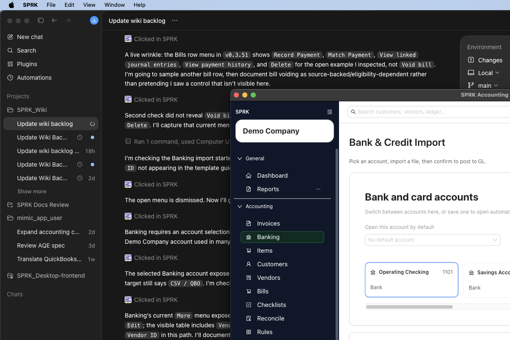
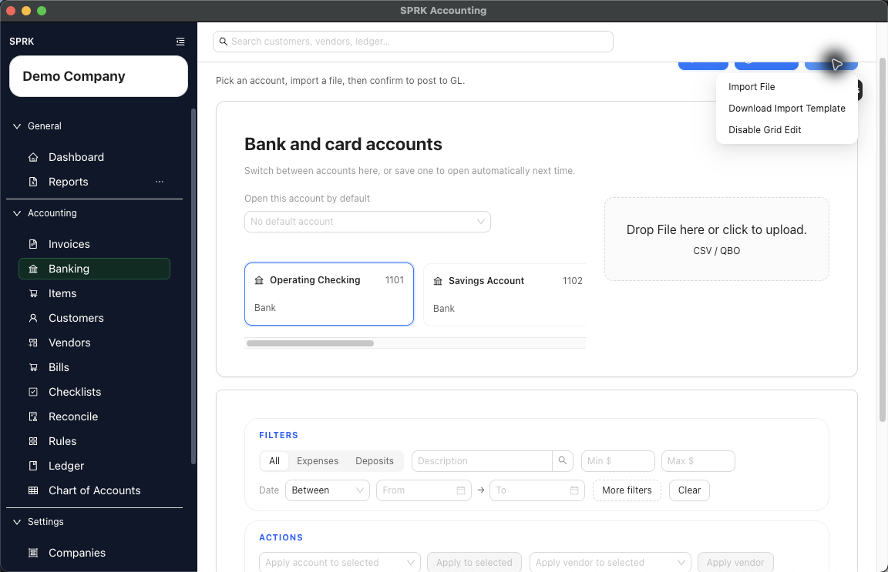

# Import Bank Transactions

Bring bank or credit card activity into SPRK from a supported file, review the preview, and load selected rows into the `Pending` tab for bank review.

## When To Use This

- You have bank or credit card activity from an outside file and want to review it in SPRK.
- You want imported rows to enter `Pending` before they are categorized and confirmed.
- Imported rows are reviewed before posting. Use Banking review to categorize and confirm them after the import.

## Before You Start

- The correct active company is selected.
- The destination bank or credit card account exists in SPRK.
- You know which account should receive the imported activity.
- Your file is one of the accepted formats: `.csv`, `.xlsx`, `.xlsm`, `.ofx`, `.qfx`, or `.qbo`.
- You are ready to review duplicate warnings, money direction, skipped rows, and unresolved vendor or customer names before confirming.
- Confirming the import preview can create pending bank rows and, where available, new vendor or customer setup records. General ledger posting happens later when pending rows are confirmed from Banking.

## Steps

1. Open `Banking`.
2. Select the bank or credit card account that should receive the imported activity.
   - If no account is selected, SPRK keeps the importer disabled and prompts you to choose an account first.
   - If a default account opens automatically, confirm it matches the file you are about to import.
3. Open `More` -> `Import File`, or use the visible upload area beside the account cards if the file is ready.
4. In the `Bank Transaction Import Template` modal, review the file guidance before choosing a file.
   - Spreadsheet imports require date, description, and amount information.
   - Common spreadsheet columns include `Amount`, `Debit`, `Credit`, `Check #`, `Memo`, and vendor or customer names.
   - If the file includes a direction column such as `Credit or Debit`, `Debit/Credit`, `Dr/Cr`, or `Type`, SPRK can use that direction to decide whether the row is spent or received.
   - `OFX`, `QFX`, and `QBO` files do not use spreadsheet column headers.
   - Use `More` -> `Download Import Template` when you want a starter spreadsheet layout.
5. Choose `Import File`, then select one supported file.
6. Review the import preview before confirming.
   - Confirm the parsed import type and row counts.
   - Confirm how many rows are selected for import.
   - Review likely-duplicate warnings against existing bank activity.
   - Review `Vendor or Customer` values when the preview shows vendor or customer matching.
   - Use `Add unknown vendors (n)` only for unresolved names that should become vendor records.
   - Use `Add unknown customers (n)` only for unresolved names that should become customer records.
   - Use row-level `Skip` for rows that should not be imported. Use `Restore` if a skipped row should be included after all.
   - Filter the preview by description, date, or transaction type when you need to inspect a subset of rows.
7. If spent and received values look backwards, turn on `Swap spent/received` before confirming the preview.
8. Confirm the import preview.
9. Return to the `Pending` tab for the selected account.
10. Review, categorize, and confirm the imported transactions you want posted to the general ledger.

## What Happens When You Import

The confirmed preview loads selected, non-skipped rows into the selected account's pending bank register.

- Selecting the destination account does not post to the general ledger.
- Opening the preview and changing `Swap spent/received` do not post to the general ledger.
- Creating vendors or customers from the preview updates setup records and the current preview batch. It does not move rows to `Pending` by itself.
- Confirming the import preview creates or updates pending bank rows for later review.
- Pending rows affect the general ledger only after they are categorized and confirmed from the Banking workflow.

Optional practice files are available for [duplicate review](../sample-files/practice/bank-import-duplicates-and-parties.csv) and [vendor or customer review](../sample-files/practice/bank-import-vendor-customer-parties.csv).

## If Something Looks Wrong

| What You See | What To Check | What To Do Next |
|---|---|---|
| `Import File` is disabled | Whether a bank or credit card account is selected | Select the destination account, then open the import action again. |
| The preview shows likely duplicates | Date, amount, description, account, and existing bank activity | Skip rows that are already present; keep only rows that should enter `Pending`. |
| A vendor or customer name remains unresolved | Whether the name should become a new setup record | Use `Add unknown vendors (n)` or `Add unknown customers (n)` only for names you want to create. |
| Spent and received values appear reversed | Whether the file uses signed amounts, debit/credit columns, or a supported direction column | Turn on `Swap spent/received` before confirming the preview if the direction is wrong. |
| Rows are missing from `Pending` after import | Whether they were skipped or filtered out in the preview | Reopen the source file and import only the rows that should be restored. |
| Imported rows do not appear in reports yet | Whether the rows are still in `Pending` | Categorize and confirm the rows from Banking before expecting ledger reports to change. |
| The wrong account received the pending rows | Which account was selected before confirmation | Stop and review the affected pending rows before confirming or correcting activity. |

## Related

- [Choose bank and credit card accounts](./choose-bank-and-credit-card-accounts.md)
- [Review and classify bank transactions](./review-and-classify-bank-transactions.md)
- [Create and manage rules](./create-and-manage-rules.md)
- [Collect import run details for support](../support-and-troubleshooting/collect-import-run-details-for-support.md)
