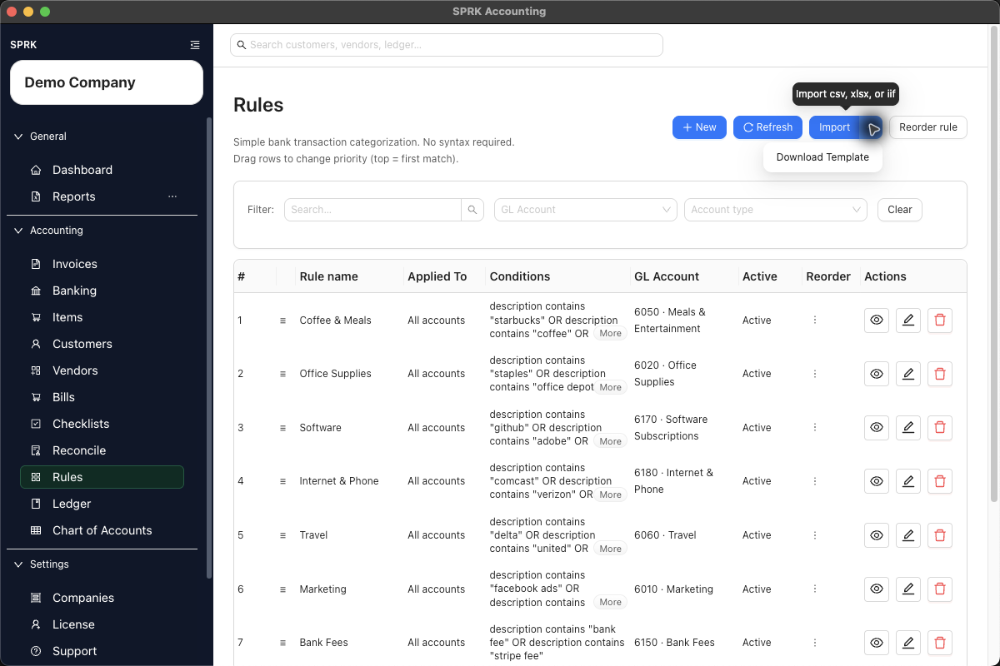
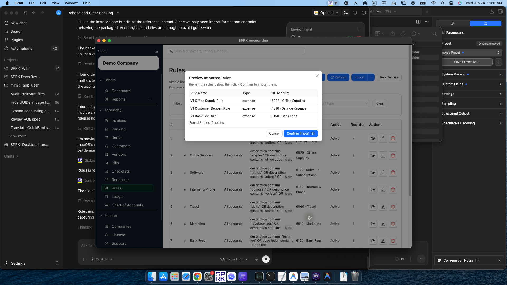
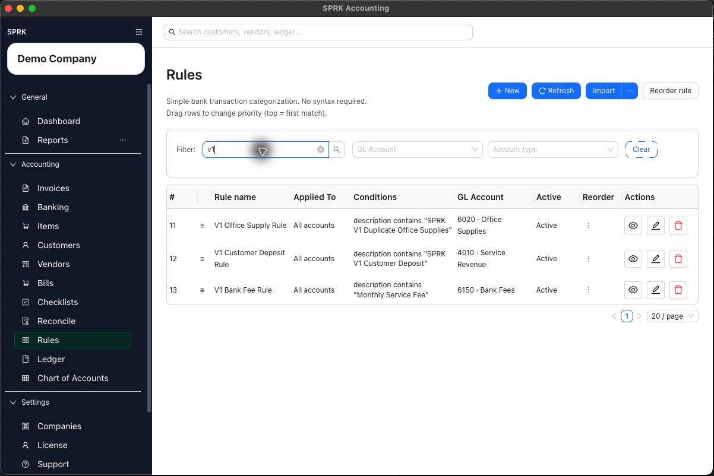

# Import Banking Rules

<!-- Screenshot status: Review needed -->

Load repeated bank or credit card rule patterns from a spreadsheet or QuickBooks rules export, review the preview, and confirm only the rules that are ready for bank review.

## When to use this

- You already maintain bank rule patterns outside SPRK.
- You want to move repeated description, amount, account, vendor, or split rules into SPRK without entering each rule manually.
- You want to review imported rules before they can suggest categories on pending bank transactions.

## Before you start

- The correct active company is selected.
- Destination accounts, vendors, and bank or credit card accounts referenced by the rule file already exist or can be resolved during preview.
- Your file is `.xlsx` or `.csv`.
- QuickBooks rules exports should be saved as `.xlsx` when you want SPRK to read them as QuickBooks rule data.
- Generic spreadsheet or CSV rule files should include `Conditions` and `Actions` columns. `Name` and `Description` are recommended so imported rules are easier to review later.
- Rule import changes rule setup only. Pending bank transactions are posted later from the Banking review workflow.

## Steps

1. Open `Rules`.
2. Select the rule tab that matches the rules you want to import.
3. Select `Import`.
4. Review the import guidance before choosing a file.
5. Choose the supported rule file.
6. Review the preview before confirming.
   - Confirm that the preview contains the expected number of rules.
   - Review each rule name, description, conditions, actions, account labels, and split instructions.
   - Review any reported issues before continuing.
   - Generic `Conditions` and `Actions` values can use plain text when they clearly describe the match and action.
   - Plain-text actions can include wording such as `set gl account` followed by an account name, code, or ID.
   - Unresolved account labels stay visible in the preview so you can correct them before relying on the rule.
7. Do not confirm an empty preview or a preview that includes unresolved rules you are not ready to clean up.
8. Confirm the import when the preview shows the rules you want to add.
9. Return to the rules list and review the imported rules.
10. Adjust rule priority before relying on the rules during bank review.

## What Happens When You Import

Confirmed rule imports add or update rule setup for later bank review.

- Importing rules does not confirm pending bank transactions.
- Imported rules suggest categorization on future pending bank rows; review each suggestion before confirming the transaction.
- Imported rules can prefill GL account/category choices, vendor or customer context, or split instructions only when SPRK evaluates matching pending bank transactions.
- A bank transaction affects the general ledger only after it is reviewed and confirmed from Banking.

Optional practice file: [banking-rules-import.csv](../sample-files/practice/banking-rules-import.csv)

## If something looks wrong

| What You See | What To Check | What To Do Next |
|---|---|---|
| The preview is empty | Whether the file has supported columns and at least one readable rule row | Fix the file before confirming. |
| A generic rules file does not resolve | Whether it includes `Conditions` and `Actions` columns | Add the required columns or use the current template. |
| A QuickBooks rules export previews as a generic spreadsheet | Whether the export was saved as `.xlsx` | Save the QuickBooks export as `.xlsx`, then import it again. |
| Account labels remain unresolved | Whether the account name, code, or ID exists in the active company | Correct the file or add the needed setup before using the rule. |
| Imported rules suggest the wrong categories | Whether the rule priority or conditions are too broad | Edit the imported rules before confirming matching bank transactions. |
| Reports do not change after rule import | Whether matching bank transactions have been confirmed from Banking | Review and confirm pending transactions before expecting ledger reports to change. |

## Related

- [Create and manage rules](./create-and-manage-rules.md)
- [Classify bank transactions](./classify-bank-transactions.md)
- [Import bank transactions](./import-bank-transactions.md)
- [Review and classify bank transactions](./review-and-classify-bank-transactions.md)
