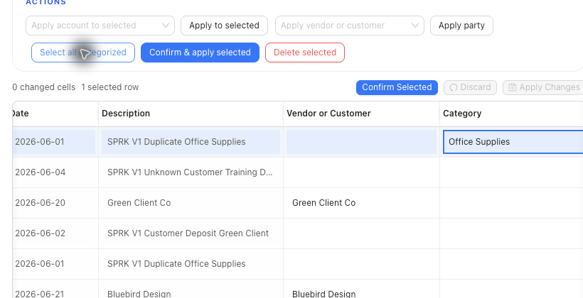

# Match Bank Transactions

Match pending bank rows to open invoices, open bills, or existing checks before confirming the bank activity.

## When To Use This

- A pending money-in bank row should apply to an open invoice.
- A pending money-out bank row should apply to an open bill.
- A pending bank row should clear an existing check.

## Before You Start

- Confirm the selected bank or credit card account.
- Confirm the row is pending, unreconciled, and not excluded.
- Confirm the candidate invoice, bill, or check is the right document.
- Compare party, candidate number, date, open amount, bank amount, and difference before confirming.

## Steps

1. Open `Banking`.
2. Select the account that contains the pending bank row.
3. Stay on the `Pending` tab.
4. Find the row that should be matched.
5. Use `Match bank transaction` when it is available.
6. Review suggested candidates:
   - Money-in rows can suggest open invoices.
   - Money-out rows can suggest open bills.
   - Eligible check rows can match an existing check.
7. Compare document type, candidate number, party name, date, due date when shown, open amount, bank amount, and difference.
8. Choose the action that matches the document and amount:
   - `Receive Payment & Confirm`
   - `Receive Partial & Confirm`
   - `Pay Bill & Confirm`
   - `Pay Partial & Confirm`
   - `Match Check`
9. If ambiguous exact matches appear, review the warning instead of assuming SPRK selected the right candidate.
10. Confirm only when the row and candidate describe the same activity.

## What Happens When You Confirm

Matching to an invoice or bill from Banking records the related customer receipt or bill payment as part of the confirm path. Partial matching is allowed only when the bank amount is less than or equal to the document open balance. Overpayments are not silently accepted from this path.

If the transaction was matched to a check first, confirming the bank transaction also clears the linked check.

## If Something Looks Wrong

| What You See | What To Check | What To Do Next |
|---|---|---|
| No document candidate appears | Account, party, date, amount, and document status | Confirm the source document is open and belongs to the same activity |
| Multiple exact candidates appear | Candidate number, party, dates, and open amount | Choose the candidate only after comparing the details |
| The bank amount is higher than the open balance | Whether the row is an overpayment | Use the supported document or payment workflow instead of forcing a match |
| Customer assignment was used instead of matching | Whether the row should apply to an invoice | Use `Match bank transaction` for invoice payment application |
| A matched check still appears pending | Whether the bank row has been confirmed | Confirm the bank row after matching the check |

## Related

- [Classify bank transactions](./classify-bank-transactions.md)
- [Receive invoice payments](../sales-and-receivables/receive-invoice-payments.md)
- [Record bill payments](../expenses-and-payables/record-bill-payments.md)
- [Work with checks](../expenses-and-payables/work-with-checks.md)
- [Start a reconciliation](../reconciliation/start-a-reconciliation.md)
