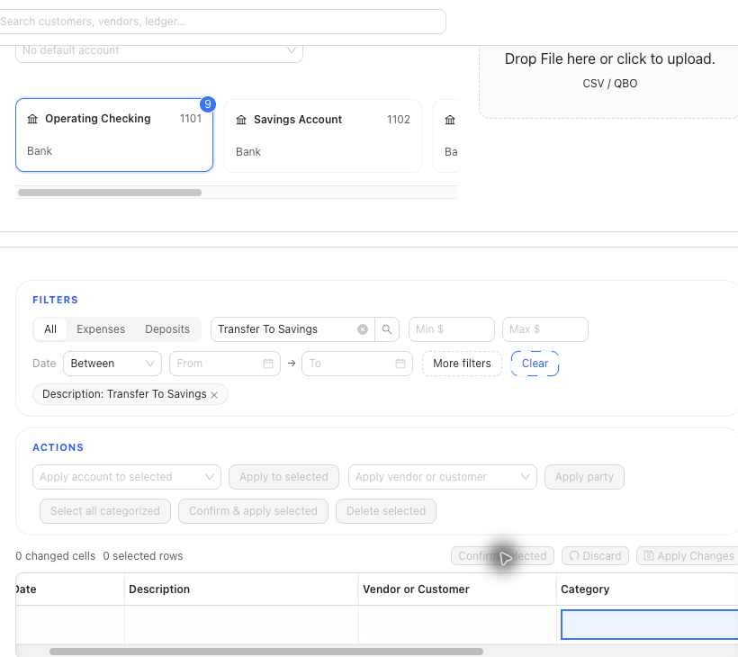

# Resolve Confirmed Bank Transactions

<!-- Last validated: 2026-07-15 (SPRK 0.4.10, Demo Company) -->
<!-- Screenshot status: Current; related reconciliation safeguards captured 2026-07-15 -->

Review and repair the accounting link for a confirmed bank row without returning the row to pending review.

## When To Use This

- A confirmed row in `Categorized` needs GL-link review.
- The visible `Resolve` action is available.
- You need to remove a link, link to an existing reviewed GL line, or create a linked journal from the confirmed bank row.

## Before You Start

- Confirm the active company and selected bank account.
- Confirm the row is already confirmed.
- Review reconciliation state before changing a linked row.
- Compare account, amount, date, memo, and supporting detail before linking to an existing GL line.

## Steps

1. Open `Banking`.
2. Select the account that contains the confirmed row.
3. Open `Categorized`.
4. Find the confirmed row.
5. Use `Resolve` on that row.
6. Review the current linked journal, if one exists.
7. Review suggested existing GL lines as candidates, not automatic matches.
8. Choose the visible action that fits the correction:
   - `Remove link` removes the journal association from the bank row.
   - Linking to an existing GL line ties the bank row to the reviewed line.
   - `Create GL and link` uses bank row details to create a linked journal when the row has a valid target account or split.
9. Confirm only after the accounting trail matches the intended correction.
10. For a compatible confirmed row linked to a simple two-line journal, a supported edit can keep the date, amount, description, memo, party, dimensions, and non-cash target account synchronized across the bank row and journal.
11. Review reconciliation impact separately:
   - A same-date change to only the non-cash target account does not by itself require posted reconciliation history to be voided when the settlement account and amount also remain unchanged.
   - Split rows, settlement-account changes, and invoice, bill, or payment corrections can require a reversal or correction from the original workflow.

## What This Changes

`Remove link` removes the journal association from the bank row. It does not delete the confirmed bank row, unconfirm it, unreconcile it, or clear statement metadata. Creating or linking GL from `Resolve` changes the accounting trail, so review it like any other posting-sensitive correction.

When a supported linked edit changes settlement details that affect posted reconciliation history, SPRK can require explicit void confirmation. A confirmed void preserves the session as `Voided` history and releases its rows for later reconciliation review; it does not delete history.

## If Something Looks Wrong

| What You See | What To Check | What To Do Next |
|---|---|---|
| `Resolve` is missing | Whether the row is confirmed and supports link review | Use the available correction path for the row |
| Suggested GL lines appear | Account, amount, date, memo, and supporting detail | Link only when the candidate matches the bank row |
| Removing the link did not remove the bank row | Whether you expected an unconfirm or delete action | Use the supported correction path for the bank row itself |
| `Create GL and link` is unavailable | Whether the row has a valid target account or split | Complete categorization before creating a linked journal |
| The row is reconciled | Statement period and reconciliation status | Review reconciliation impact before changing the link |
| A simple target-account reclassification needs correction | Whether date, amount, and settlement account can remain unchanged | Use the supported paired edit and verify both the bank row and journal afterward |

## Related

- [Review and classify bank transactions](./review-and-classify-bank-transactions.md)
- [Edit linked ledger and bank activity](../ledger-and-chart-of-accounts/edit-linked-ledger-and-bank-activity.md)
- [Common accountant corrections](../ledger-and-chart-of-accounts/common-accountant-corrections.md)
- [Resolve common reconciliation exceptions](../reconciliation/resolve-common-reconciliation-exceptions.md)
