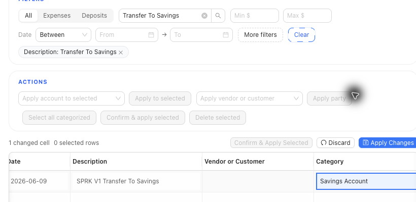

# Review Bank Transfers

Review bank-to-bank, bank-to-cash, or bank-to-credit-card pairings before confirming transfer activity.

## When To Use This

- A bank row appears to be the other side of a transfer.
- SPRK uses `Transfer` wording instead of check, invoice, or bill matching.
- Transfer confirmation stops for review before creating or reusing a transfer.

## Before You Start

- Confirm both accounts involved in the transfer.
- Compare date, amount, description, memo, and reconciliation state.
- Do not reuse a transfer candidate that belongs to another statement period or already reconciled activity unless that is the intended result.

## Steps

1. Open `Banking`.
2. Select the account that contains the pending row.
3. Review the row amount, date, description, and account.
4. Look for transfer language when the offset account is another bank, cash, or credit-card account.
5. If transfer confirmation stops for review, compare the candidate transfer details.
6. Choose `Use existing transfer` when the row is the missing counterpart to the existing transfer.
7. Choose `Create separate transfer` when the nearby same-amount transfer is unrelated or risky to reuse.
8. Cancel if the candidate is already reconciled, belongs to another statement period, or does not match your supporting detail.
9. Confirm only after the transfer choice matches the bank activity.

## What Happens When You Confirm

A later imported opposite side of a transfer can be adopted into an existing transfer or excluded as a duplicate counterpart instead of creating a second journal entry for the same transfer. Ambiguous transfer evidence can require an explicit transfer-review choice instead of silently adopting or changing an existing transfer.

## If Something Looks Wrong

| What You See | What To Check | What To Do Next |
|---|---|---|
| A transfer looks like a document match | Whether the offset account is another cash, bank, or credit-card account | Use transfer review instead of invoice, bill, or check matching |
| A same-amount transfer candidate appears | Date, account, memo, and reconciliation state | Reuse the candidate only if it is the missing counterpart |
| The candidate is already reconciled | Statement period and reconciled status | Cancel and review before changing transfer history |
| Transfer wording appears unexpectedly | Offset account type | Confirm whether the account pairing is a register-account transfer |

## Practice And Examples

- Practice file: [bank-transfer-counterpart-adoption.csv](../sample-files/practice/bank-transfer-counterpart-adoption.csv)

## Related

- [Classify bank transactions](./classify-bank-transactions.md)
- [Choose bank and credit card accounts](./choose-bank-and-credit-card-accounts.md)
- [Start a reconciliation](../reconciliation/start-a-reconciliation.md)
