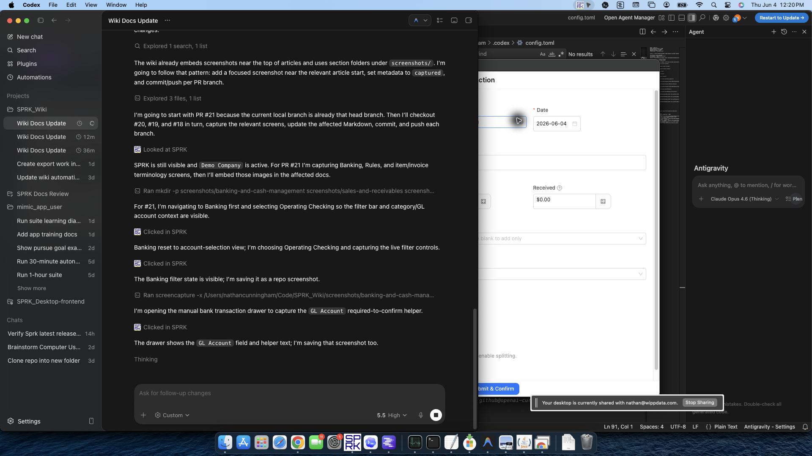
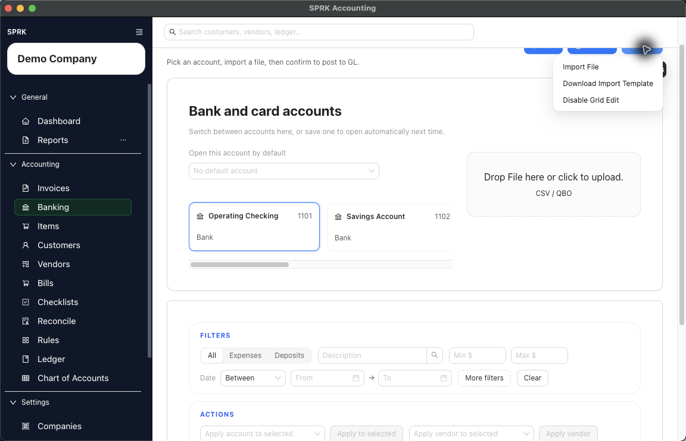

# Understand the Banking Page

Learn how the Banking page is organized so you can choose the right bank or credit card account, import activity into that account, review pending transactions, and confirm what should post to the general ledger.

## When To Use This

Use this article when you want a high-level map of the Banking page before importing or categorizing transactions.

## Before You Start

- You are signed in to SPRK.
- An active company is selected.
- Your company has at least one bank or credit card account if you want to review real transaction activity.

## Steps

1. Open `Banking`.
2. Review the page header:
   - The page title is `Bank & Credit Import`.
   - `New` lets you enter a bank transaction manually.
   - `Refresh` reloads the current account activity and pending suggestions.
   - `Import` opens the current bank-transaction import starter modal after you choose a bank or credit card account.
3. Use the account cards near the top of the page to choose the bank or credit card account you want to work in:
   - SPRK can open a saved default account automatically when one is already set for the active company.
   - If no account is active yet, choose one before you import or review activity.
   - Each card stays tied to one account, so imports and transaction review happen in the account you selected.
   - A badge on the card shows how many pending transactions still need review for that account.
   - `Default on open` marks the account SPRK will try to open first next time.
4. If the account you need is missing, add the bank or credit card account before continuing:
   - Some chooser views can offer an add-account path without leaving the current workflow.
   - The account must exist in the active company before you can import or reconcile activity into it.
5. Use the page-header `Import` action or the upload area beside the account cards to import one file at a time for the selected account:
   - The import starter modal shows accepted formats, starter-template download, required columns, and recommended columns before you select a spreadsheet file.
   - You can also click the uploader or drag a file onto it when the selected account is already active.
   - Import preview review happens before rows are created in `Pending`.
   - When the build exposes vendor-aware import review, spreadsheet imports can carry vendor details. Exact active vendor IDs and uniquely matched active vendor names can resolve during preview, unresolved imported names can stay visible for review, and `Add unknown vendors (n)` creates one vendor record for each unique unresolved name in the current batch.
   - Importing only adds or updates selected, non-skipped pending transactions for the selected account.
6. Review the `Transactions` area:
   - The transaction-type toggle supports `All`, `Expenses`, and `Deposits`.
   - Filters support description, amount, date, GL account/category, rule-applied status, and class filters when dimensions are enabled.
   - `Pending` shows transactions that still need review before posting.
   - `Categorized` shows transactions that were already confirmed.
7. In the `Pending` tab, use the row-level fields and actions:
   - `Vendor` is optional.
   - `GL Account` selects the account for the other side of the journal entry. Some grid views still label this column `Category`; use it as the offset GL account.
   - `Split` lets you allocate one transaction across multiple accounts.
   - `Find Check` appears when check matching is supported for the selected account.
   - `Match bank transaction` can connect eligible pending rows to open invoices, open bills, or existing checks when the row direction and document balance allow it.
   - Register-account pairings between bank, cash, or credit-card accounts use `Transfer` language instead of document-match language.
   - The primary action confirms the transaction once it is ready.
8. If you use `New` to enter a bank transaction manually:
   - `GL Account` is required before `Submit & Confirm` can post the transaction.
   - You can leave `GL Account` blank only when you are adding the row for later review instead of confirming it immediately.
9. Use the bulk controls above the table when you want to apply one account, apply one vendor, confirm several transactions, or delete several transactions at once:
   - In the standard table, select rows with the checkbox column.
   - In Banking Grid Edit, selection may appear through the row-number column when that mode supports selected-row actions.
   - Bulk posting and cleanup actions should run only after any draft Grid Edit changes have been applied.

## What Happens Next

You understand where to select the account, where imported files enter the workflow, and which parts of the page only prepare transactions versus which step actually posts to the general ledger.

- Viewing the Banking page does not post anything to the general ledger.
- Selecting an account or saving a default account does not post anything to the general ledger.
- Selecting accounts, filtering, importing files, editing GL account/category choices, assigning vendors, creating splits, and matching checks on the page are preparation steps only.
- Creating vendors from an import preview, when available, updates vendor setup and preview resolution only; rows still must be confirmed from the preview before they reach `Pending`.
- Draft Grid Edit cleanup remains a preparation step until the changes are applied, and applying Grid Edit changes still does not confirm the bank transaction by itself.
- Reviewing a bank-import preview, skipping likely duplicate rows, and restoring rows before import are preparation steps only.
- General ledger posting happens when a pending transaction is confirmed.

## If Something Looks Wrong

- Working in the wrong bank or credit card account card before importing or confirming transactions.
- Treating the `Categorized` tab as the place where edits are staged. It reflects transactions that are already confirmed.
- Assuming a rule-based suggestion means the transaction has already posted.
- Forgetting that importing into the wrong selected account sends the pending rows into that account's workflow.
- Treating the import preview as an immediate batch load instead of a review-and-selection step.
- Relying on the wrong saved default account when you switch between multiple bank or credit card accounts.
- Mixing unapplied Grid Edit changes with bulk Banking actions instead of applying the draft changes first.

## Related

- [Choose bank and credit card accounts](./choose-bank-and-credit-card-accounts.md)
- [Review and classify bank transactions](./review-and-classify-bank-transactions.md)
- [Create and manage rules](./create-and-manage-rules.md)
- [Import bank transactions](./import-bank-transactions.md)
