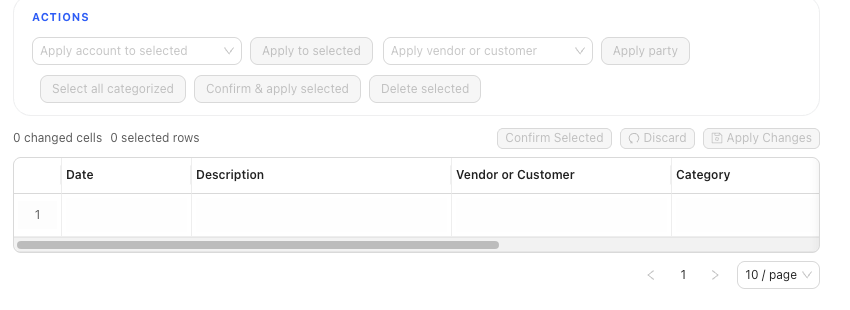
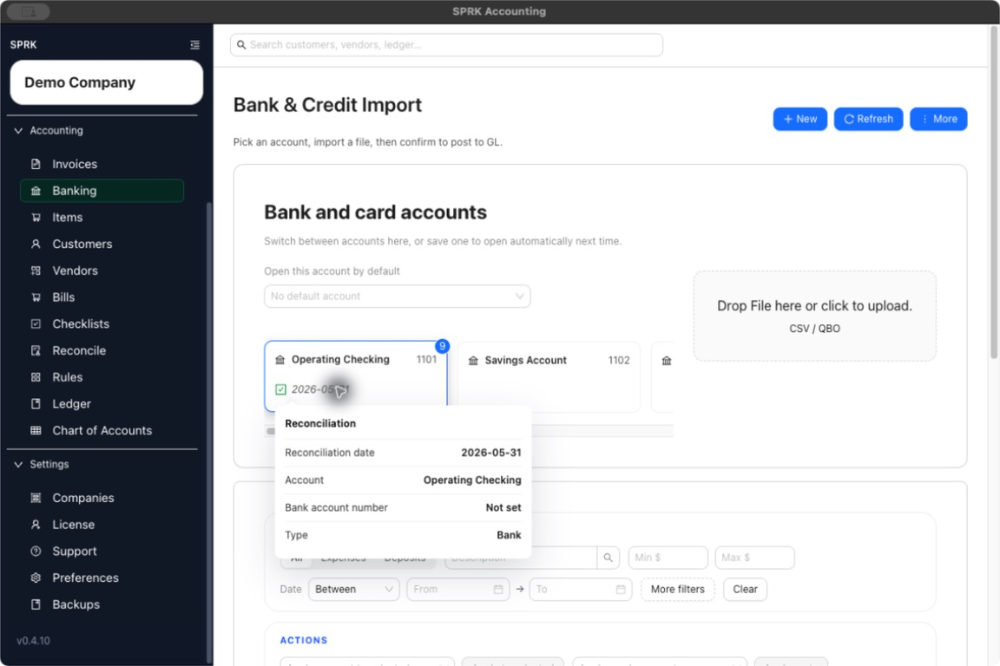

# Understand the Banking Page

<!-- Last validated: 2026-07-15 (SPRK 0.4.10, Demo Company) -->
<!-- Screenshot status: Current; reconciliation card popover captured 2026-07-15 -->

Use this Banking page map to understand where account selection, import, pending review, confirmed activity, and repair actions live.

## Quick reference

| Area Or Control | Meaning | Where It Matters |
|---|---|---|
| Account cards | Select the bank or credit card register you are reviewing; a card can also show the latest posted reconciliation date | Import, pending review, confirmation, and reconciliation |
| `Default on open` | Marks the account SPRK should try to open first next time | Multi-account banking workflows |
| `Import` or upload area | Starts bank-transaction import for the selected account | [Import bank transactions](./import-bank-transactions.md) |
| `Pending` | Rows that still need review before posting | [Classify bank transactions](./classify-bank-transactions.md) |
| `Categorized` | Confirmed rows for the selected account | Review, reconciliation, and link repair |
| `GL Account` or `Category` | The non-bank side of the posting | Classification and confirmation |
| Party field | Optional vendor or customer context | Review, reporting, and linked journal detail |
| `Split` | Allocates one bank row across multiple accounts | Classification before confirmation |
| `Match bank transaction` | Applies eligible rows to invoices, bills, or checks | [Match bank transactions](./match-bank-transactions.md) |
| `Transfer` wording | Indicates a bank, cash, or credit-card account pairing | [Review bank transfers](./review-bank-transfers.md) |
| `Resolve` | Repairs a confirmed row's accounting link | [Resolve confirmed bank transactions](./resolve-confirmed-bank-transactions.md) |
| Grid Edit | Lets supported tables be cleaned up in bulk before actions | [Use grid edit for bulk record maintenance](../dashboard-and-navigation/use-grid-edit-for-bulk-record-maintenance.md) |

## Details

The Banking page is account-specific. Imports, pending rows, confirmed rows, filters, and review actions apply to the selected bank or credit card account. If a saved default account opens automatically, confirm it is the account you meant to review before importing, editing, or confirming rows.

When posted reconciliation history is available, an account card can show the latest statement-ending date. Open the date context to review `Reconciliation date`, `Account`, `Bank account number`, and `Type`. This is historical account context; it does not mean current pending or categorized rows are reconciled.

Import preview review happens before rows are created in `Pending`. Spreadsheet imports can use signed amounts, separate `Debit` and `Credit` columns, or a positive `Amount` plus direction columns such as `Credit or Debit`, `Debit/Credit`, `Dr/Cr`, or `Type`.

`Pending` rows are preparation work until they are confirmed. Selecting accounts, filtering, importing files, editing GL account/category choices, assigning vendors, creating splits, and matching checks are preparation steps. General ledger posting happens when a pending transaction is confirmed.

`Categorized` rows have already been confirmed. When `Resolve` is available, it can remove a journal link, link to a suggested existing GL line, or create and link a new GL transaction when the bank row has enough categorization. Removing a GL link preserves the confirmed bank row and does not erase reconciliation or statement metadata.

Compatible confirmed rows linked to simple two-line journals can keep supported bank and journal fields synchronized during correction. Treat this as a reviewed paired-edit path, not a promise that every row is editable: split activity, source-document postings, or changes to the reconciled settlement account can require reversal or the source workflow. A same-date correction to only the non-cash target account is narrower and does not by itself void reconciliation history when the settlement account and amount remain unchanged.

## If something looks wrong

| What You See | What To Check | What To Do Next |
|---|---|---|
| Rows appear under the wrong account | Selected account card and default account | Select the intended account before importing or confirming |
| `Categorized` looks like an edit queue | Whether the row has already been confirmed | Use confirmed-row review or resolve actions instead of pending classification |
| Import preview looks final | Whether rows have been confirmed from the preview | Review and confirm only the rows you intend to import |
| A rule suggestion appears | Whether it has been confirmed | Review the suggestion before posting the row |
| Bulk actions are blocked | Unapplied Grid Edit changes | Apply or discard grid edits before running bulk actions |
| Suggested GL lines appear in `Resolve` | Whether they match account, amount, date, memo, and context | Link only reviewed matches |

## Related

- [Choose bank and credit card accounts](./choose-bank-and-credit-card-accounts.md)
- [Review and classify bank transactions](./review-and-classify-bank-transactions.md)
- [Import bank transactions](./import-bank-transactions.md)
- [Create and manage rules](./create-and-manage-rules.md)
