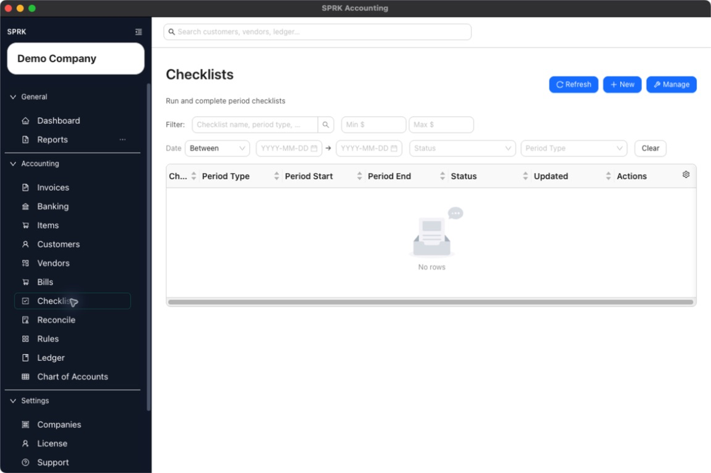

# Month-End Review Checklist

<!-- Screenshot status: Review needed -->

Use this month-end checklist to review banking, reconciliation, receivables, payables, reports, and backups before you finish the period.

## When to use this

Use this page when you are closing a month, reviewing a client file, preparing financial statements, or checking whether routine accounting work is complete before reporting.

## Before you start

- The correct company is active.
- Bank and credit-card activity for the period has been imported or entered.
- Customer invoices, payments, vendor bills, checks, and journal entries are entered through the source pages that fit the work.
- You know the month or period you want to review.

## Steps

1. Confirm the active company before you review anything.
2. Open `Banking` and review pending bank and credit card transactions.
   - Assign accounts and vendors where needed.
   - Confirm only the rows you are ready to post.
   - Leave unclear items pending until you can review them.
3. Open `Reconcile` and complete bank and credit card reconciliations for the period.
   - Match or clear transactions carefully.
   - Resolve differences before finishing the reconciliation.
   - Print or review the reconciliation report after posting.
4. Review open receivables.
   - Check invoices that remain open.
   - Apply customer payments that have been received.
   - Run receivables aging if the report is available.
5. Review open payables.
   - Check bills that remain unpaid.
   - Review checks or payment records entered for the period.
   - Run payables aging if the report is available.
6. Review the `Ledger` for manual journal entries that affect the period.
   - Confirm accruals, reclasses, owner entries, and adjusting entries.
   - Confirm any intended reversing entries use the correct reversal date.
7. Run core reports from `Reports`.
   - Start with `Trial Balance` to scan account balances.
   - Review `Balance Sheet` for as-of balances.
   - Review `Income Statement` for the period.
   - Use `General Ledger` or `Account Detail` to investigate unusual balances.
8. Use report drilldown before making corrections.
9. Make corrections through the source workflow whenever possible.
   - Use invoices for customer billing corrections.
   - Use bills or checks for vendor/payables corrections.
   - Use banking for bank transaction classification.
   - Use journal entries for accountant adjustments that do not belong to a source workflow.
10. Export or save the reports your firm keeps with the period workpapers.
11. Use `Checklists` to track review tasks that should be repeated every month.
12. Review backup/export expectations for the company before major cleanup, import, or transfer work.

## What happens next

The month-end review gives you a repeatable path for finding missing activity, wrong classifications, open AR/AP items, reconciliation issues, and report balances that need attention.

- Reports show posted data; correct an issue from the page that owns the original transaction when possible.

## If something looks wrong

| What You See | What To Check | What To Do Next |
|---|---|---|
| A report difference is going straight to a journal entry | Whether the source transaction explains the difference | Review the source transaction before posting an adjustment |
| Reconciliation is ready to finish while bank activity is still missing | Whether all known statement activity has been imported or entered | Add or review missing bank activity before finishing |
| Aging report totals look incomplete | Whether invoices, bills, and payments have all been entered | Complete the source workflows before relying on aging reports |
| Reports show the wrong company | Whether the active company matches the review file | Switch to the correct company and rerun the reports |
| Closed-period history looks messy | Whether a correction or reversal workflow is available | Use supported correction workflows instead of deleting history |

## Related

- [Review and classify bank transactions](../banking-and-cash-management/review-and-classify-bank-transactions.md)
- [Start a reconciliation](../reconciliation/start-a-reconciliation.md)
- [AR review workflow](../sales-and-receivables/ar-review-workflow.md)
- [AP review workflow](../expenses-and-payables/ap-review-workflow.md)
- [Review financial results inside the product](../reports-and-financial-review/review-financial-results-inside-the-product.md)
- [Common accountant corrections](../ledger-and-chart-of-accounts/common-accountant-corrections.md)
