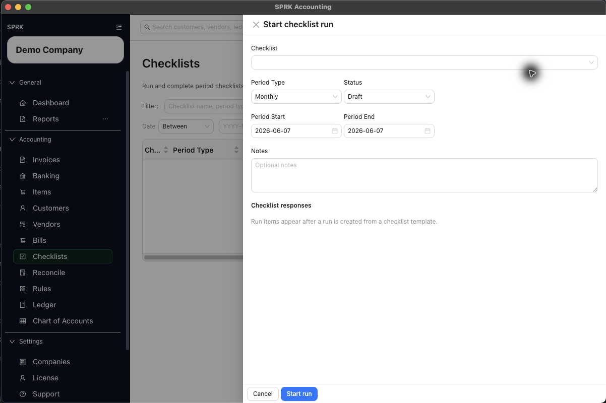

# Run Recurring Close-Style Tasks

Start a checklist run for a defined period, capture responses on each checklist item, and complete the run when the work is actually finished.

## Purpose

Use this workflow when you want to start and complete a checklist run for daily, weekly, monthly, quarterly, yearly, or custom close-style work.

## Prerequisites

- An active company is selected.
- At least one active checklist template exists.
- You know the period dates the run should cover.

## Steps

1. Open `Checklist`.
2. Select `New`.
3. In `Start checklist run`, choose the `Checklist` template you want to use.
4. Set the run details:
   - `Period Type`: `Daily`, `Weekly`, `Monthly`, `Quarterly`, `Yearly`, or `Custom`
   - `Status`: usually start with `Draft` or `In Progress`
   - `Period Start`
   - `Period End`
   - Optional `Notes`
5. Select `Start run`.
6. Open the created run from the main checklist table if it does not stay open automatically.
7. Complete each checklist response item:
   - Enter text for text fields.
   - Choose `Yes` or `No` for boolean items.
   - Pick a date for date items.
   - Add optional item notes when the task needs supporting context.
8. Update the run as work progresses:
   - Use `Save run` to keep in-progress changes.
   - Use `Complete run` only when the checklist work is actually finished.
9. Reopen the run later if you need to review or edit it before completion.

## Expected Result

You have a dated checklist run tied to a specific period and template, with stored responses and a visible status. Current general ledger impact as of 2026-05-04:

- Starting a checklist run creates a checklist-run record only.
- Saving responses updates checklist-run fields only.
- Completing the run changes the run status to `Completed` but does not create, edit, reverse, or approve a journal entry.
- If one of the checklist items tells you to post an entry elsewhere in SPRK, that posting must still happen in the separate source workflow.

## Common Mistakes

- Starting a run with the wrong period dates.
- Assuming `Completed` means all related accounting transactions have already been posted.
- Using a checklist run to replace the actual bill, banking, reconciliation, or journal-entry action.
- Trying to start a duplicate run for the same company, checklist, and period.

## Related Articles

- [Use checklists](./use-checklists.md)
- [Track completion across routine accounting work](./track-completion-across-routine-accounting-work.md)

## Info

- App sections: `checklists`
- Last validated: 2026-05-04
- Screenshot status: `captured`
