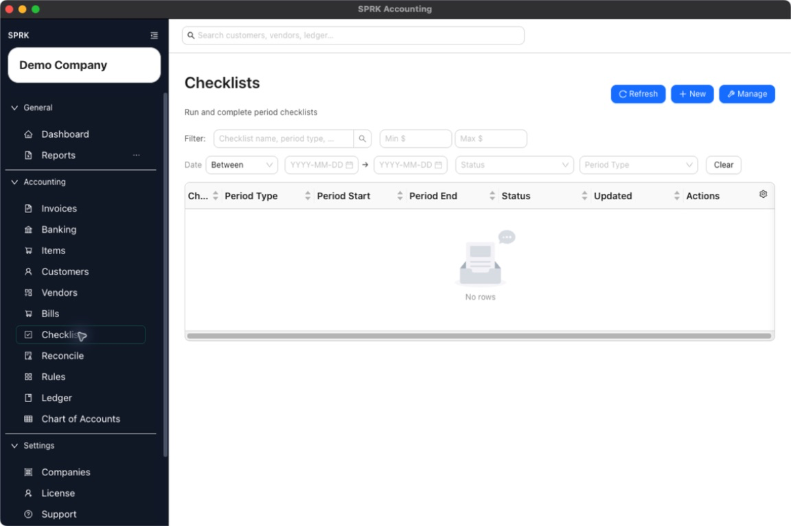
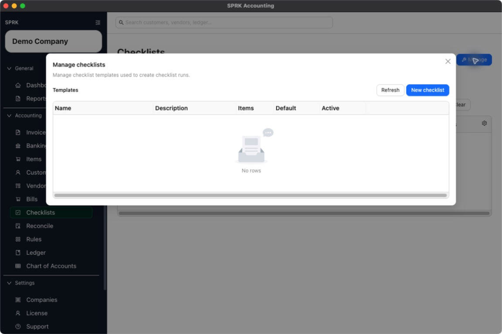

# Use Checklists

Open the Checklist area, manage reusable checklist templates, and understand the difference between template setup and period-specific runs.

## Purpose

Use this workflow when you need to review the Checklist page layout, maintain reusable checklist templates, or understand how checklist runs are created from those templates.

## Prerequisites

- An active company is selected.
- You know the checklist name and the items you want the template to contain.
- If you plan to reuse a checklist across multiple periods, you know whether it should stay active or be treated as a default template.

## Steps

1. Open `Checklist`.
2. Review the main page:
   - The top action row includes `Refresh`, `New`, and `Manage`.
   - The main table lists checklist runs, not checklist templates.
3. Select `Manage` when you want to work with templates.
4. In `Manage checklists`, review the template list columns:
   - `Name`
   - `Description`
   - `Items`
   - `Default`
   - `Active`
5. Select `New checklist` to create a template, or `Edit` beside an existing template to update one.
6. In the checklist editor, complete the template details:
   - Enter a `Name`.
   - Add an optional `Description`.
   - Turn on `Default checklist` only when the template should behave as a shared default template.
   - If you are editing an existing template, keep `Active` turned on unless you want to retire it from future use.
7. Build the checklist items:
   - Use `Add item` to add more steps.
   - Enter a `Label` for each item.
   - Choose the response type: `Text`, `Yes / No`, or `Date`.
   - Add an optional item description.
   - Mark `Required` when the item should not be skipped.
   - Reorder or remove items with the item controls.
8. Save the template.
9. Return to the main Checklist page when you are ready to start a run from one of the active templates.

## Expected Result

You have a reusable checklist template that can be used to create period-specific runs. Current general ledger impact as of 2026-05-04:

- Creating or editing a checklist template stores checklist metadata only.
- Deleting a checklist from the manage view retires it from active use instead of posting a reversing entry.
- No template action changes balances, clears transactions, or posts to the ledger.

## Common Mistakes

- Expecting `Manage` to show completed runs instead of templates.
- Leaving item labels blank and then trying to save.
- Treating a checklist template as proof that the accounting work is already done.
- Turning a template inactive before confirming you no longer need it for future periods.

## Related Articles

- [Run recurring close-style tasks](./run-recurring-close-style-tasks.md)
- [Track completion across routine accounting work](./track-completion-across-routine-accounting-work.md)

## Info

- App sections: `checklists`
- Last validated: 2026-06-05
- Screenshot status: `captured`
