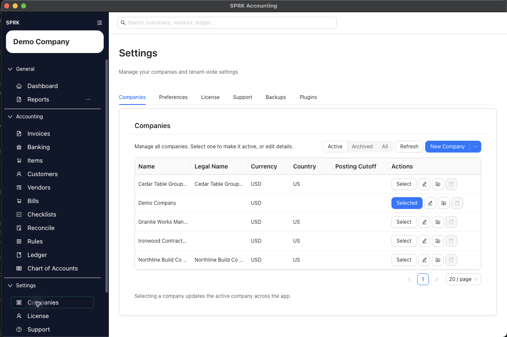

# Company Administration

Review the company list, understand which company is active, add a company, and manage company-level settings.

## In This Section

- [Use the Companies tab](./use-the-companies-tab.md)
- [Understand active company behavior](./understand-active-company-behavior.md)
- [Add a company from the sidebar flow](./add-a-company-from-the-sidebar-flow.md)
- [Review company-level maintenance actions](./review-company-level-maintenance-actions.md)

## Related Foundation Workflows

- [Choose or switch your active company](../getting-started/choose-or-switch-your-active-company.md)
- [Switch between companies](../company-setup-and-migration/switch-between-companies.md)
- [Understand company-aware navigation](../dashboard-and-navigation/understand-company-aware-navigation.md)

## Info

- App sections: `companies`
- Last validated: 2026-05-04
- Screenshot status: `captured`
