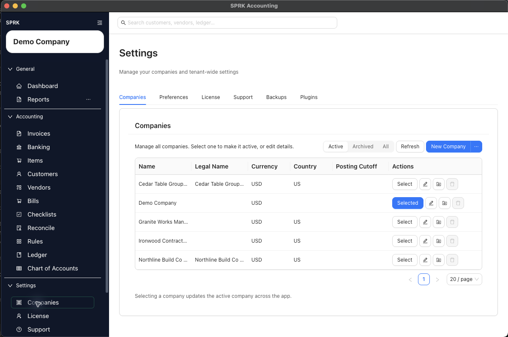

# Company settings

Manage companies, defaults, dimensions, and company-level options.

## Start here

- [Use the Companies tab](./use-the-companies-tab.md)
- [Manage default company settings](./manage-default-company-settings.md)

## Common tasks

- [Set up dimensions or classes](./set-up-and-use-dimensions-or-classes.md)
- [Review company maintenance actions](./review-company-level-maintenance-actions.md)

## Related

- [Switch between companies](../company-setup-and-migration/switch-between-companies.md)
- [Create your first company](../company-setup-and-migration/create-your-first-company.md)
