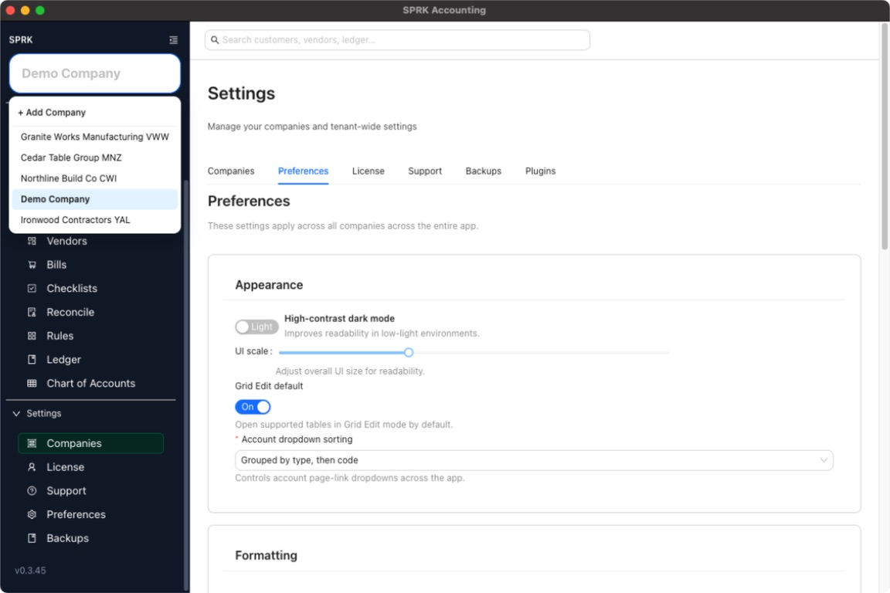
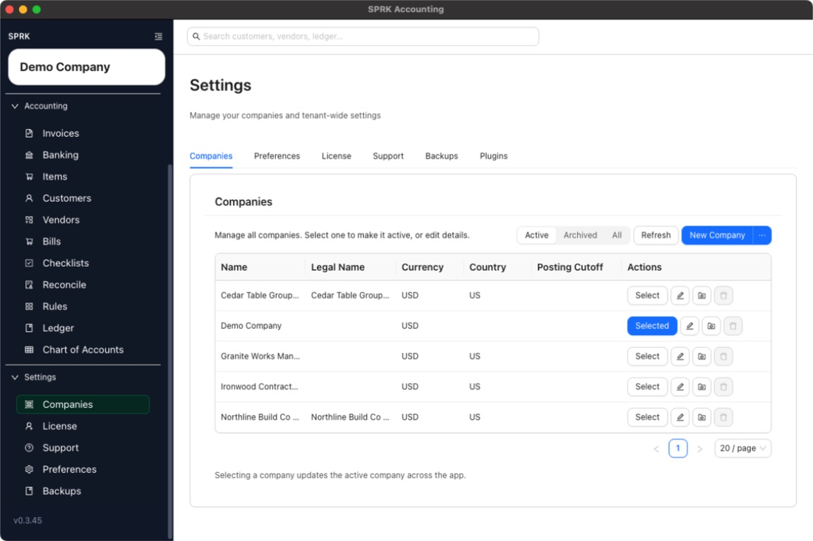

# Add a Company from the Sidebar Flow

Start a new company from the sidebar company selector and finish setup in the Companies area.

## Purpose

Use this workflow when you are already in the app and want to start a new company without browsing through the full settings layout first.

## Prerequisites

- You are signed in to SPRK.
- You can see the company selector in the sidebar.
- Your workspace is allowed to create another real company, or you are prepared to enter a license before adding more than the free limit.

## Steps

1. Look at the company selector at the top of the left sidebar and confirm the current company before you continue.
2. Open the company selector.
3. Choose `+ Add Company`.
4. SPRK opens the `Companies` area and takes you to the new-company flow.
5. Enter the company details that apply to the new company, such as the display name, currency, country, posting cutoff date, fiscal year end, required account fields, accounting edit permissions, and any default A/R or A/P account choices.
   - Workspace or tenant accounting edit-policy defaults can prefill the drawer when those defaults exist, while explicit values you choose in the form override them.
   - `Required account fields = Name` can make supported account lists and pickers show account names without account codes.
6. Select `Create` when the new company setup is ready.
7. Confirm the new company becomes selectable and review whether SPRK switches the active company to the newly created company.

## Expected Result

You can start from the sidebar and land in the same company-creation experience used by the `Companies` tab. Current general ledger impact as of 2026-05-04:

- Opening `+ Add Company` does not post anything to the general ledger.
- Creating a company sets up a separate company workspace and related settings, but it does not create sales, expense, banking, or journal transactions by itself.
- Future transactions entered after switching to the new company affect that company's general ledger only.

## Common Mistakes

- Skipping the company-name check before opening the add-company flow.
- Expecting the sidebar flow to import historical activity automatically.
- Confusing license limits with an application error when another real company cannot be added.

## Related Articles

- [Create your first company](../company-setup-and-migration/create-your-first-company.md)
- [Use the Companies tab](./use-the-companies-tab.md)
- [Understand active company behavior](./understand-active-company-behavior.md)

## Info

- App sections: `companies`
- Last validated: 2026-05-04
- Screenshot status: `captured`
