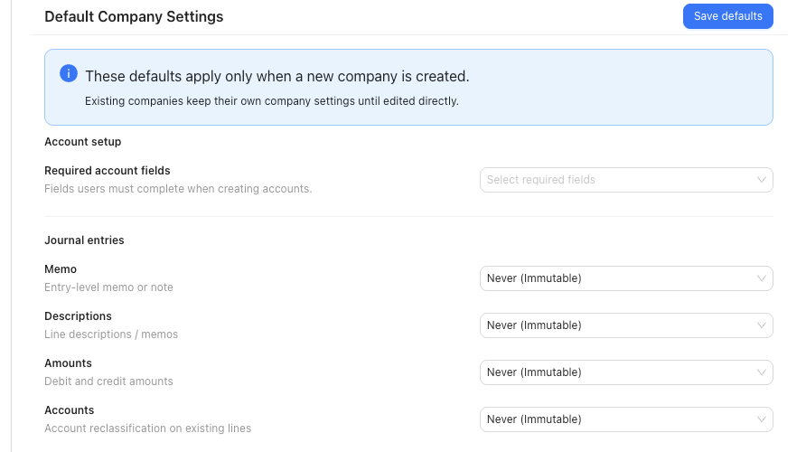

# Manage Default Company Settings

Set tenant-level defaults for future companies and apply the same accounting policy choices to selected active companies when your firm wants a consistent setup.

## When To Use This

Use this workflow when your workspace has a valid tenant license and you want new companies to start with consistent account-field and accounting edit-policy settings.

## Before You Start

- You can open `Settings`.
- The `Defaults` tab is visible.
- You know whether the defaults should affect only future companies or selected existing companies too.
- You have reviewed the companies that should receive a bulk update before applying defaults.

## Steps

1. Open `Settings`.
2. Select `Defaults`.
3. In `Default Company Settings`, review the fields SPRK can store for new companies:
   - `Required account fields`
   - `Journal entries`
   - `Reconciliation dates`
4. Set `Required account fields` to match how your firm wants account labels presented during setup.
   - Choosing `Name` only can hide account-code columns and code-first labels in supported lists and account selectors.
   - Clearing required account fields intentionally is treated as an explicit setup choice.
5. Review the journal-entry and reconciliation edit-policy choices before saving.
6. Select `Save defaults`.
7. If the same policy should also be applied to existing active companies, use `Apply Defaults`:
   - Select the company checkboxes, then choose `Apply to selected`.
   - Or choose `Apply to all` when every active company should receive the same defaults.
8. Review the confirmation before applying. The confirmation explains that required account fields and accounting edit permissions are updated while other company accounting settings are preserved.

## What This Changes

`Save defaults` stores the tenant defaults used when a new company is created. Existing companies keep their own settings until you edit them directly or use `Apply to selected` or `Apply to all`.

Bulk apply updates `Required account fields`, `Journal entries`, and `Reconciliation dates` policy fields on the target active companies. It does not replace unrelated company accounting settings such as control accounts, fiscal year end, posting cutoff, dimensions, or default A/R and A/P accounts.

The `Defaults` tab requires a valid tenant license before defaults can be saved or applied.

## If Something Looks Wrong

- If `Defaults` is missing, confirm the tenant license and workspace access.
- If `Save defaults` or apply actions are disabled, confirm a valid tenant license is active.
- If account codes disappear after applying defaults, check whether `Required account fields` is set to `Name` only.
- If a company should keep a different edit policy, do not include it in `Apply to selected` and avoid `Apply to all`.

## Related

- [Use the Companies tab](./use-the-companies-tab.md)
- [Review company-level maintenance actions](./review-company-level-maintenance-actions.md)
- [Create your first company](../company-setup-and-migration/create-your-first-company.md)
- [Understand the chart of accounts structure](../ledger-and-chart-of-accounts/understand-the-chart-of-accounts-structure.md)
