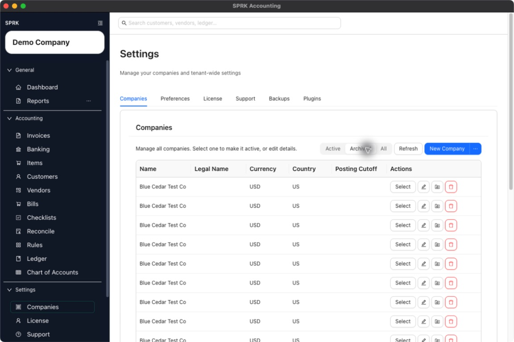

# Review Company-Level Maintenance Actions

Edit company details, archive or unarchive companies, and understand when permanent delete is available.

## Purpose

Use this workflow when you need to maintain company settings after a company already exists.

## Prerequisites

- You can open `Companies` from the `System` section.
- The company you want to maintain is visible in the list.

## Steps

1. Open `Companies`.
2. Find the company you want to maintain.
3. Use `Edit` to update company-level details such as display name, legal name, currency, country, posting cutoff date, fiscal year end, required account fields, dimensions, accounting edit permissions, or default A/R and A/P accounts.
   - Workspace or tenant accounting edit-policy defaults can prefill new company setup when those defaults exist, but explicit values saved on the company control that company.
   - If `Required account fields` is set to `Name`, supported account lists and pickers can hide account codes and sort by account name.
   - If `Control accounts` is exposed, selected accounts should be posted through their source workflow; SPRK can hide or block those accounts in new manual journal-entry account choices.
4. Use the archive action to move a company out of the active list when you no longer want it used day to day.
5. If needed, switch to the `Archived` or `All` filter to review archived companies.
6. Unarchive a company if it needs to become active again.
7. Permanently delete a company only after it has been archived first.
8. If SPRK warns that the company has journal entries, keep it archived instead of expecting permanent delete to succeed.

## Expected Result

You can maintain company settings and lifecycle state without guessing which actions are reversible. Current general ledger impact as of 2026-05-04:

- Editing company settings changes setup values but does not create a journal entry by itself.
- A posting cutoff date can restrict which dates are allowed for future posted entries, but changing the cutoff does not repost prior activity automatically.
- Changing `Required account fields` affects account setup and visible account presentation. It does not delete existing account codes or change posted balances.
- Changing `Control accounts` changes future manual-journal availability for selected accounts. It does not delete accounts or rewrite existing posted lines.
- Archiving or unarchiving a company changes availability in the company list and selector; it does not create, edit, or delete journal entries.
- Permanent deletion is limited to archived companies, and companies with journal-entry activity are blocked from deletion.

## Common Mistakes

- Trying to delete an active company before archiving it.
- Assuming a company with accounting activity can always be removed permanently.
- Treating setup edits as though they rewrite prior transactions automatically.
- Assuming a missing manual-journal account picker option means the account is inactive. It may be configured as a control account.

## Related Articles

- [Use the Companies tab](./use-the-companies-tab.md)
- [Understand the chart of accounts structure](../ledger-and-chart-of-accounts/understand-the-chart-of-accounts-structure.md)
- [Understand audit-sensitive ledger behavior](../ledger-and-chart-of-accounts/understand-audit-sensitive-ledger-behavior.md)

## Info

- App sections: `companies`
- Last validated: 2026-06-17
- Screenshot status: `captured`
