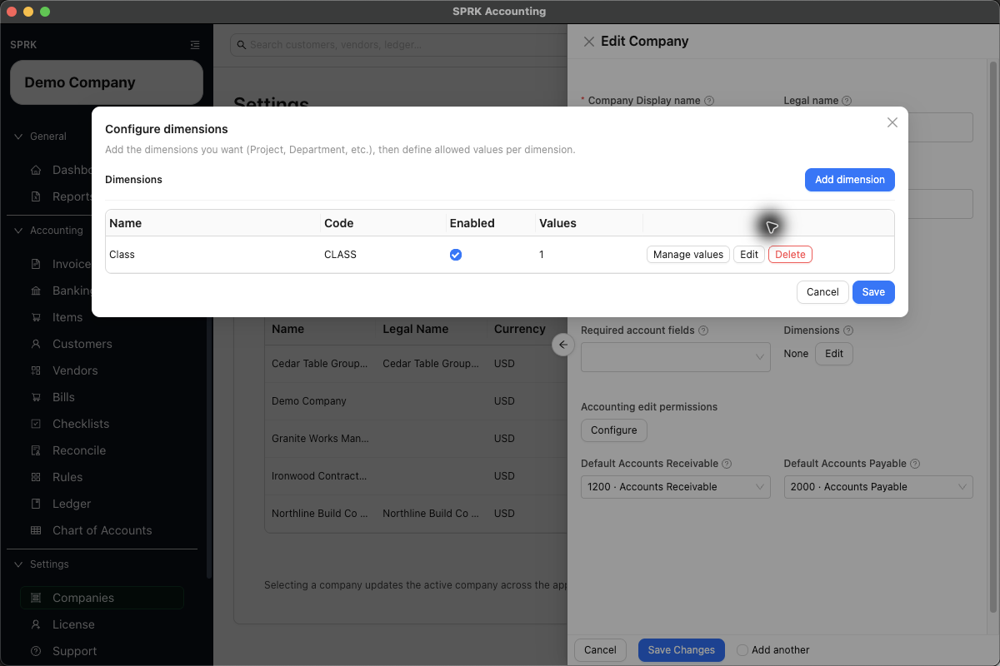
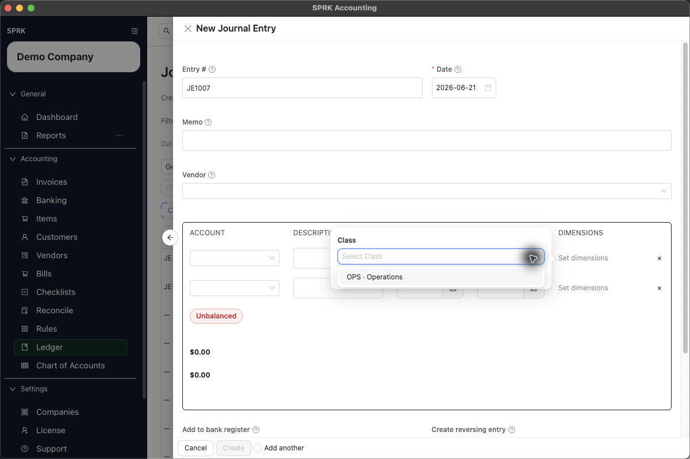

# Set Up and Use Dimensions or Classes

Create company-level dimensions, such as a `Class`, `Project`, or `Department`, then apply those values to journal-entry lines for cleaner review and filtering.

## When To Use This

Use dimensions when your team needs to review ledger activity by a tracking label that is not a general ledger account.

Common examples include:

- `Class`, when your team uses class tracking language.
- `Project`, when costs or income need to be reviewed by job or engagement.
- `Department`, `Location`, or another internal reporting group.

Do not use dimensions to replace the chart of accounts. Use accounts for financial statement classification, then use dimensions for the extra reporting view.

## Before You Start

- You can open `Settings` -> `Companies`.
- The company you want to configure is selected or visible in the companies list.
- You know the dimension names and allowed values you want users to choose from.
- If you are adding dimensions for journal entries, users should know which lines need a value before posting.

## Set Up Dimensions in Company Settings

1. Open `Settings` -> `Companies`.
2. Find the company and select `Edit`.
3. In the company drawer, find `Dimensions`.
4. Select `Edit`.
5. In `Configure dimensions`, select `Add dimension`.
6. Enter the dimension details:
   - `Name` is the label users will see, such as `Class`.
   - `Code` is optional, such as `CLASS`.
   - `Sort order` is optional and controls display order when you use more than one dimension.
   - `Enabled` keeps the dimension available for use.
7. Select `Save`.
8. On the dimension row, select `Manage values`.
9. Select `Add value`.
10. Enter the value details:
   - `Name` is the value users select, such as `Operations`.
   - `Code` is optional, such as `OPS`.
   - `Sort order` is optional.
   - `Enabled` keeps the value available for selection.
11. Save the value, return to `Configure dimensions`, and confirm the `Values` count is correct.
12. Save the dimension configuration.
13. Select `Save Changes` on the company drawer.

## Add Dimensions to a Journal Entry

1. Open `Ledger`.
2. Select `New`.
3. Enter the journal header details.
4. Add each journal line with the correct account, description, debit, and credit.
5. In the `DIMENSIONS` column, select `Set dimensions` for the line you want to tag.
6. Choose the value for each enabled dimension, such as `OPS · Operations` under `Class`.
7. Repeat the same process on any other line that needs a dimension value.
8. Confirm the journal entry is balanced.
9. Select `Create` only when the accounting and dimension coding are ready to post.

## What This Changes

Saving company dimensions changes the fields available in supported workflows. It does not create a journal entry by itself.

When a journal entry is posted with dimensions, the selected dimension values are stored on the related journal lines. Ledger review can then show a `Dimensions` column and filters such as `Class Type` and `Class Value` when dimensions are enabled.

## If Something Looks Wrong

- If `Set dimensions` does not appear on journal lines, confirm the company has at least one enabled dimension and enabled value.
- If a value is missing from the selector, return to `Settings` -> `Companies` -> `Edit` -> `Dimensions` and confirm the value is enabled.
- If users expect class tracking, create a dimension named `Class`; SPRK treats class tracking as a company dimension.
- If a journal is already posted, review your company's accounting edit permissions before expecting to change dimension values afterward.

## Related

- [Review company-level maintenance actions](./review-company-level-maintenance-actions.md)
- [Record journal entries](../ledger-and-chart-of-accounts/record-journal-entries.md)
- [Understand audit-sensitive ledger behavior](../ledger-and-chart-of-accounts/understand-audit-sensitive-ledger-behavior.md)
- [Review financial results inside the product](../reports-and-financial-review/review-financial-results-inside-the-product.md)
