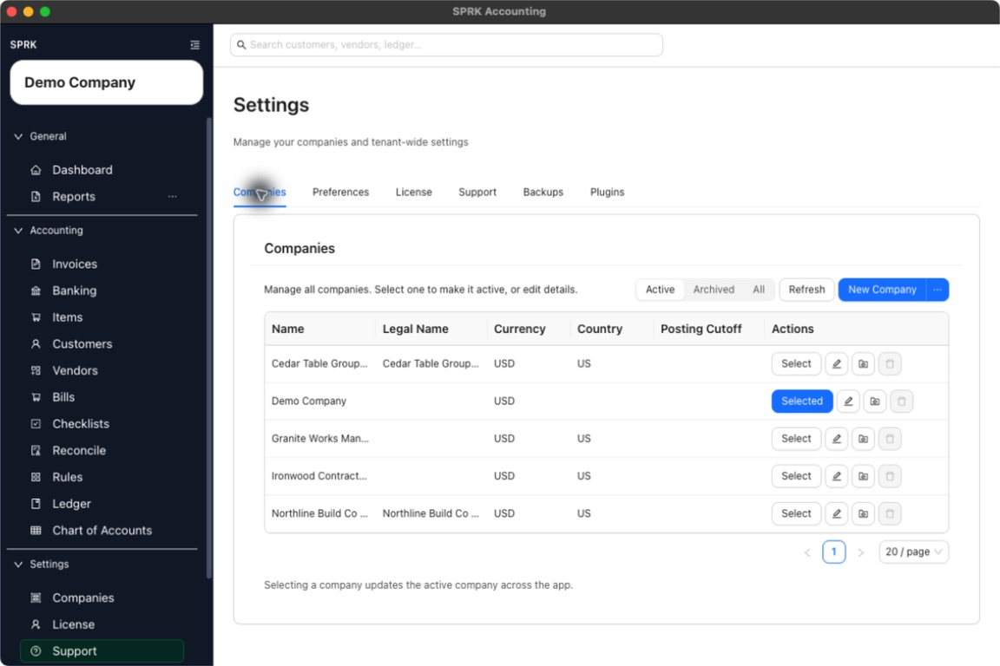

# Use the Companies Tab

Open the Companies tab to review active and archived companies, refresh the list, and reach creation or maintenance actions.

## When To Use This

Use this workflow when you need a central place to review companies and reach the actions for selecting, editing, archiving, deleting, or adding a company.

## Before You Start

- You are signed in to SPRK.
- At least one company exists in the workspace.

## Steps

1. Open `Companies` from the `System` section in the sidebar.
2. Review the company table on the `Companies` tab.
3. Use the filter control to switch between `Active`, `Archived`, and `All`.
4. Select `Refresh` if you need to reload the list.
5. Use `New Company` for a blank company, or open the menu next to it for import and demo options.
   - The new-company drawer includes `Required account fields` and `Accounting edit permissions` so admins can review account-code presentation and edit-policy defaults before creating the company.
6. If your workspace uses tenant-level defaults, open `Settings` -> `Defaults` before creating a batch of companies so new company setup starts from the intended `Required account fields`, `Journal entries`, and `Reconciliation dates` policies.
7. Use the row actions to select the active company, edit a company, archive or unarchive it, or permanently delete an archived company.

## What Happens Next

You can see the publicly supported company management actions in one place, including the active company marker and company-level action buttons.

- Viewing or refreshing the company list does not create, edit, or delete a journal entry.
- Switching which company is selected changes app context only.
- Opening company creation or maintenance actions does not post to the general ledger until you later create accounting transactions inside that company.

## If Something Looks Wrong

- Looking for company maintenance under `Preferences` or another settings tab.
- Assuming archived companies disappear from filters permanently.
- Using the `New Company` menu when you only meant to switch the active company.

## Related

- [Switch between companies](../company-setup-and-migration/switch-between-companies.md)
- [Create your first company](../company-setup-and-migration/create-your-first-company.md)
- [Manage default company settings](./manage-default-company-settings.md)
- [Review company-level maintenance actions](./review-company-level-maintenance-actions.md)
