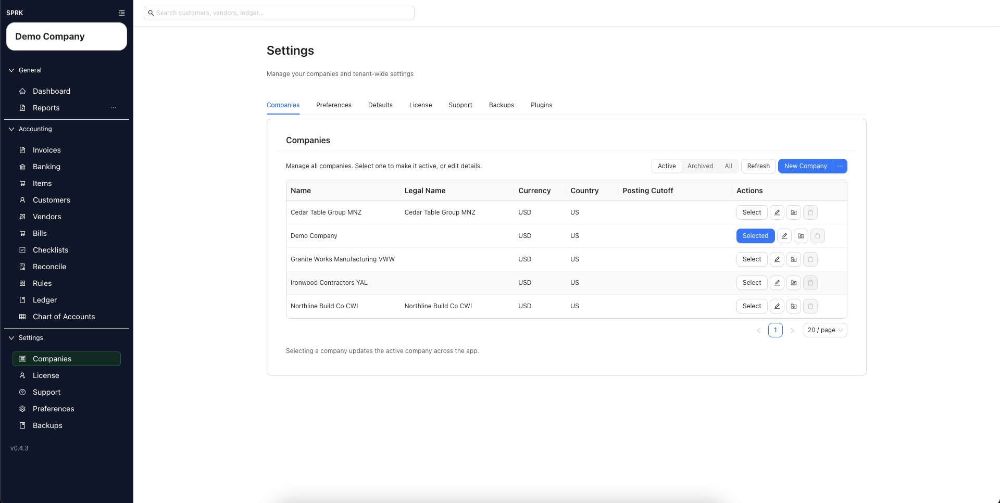

# Copying an Existing Company

Use the Import Wizard, also called the Import Company Wizard in some workflows, to create a new SPRK company from data already stored in another SPRK company.

## When To Use This

Use this workflow when you want to clone, copy, or duplicate an existing company into a separate new company. Common uses include building a training copy, starting a similar client from a known setup, testing a setup pattern, or creating a clean company that reuses selected foundation data.

Use Company File export/import instead when the goal is a file handoff or replace-style company transfer.

## Before You Start

- You can open `Settings` -> `Companies`.
- The source company already exists in SPRK.
- You know the new company name.
- You know whether you want to copy only setup data or also include transaction-style data such as journal entries, invoices, bills, payments, or trial balance data where the wizard offers those choices.

## Steps

1. Open `Settings` -> `Companies`.
2. Open the menu attached to `New Company`.
3. Select `Import Wizard`.
4. Enter the new `Company name`.
5. In the upload step, skip file upload if this is only a copy from an existing company.
   - Add files only when the new company should mix uploaded source data with copied company data.
6. Choose the `Existing company (optional)` that should act as the copy source.
7. In `Finalize your configuration`, review each data type and choose `existing company` for the categories you want copied.
   - Common categories can include accounts, customers, vendors, items, trial balance, journal entries, invoices, bills, payments, and settings.
   - Use file upload or manual settings for any category that should not come from the source company.
8. Select `Review & Create Company`.
9. On the confirmation step, verify the new company name and the source selected for each data type.
10. Create the company.
11. Switch to the new company and review setup, balances, open documents, reports, and defaults before using it for live work.

## What Happens Next

SPRK creates a separate new company using the source choices you reviewed in the Import Wizard.

- The source company remains in place.
- The new company is not synced to the source company after creation.
- Copying setup-only categories is different from copying transaction or balance categories. Review the wizard choices carefully before creating the company.
- Copied settings can affect future workflows in the new company, such as account label presentation, invoice defaults, item identification, and edit policies.

## If Something Looks Wrong

- Starting from the wrong source company.
- Reusing the original company name and then confusing the source and copied company later.
- Copying transaction data when you only wanted setup lists.
- Skipping post-copy review before using the duplicated company for live work.
- Treating a copied company as a backup restore or Company File handoff.

## Related

- [Use the Import Wizard](./use-the-import-wizard.md)
- [Create your first company](./create-your-first-company.md)
- [Switch between companies](./switch-between-companies.md)
- [Use the Companies tab](../company-administration/use-the-companies-tab.md)
- [Export and import Company Files](../backups-and-data-safety/export-and-import-company-files.md)
