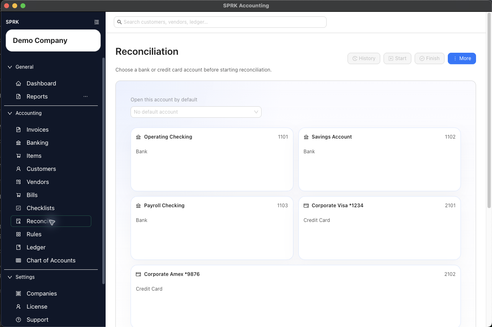

# Create a Starting Balance

<!-- Screenshot status: Review needed -->

Choose how a new bank or credit-card account should begin its first reconciliation: start it at zero, or use a journal entry to establish its opening balance.

<!-- Last validated against SPRK source: 2026-08-27 -->

## When to use this

Use this guide when you are setting up a company and need SPRK to recognize the first balance for a bank or credit account before regular reconciliation work begins.

## Before you start

- An active company is selected.
- The bank or credit account you want to reconcile already exists in the chart of accounts.
- You know whether the account truly opened at zero or already had a balance when SPRK began tracking it.
- If it already had a balance, you know the opening amount, date, and offset account your team approved.

## Steps

1. Open `Reconcile`, choose the bank or credit-card account, and select `Start`.
2. Under `How should this account start?`, choose one method:
   - `Start at $0 — New account` when the real account opened with no prior balance. Enter `Account opened on`; `Starting balance` remains $0.
   - `Use a Ledger Entry to establish the opening balance` when the account already had a balance.
3. For the ledger-entry method, select the correct `Opening balance journal entry`. If it does not exist, use `Create Opening Balance`, create a balanced entry with this account and the approved offset account, then return to the picker.
4. Enter the statement ending date and balance shown by your statement when those fields are available.
5. Review the account, dates, and amount, then continue with the visible reconciliation action.

## What happens next

SPRK creates the first reconciliation anchor for that account using the method you chose.

- `Start at $0 — New account` creates a nonposting zero-balance anchor. It does not create a journal entry.
- The ledger-entry method uses the selected posted entry without creating a duplicate posting.
- Pending imported bank activity remains available for later Banking review whichever method you choose.
- Later reconciliation periods use the completed first period as their beginning-balance reference.

## If something looks wrong

| What You See | What To Check | What To Do Next |
|---|---|---|
| The journal entry does not appear in the picker | Whether it includes the same account selected in `Reconcile` | Correct the entry or select the matching account before continuing |
| `Starting balance` is locked at $0 | Whether `Start at $0 — New account` is selected | Choose the ledger-entry method if the account had a real opening balance |

## Related

- [Create your first company](./create-your-first-company.md)
- [Use the Import Wizard](./use-the-import-wizard.md)
- [Start a reconciliation](../reconciliation/start-a-reconciliation.md)
- [Record journal entries](../ledger-and-chart-of-accounts/record-journal-entries.md)
