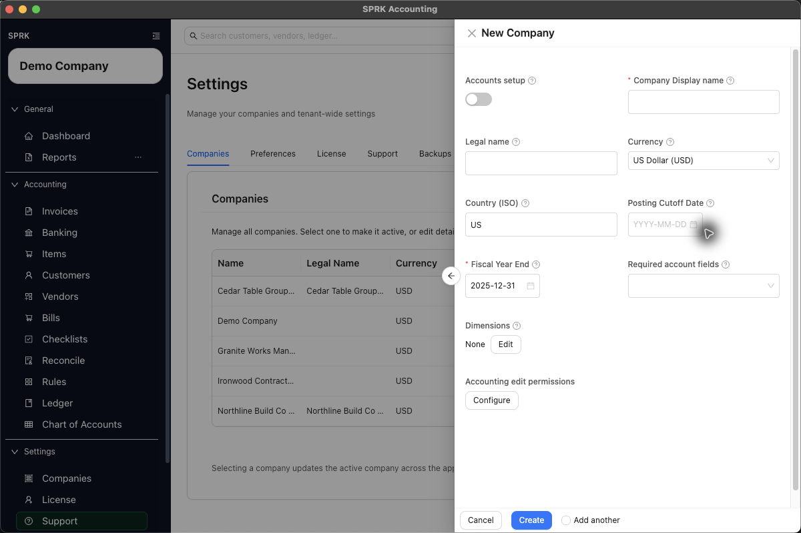
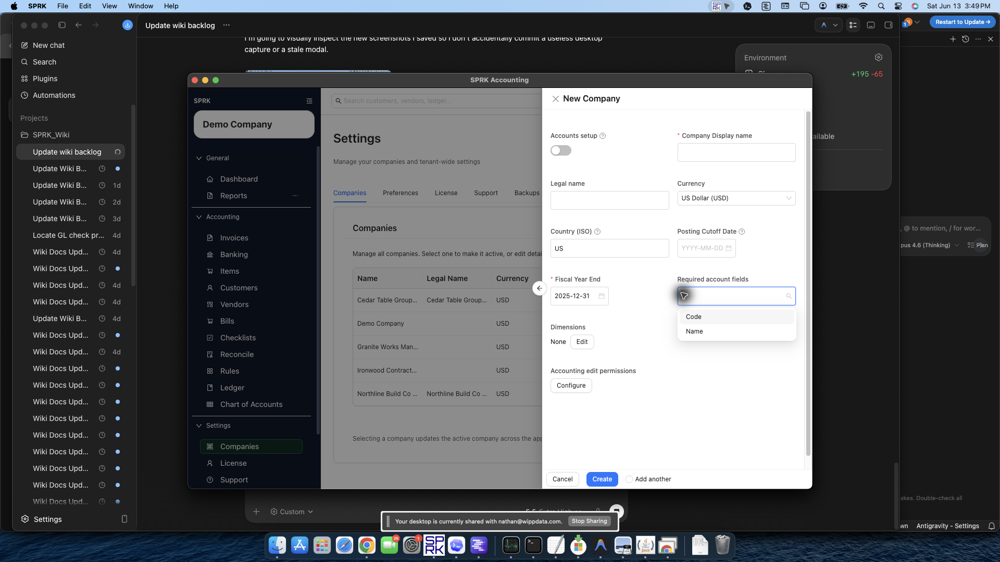
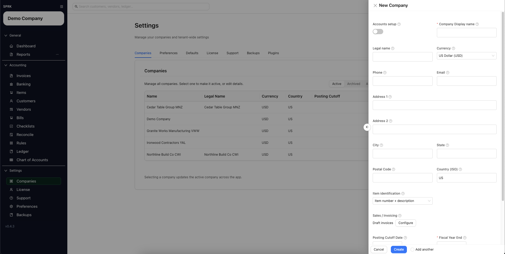

# Create Your First Company

Create a company from the Companies tab and set the core accounting options that SPRK uses for day-to-day work.

## When To Use This

Use this workflow when you want to start a new company in SPRK without importing it from another accounting system.

## Before You Start

- You can open `Settings` → `Companies`.
- You have permission to create a company in your current workspace.
- You know the company display name you want to use.
- You know whether you want SPRK to start with default accounts or a blank chart.

## Steps

1. Open `Settings` → `Companies`.
2. Select `New Company`.
3. In the `New Company` drawer, complete the core fields:
   - `Company Display name` is required.
   - `Legal name` is optional if it is different from the display name.
   - `Currency` sets the default reporting currency.
   - `Country (ISO)` is the two-letter country code shown in the form, such as `US`.
4. Leave `Accounts setup` turned on if you want SPRK to seed default accounts. Turn it off only if you want to start with a blank chart.
5. Review optional accounting settings if they matter for your rollout:
   - `Posting Cutoff Date`
   - `Fiscal Year End`
   - `Required account fields`
   - `Dimensions`
   - `Default Accounts Receivable`
   - `Default Accounts Payable`
   - `Item identification`, if the form exposes item-label presentation
6. Review `Accounting edit permissions` before creating the company.
   - Workspace or tenant defaults can prefill accounting edit policies when those defaults exist.
   - Explicit choices you make in the company drawer override those defaults for the new company.
   - If the form exposes `Control accounts`, use it for accounts that should be posted through their source workflow instead of new manual journals.
   - Tenant defaults are managed from `Settings` -> `Defaults`; saving a different value in the new-company drawer controls the new company.
7. Use `Required account fields` to decide whether account codes are required in visible account setup.
   - Choosing `Name` only can make account-code columns and code-first labels disappear from the `Chart of Accounts`, bank-account choosers, reconcile account selectors, and account dropdowns that otherwise show `code · name`.
   - When `Name` only is active, account pickers sort and label by account name instead of code-first display strings.
8. For date fields such as `Posting Cutoff Date` and `Fiscal Year End`, you can use the visible calendar control or type a date directly. Typed dates should follow your saved `Preferences` date order; SPRK normalizes accepted entries to the selected display format.
9. If `Item identification` is available, choose how supported item labels should appear:
   - `Item number + description` shows item numbers beside descriptions where supported.
   - `Description only` hides item numbers in supported item and invoice workflows without deleting the saved item numbers.
10. Select `Create`.
11. Confirm that the new company appears in the companies list and becomes the active company after creation.
12. After the company exists, review `Sales / Invoicing` settings if the company will send invoices:
   - `Default invoice payment terms` can seed new invoice terms and due dates.
   - `New invoice workflow` can start new invoices as `Draft` or `Open`.
   - Company contact fields and `Payment Instructions` can appear on printed customer invoices.

## What Happens Next

The new company is added to the `Companies` table and becomes available as the active company across the app.

## If Something Looks Wrong

- Leaving `Company Display name` blank. The create action is not meant to succeed without it.
- Turning off `Accounts setup` without planning how the chart of accounts will be created afterward.
- Setting the wrong `Country (ISO)` format. Use the short country code shown by the product, not the full country name.
- Typing setup dates in an order that does not match your saved date-format preference.
- Ignoring default receivable or payable account settings when your team needs invoices or bills immediately after setup.
- Treating missing account codes in lists as missing data when the company is configured for name-only account presentation.
- Treating hidden item numbers as missing item data when the company is configured for `Description only` item identification.
- Forgetting to review `Sales / Invoicing` before the first invoice if your firm wants standard terms or draft/open defaults.
- Selecting control accounts without telling journal-entry users why those accounts disappear from new manual journal account choices.

## Related

- [Import from QuickBooks Online ZIP](./import-from-quickbooks-online-zip.md)
- [Import from QuickBooks Desktop IIF](./import-from-quickbooks-desktop-iif.md)
- [Use the Import Wizard](./use-the-import-wizard.md)
- [Copying an existing company](./copying-an-existing-company.md)
- [Switch between companies](./switch-between-companies.md)
- [Use the Companies tab](../company-administration/use-the-companies-tab.md)
- [Manage default company settings](../company-administration/manage-default-company-settings.md)
- [Record journal entries](../ledger-and-chart-of-accounts/record-journal-entries.md)
- [Use the Preferences tab](../preferences-and-personalization/use-the-preferences-tab.md)
