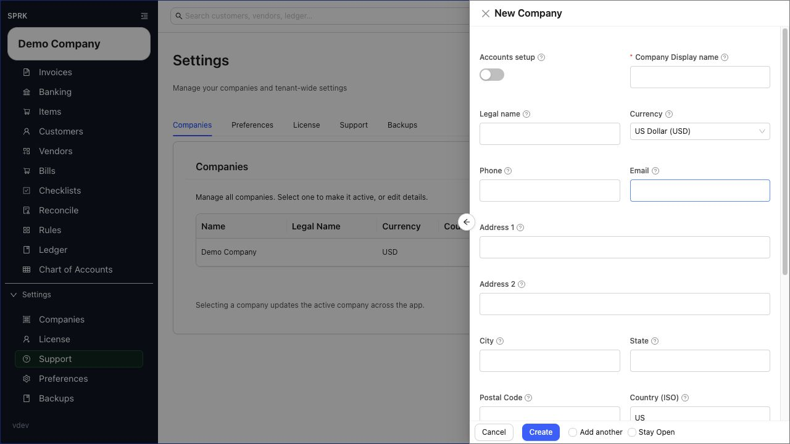
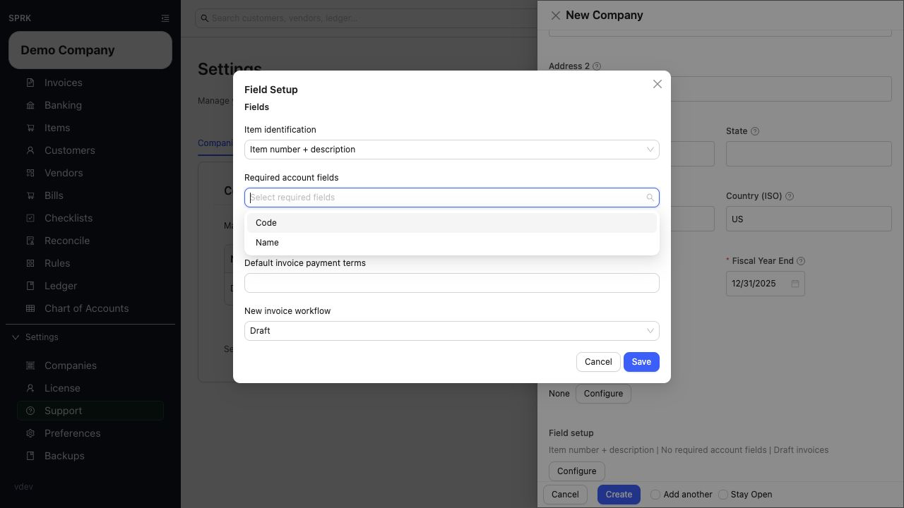
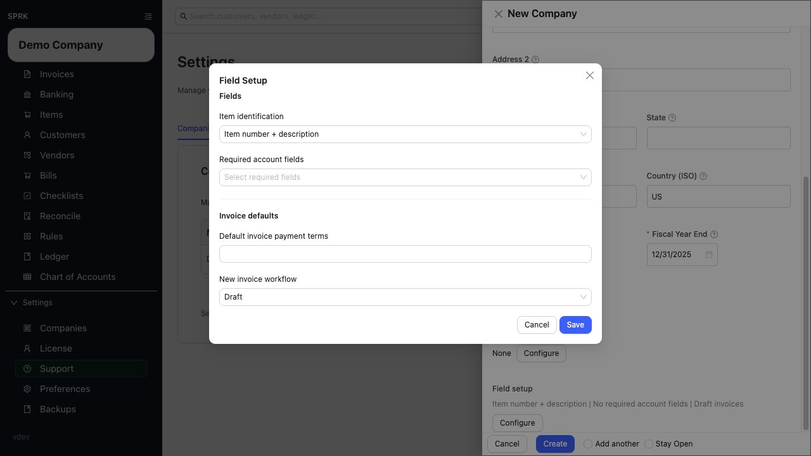

# Create Your First Company

Create a company from the Companies tab and set the core accounting options that SPRK uses for day-to-day work.

<!-- Last validated against SPRK source: 2026-08-27 -->

## When To Use This

Use this workflow when you want to start a new company in SPRK without importing it from another accounting system.

## Before You Start

- You can open `Companies` from the left sidebar.
- You have permission to create a company in your current workspace.
- You know the company display name you want to use.
- You know whether you want SPRK to start with default accounts or a blank chart.

## Steps

1. Open `Companies` from the left sidebar.
2. Select `New Company`.
3. In the `New Company` drawer, complete the core fields:
   - `Company Display name` is required.
   - `Legal name` is optional if it is different from the display name.
   - `Currency` sets the default reporting currency.
   - `Country (ISO)` is the two-letter country code shown in the form, such as `US`.
4. `Accounts setup` starts turned off, which creates a blank chart. Turn it on if you want SPRK to seed default accounts.
5. Select `Configure` beside `Field setup`, then review:
   - `Required account fields`
   - `Item identification`
   - `Default invoice payment terms`
   - `New invoice workflow`
6. Review the other accounting settings that matter for your company:
   - `Posting Cutoff Date`
   - `Fiscal Year End`
   - `Dimensions`
7. Review `Accounting edit permissions` before creating the company.
   - Workspace or tenant defaults can prefill accounting edit policies when those defaults exist.
   - Explicit choices you make in the company drawer override those defaults for the new company.
   - If the form exposes `Control accounts`, use it for accounts that should be posted through their source workflow instead of new manual journals.
   - Tenant defaults are managed from `Defaults`; saving a different value in the new-company drawer controls the new company.
8. Use `Required account fields` to decide whether account codes are required in visible account setup.
   - Choosing `Name` only can make account-code columns and code-first labels disappear from the `Chart of Accounts`, bank-account choosers, reconcile account selectors, and account dropdowns that otherwise show `code · name`.
   - When `Name` only is active, account pickers sort and label by account name instead of code-first display strings.
9. For date fields such as `Posting Cutoff Date` and `Fiscal Year End`, you can use the visible calendar control or type a date directly. Typed dates should follow your saved `Preferences` date order.
10. Under `Item identification`, choose how supported item labels should appear:
   - `Item number + description` shows item numbers beside descriptions where supported.
   - `Description only` hides item numbers in supported item and invoice workflows without deleting the saved item numbers.
11. Select `Create`.
12. Confirm that `Company created` appears and the new company becomes active.
13. If the company will use invoices or bills, reopen it from `Companies` and select `Edit`. Under `Field setup`, select `Configure` and set `Default Accounts Receivable` and `Default Accounts Payable`. These account defaults are available after creation, not in the new-company form.
14. Review printed-invoice details such as company contact fields and `Payment Instructions` after the company exists.

## What Happens Next

The new company is added to the `Companies` table and becomes available as the active company across the app.

## If Something Looks Wrong

| What You See | What To Check | What To Do Next |
|---|---|---|
| A required value or review step is missing | Leaving `Company Display name` blank | The create action is not meant to succeed without it |
| No default receivable or payable fields appear during creation | Whether the company has been created yet | Create the company, reopen `Edit`, then use `Field setup` > `Configure` |
| New invoices use the wrong terms or starting status | `Default invoice payment terms` and `New invoice workflow` in `Field setup` | Edit those defaults before creating the next invoice |

## Related

- [Import from QuickBooks Online ZIP](./import-from-quickbooks-online-zip.md)
- [Import from QuickBooks Desktop IIF](./import-from-quickbooks-desktop-iif.md)
- [Use the Import Wizard](./use-the-import-wizard.md)
- [Copying an existing company](./copying-an-existing-company.md)
- [Switch between companies](./switch-between-companies.md)
- [Use the Companies tab](../company-administration/use-the-companies-tab.md)
- [Manage default company settings](../company-administration/manage-default-company-settings.md)
- [Record journal entries](../ledger-and-chart-of-accounts/record-journal-entries.md)
- [Use the Preferences tab](../preferences-and-personalization/use-the-preferences-tab.md)
