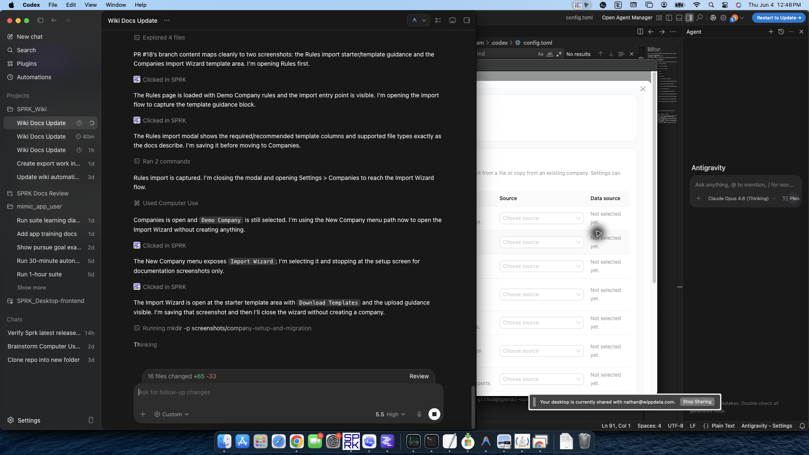

# Import from QuickBooks Online ZIP

<!-- Screenshot status: Review needed -->

Create a company in SPRK by importing a QuickBooks Online ZIP export from the Companies page.

## When to use this

Use this guide when you already exported company data from QuickBooks Online and want SPRK to create or import the company from that ZIP package.

## Before you start

- You can open `Companies` from the left sidebar.
- You have a QuickBooks Online export saved as a `.zip` file.
- You have room to create another company in your workspace.

## Steps

1. Open `Companies` from the left sidebar.
2. Open the menu attached to `New Company`.
3. Select `Import from QBO (ZIP)`.
4. In the file picker, choose the QuickBooks Online `.zip` export.
5. Wait for SPRK to finish the import and refresh the companies list.
6. Confirm that the imported company appears in the `Companies` table.
7. If needed, select the new company so it becomes the active company across the app.
8. Review imported records before moving into daily work, especially chart of accounts, customers, and vendors.

## What happens next

SPRK imports the QuickBooks Online ZIP and adds the imported company to the companies list.

## Related

- [Create your first company](./create-your-first-company.md)
- [Import from QuickBooks Desktop IIF](./import-from-quickbooks-desktop-iif.md)
- [Use the Import Wizard](./use-the-import-wizard.md)
- [Switch between companies](./switch-between-companies.md)
