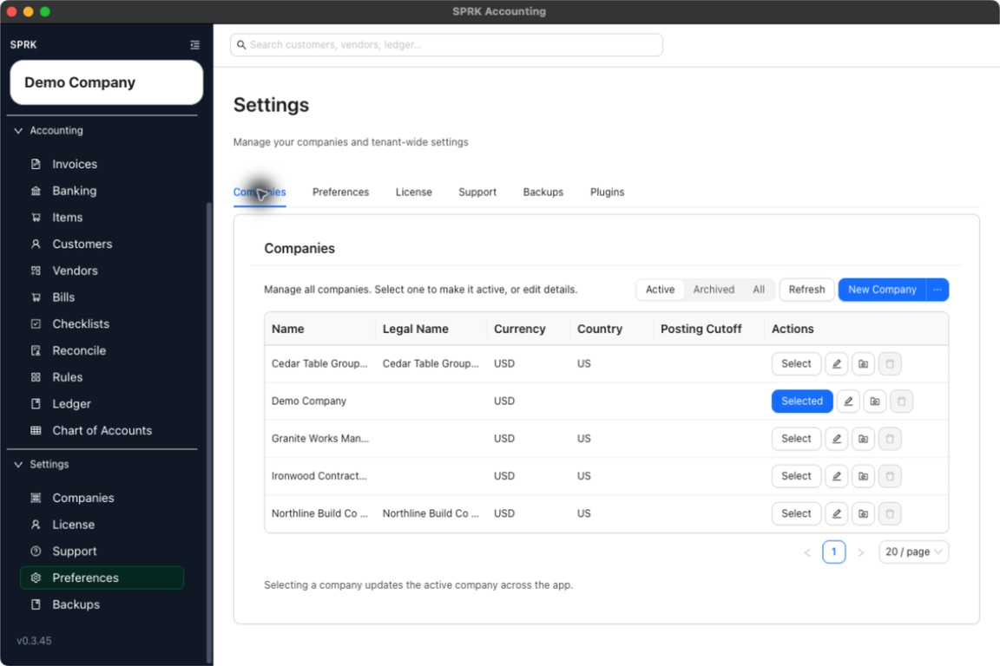

# Switch Between Companies and Confirm the Active Company

Change the active company from the Companies page so the rest of SPRK uses the company you intend to work in.

## When To Use This

Use this workflow when you need to move from one SPRK company to another without signing out, or when you want to verify the active company before creating records.

## Before You Start

- You can open `Settings` → `Companies`.
- More than one company is available in your workspace if you plan to switch.

## Steps

1. Open `Settings` → `Companies`.
2. Find the company you want to work in.
3. Select `Select` in that company’s row.
4. Confirm that the button changes to `Selected`.
5. Check the active company shown in the sidebar before entering transactions, importing data, or editing records.
6. Move to any working page in the app and verify you are now operating in the intended company.

## What Happens Next

The selected company becomes the active company across the app. New records, imports, reports, and settings work use that company until you switch again.

## If Something Looks Wrong

- Assuming opening the row is enough. You need to use the `Select` action to make a company active.
- Forgetting to verify the active company before creating transactions or editing records.
- Switching companies during setup work and then continuing in the wrong company by accident.
- Assuming another browser window or session is using the same company without checking its own visible sidebar.

## Related

- [Create your first company](./create-your-first-company.md)
- [Import from QuickBooks Online ZIP](./import-from-quickbooks-online-zip.md)
- [Import from QuickBooks Desktop IIF](./import-from-quickbooks-desktop-iif.md)
- [Use the Import Wizard](./use-the-import-wizard.md)
