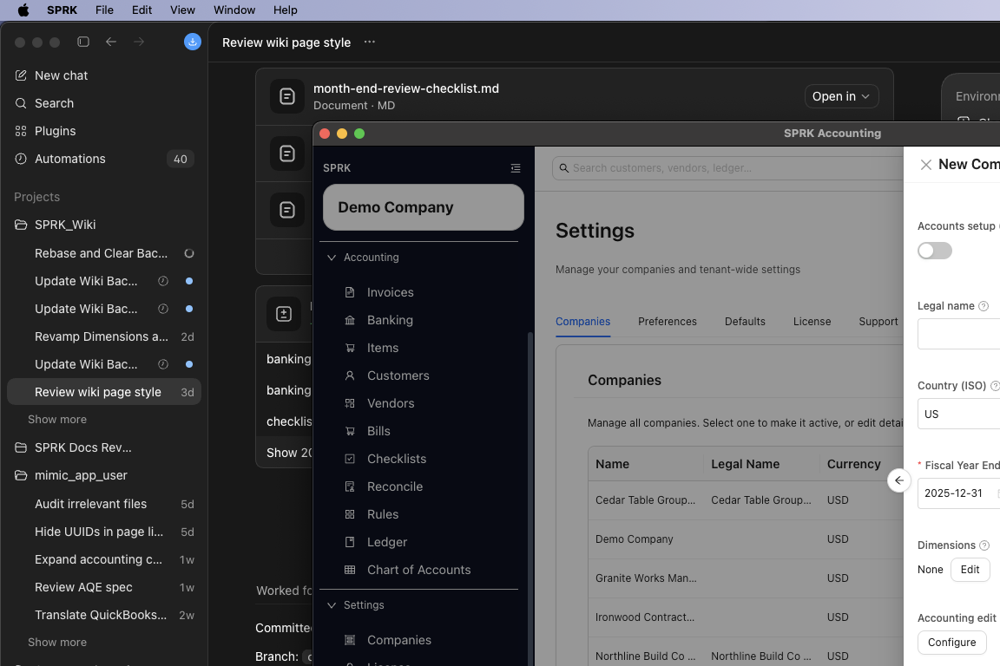
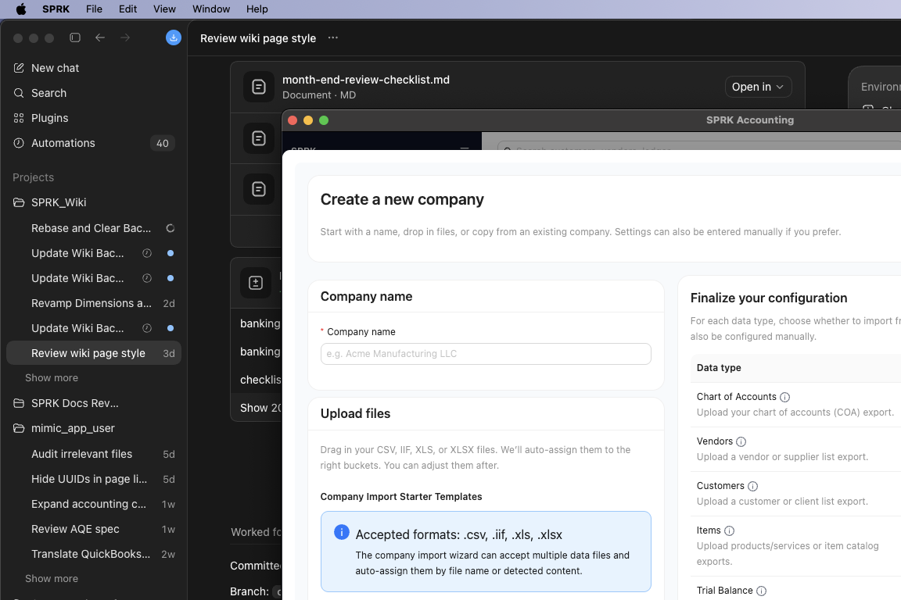

# Use the Import Wizard

Build a new company from uploaded files, copied data, and manual settings when a simple one-file import is not enough.

## When To Use This

Use the Import Wizard when your migration spans multiple files or when you want to mix uploaded files, copied data from an existing company, and manual settings in one guided flow.

## Before You Start

- You can open `Settings` → `Companies`.
- You know the new company name you want to create.
- If you plan to upload files, they are ready in supported formats such as CSV, IIF, XLS, or XLSX.
- If you plan to copy data from an existing company, that company already exists in SPRK.

## Steps

1. Open `Settings` → `Companies`.
2. Open the menu attached to `New Company`.
3. Select `Import Wizard`.
4. Enter the new `Company name`.
5. Add files in the `Upload files` step if you are importing source files.
   - Use `Download Templates` when you want starter file layouts before preparing uploads.
   - The wizard can accept multiple files in the same run.
   - After files are added, review how SPRK auto-assigns each file before continuing.
6. If you want to reuse existing SPRK data, choose an `Existing company (optional)` as the default copy source.
7. In `Finalize your configuration`, choose a source for each data type:
   - file upload
   - existing company
   - manual settings, where offered
8. Review the data types carefully. Common categories include accounts, customers, vendors, items, trial balance, journal entries, invoices, bills, payments, and settings.
9. Select `Review & Create Company`.
10. On the confirmation step, verify the files and sources that will be used.
11. Create the company and wait for the wizard to finish.
12. Review the new company before using it for live work.

## What Happens Next

SPRK creates a new company using the combination of files, copied data, and settings you selected in the wizard.

## If Something Looks Wrong

- Starting the wizard without a company name. The review action is disabled until a name is entered.
- Skipping the starter templates and then uploading files that do not match the expected columns.
- Uploading operational files such as invoices or bills without also bringing in foundation data like a chart of accounts or a trial balance.
- Assuming the wizard’s auto-assignment is final. Review each data type before creating the company.
- Forgetting that settings can be entered manually if no source file exists for them.

## Business Scenario: First Client Import Wizard Setup

Use this scenario to train staff on starting a new client company from the Companies page, downloading starter templates, and assigning uploaded files to the right data types before creating the company.

- Sample file: [24-first-client-import-wizard-templates.csv](../sample-files/v1-validation/24-first-client-import-wizard-templates.csv)
- Evidence:

The walkthrough opened the wizard from `Settings` -> `Companies` and stopped before creating a new company.

## Related

- [Create your first company](./create-your-first-company.md)
- [Import from QuickBooks Online ZIP](./import-from-quickbooks-online-zip.md)
- [Import from QuickBooks Desktop IIF](./import-from-quickbooks-desktop-iif.md)
- [Switch between companies](./switch-between-companies.md)
