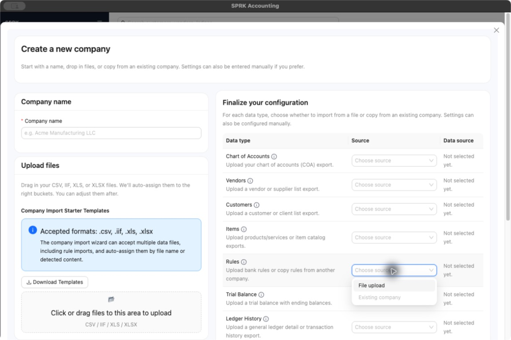
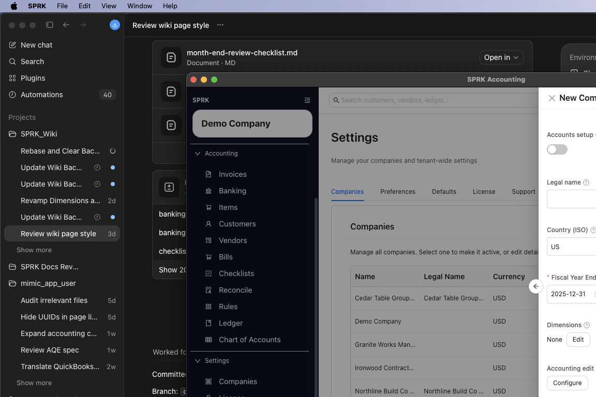
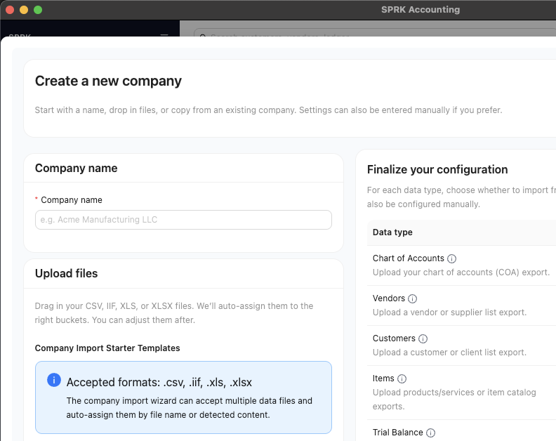

# Use the Import Wizard

<!-- Last validated: 2026-07-15 (SPRK 0.4.10, Demo Company) -->
<!-- Screenshot status: Current; Rules data type and source choices captured 2026-07-15 -->

Build a new company from uploaded files, copied data, and manual settings when a simple one-file import is not enough.

## When To Use This

Use the Import Wizard when your migration spans multiple files or when you want to mix uploaded files, copied data from an existing company, and manual settings in one guided flow.

If your main goal is to clone, copy, or duplicate an existing SPRK company, start with [Copying an existing company](./copying-an-existing-company.md) for the focused version of this workflow.

## Before You Start

- You can open `Companies` from the left sidebar.
- You know the new company name you want to create.
- If you plan to upload files, they are ready in supported formats such as CSV, IIF, XLS, or XLSX.
- If you plan to copy data from an existing company, that company already exists in SPRK.

## Steps

1. Open `Companies` from the left sidebar.
2. Open the menu attached to `New Company`.
3. Select `Import Wizard`.
4. Enter the new `Company name`.
5. Add files in the `Upload files` step if you are importing source files.
   - Use `Download Templates` when you want starter file layouts before preparing uploads.
   - The wizard can accept multiple files in the same run.
   - After files are added, review how SPRK auto-assigns each file before continuing.
6. If you want to reuse existing SPRK data, choose an `Existing company (optional)` as the default copy source.
7. In `Finalize your configuration`, choose a source for each data type:
   - `File upload`
   - `Existing company`, after you choose an `Existing company (optional)` source
   - manual settings, where offered
8. Review the data types carefully. Current categories include `Chart of Accounts`, `Vendors`, `Customers`, `Items`, `Rules`, `Trial Balance`, `Ledger History`, `Journal Entries`, `Invoices`, `Bills`, `Payments`, and `Settings`.
   - For `Rules`, use `File upload` to bring in a rules file assigned to that slot.
   - Use `Existing company` to copy rules from the selected SPRK source company.
   - If `Existing company` is disabled, choose the optional source company first.
9. Select `Review & Create Company`.
10. On the confirmation step, verify the files and sources that will be used.
11. Create the company and wait for the wizard to finish.
12. Review the new company before using it for live work.

## What Happens Next

SPRK creates a new company using the combination of files, copied data, and settings you selected in the wizard.

## If Something Looks Wrong

| What You See | What To Check | What To Do Next |
|---|---|---|
| `Existing company` is unavailable for `Rules` | No `Existing company (optional)` source has been selected | Choose the source company, then return to the `Rules` row and select `Existing company` |

## Practice And Examples

Use the practice file and screenshots to review the new-company drawer, starter templates, accepted formats, and data-type source slots before creating a company.

- Practice file: [first-client-import-wizard-templates.csv](../sample-files/practice/first-client-import-wizard-templates.csv)

Review the assigned data types before creating the company.

## Related

- [Create your first company](./create-your-first-company.md)
- [Copying an existing company](./copying-an-existing-company.md)
- [Import from QuickBooks Online ZIP](./import-from-quickbooks-online-zip.md)
- [Import from QuickBooks Desktop IIF](./import-from-quickbooks-desktop-iif.md)
- [Switch between companies](./switch-between-companies.md)
