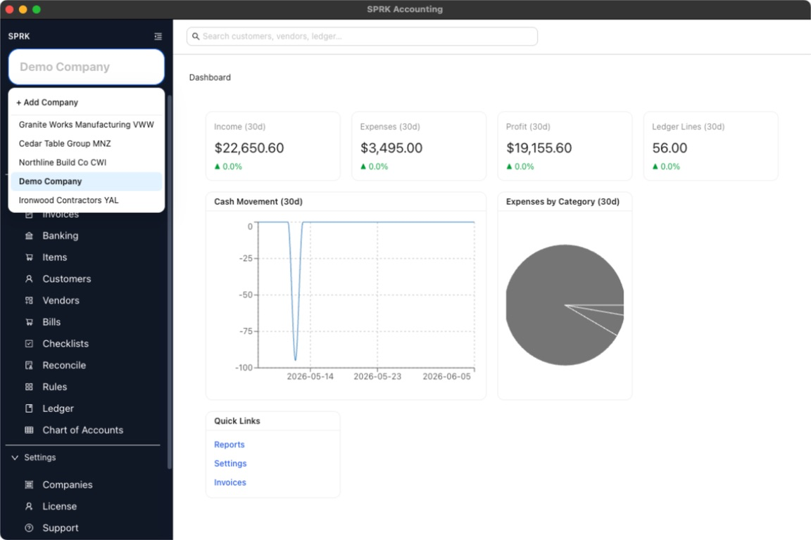

# Understand Company-Aware Navigation

Learn how the active company affects what you see as you move through SPRK and how to avoid working in the wrong company.

## Purpose

Use this article when you want to understand why navigation results can change based on the active company and how to verify you are working in the right place.

## Prerequisites

- More than one company exists in your SPRK workspace, or you expect to switch companies over time.

## Steps

1. Check the company selector at the top of the sidebar before starting work.
2. Treat the selected company as the active context for the rest of the app.
3. Before entering transactions, running reports, or using search, confirm the company shown in the sidebar is correct.
4. If you need a different company, switch it from the company selector or from `Settings` → `Companies`.
5. After switching, reopen the page you care about if you want to confirm that the data now reflects the new active company.

## Expected Result

You understand that pages, search results, dashboard data, and accounting workflows all follow the active company shown in the sidebar.

## Common Mistakes

- Running a search or report without checking the active company first.
- Assuming a page remembers a different company than the one shown in the sidebar.
- Treating company switching as a page-level filter instead of an app-wide context change.

## Related Articles

- [Move between major app areas](./move-between-major-app-areas.md)
- [Use global search](./use-global-search.md)
- [Switch between companies](../company-setup-and-migration/switch-between-companies.md)
- [Understand active company behavior](../company-administration/understand-active-company-behavior.md)

## Info

- App sections: `dashboard`, `companies`
- Last validated: 2026-05-01
- Screenshot status: `captured`
