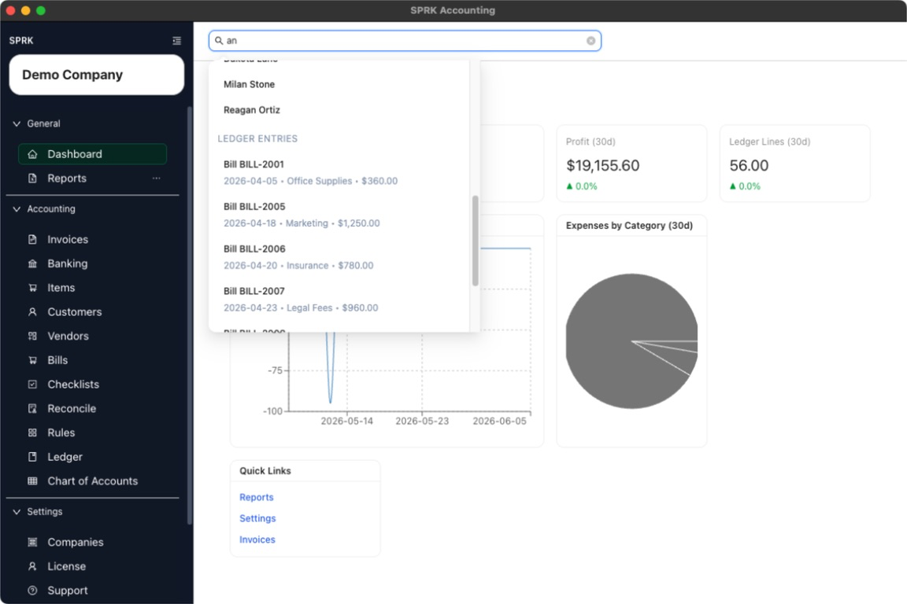

# Use Global Search

<!-- Screenshot status: Review needed -->

Search across customers, vendors, and ledger entries from the persistent search bar at the top of the app.

## When to use this

Use global search when you want to jump directly to a customer, vendor, or ledger result without browsing to the page first.

## Before you start

- An active company is selected.
- You can see the search field at the top of the app.

## Steps

1. Select the search field at the top of the app.
2. If you prefer the keyboard, press `/` to move focus to the search field when you are not already typing in another input.
3. Enter at least two characters from the record you want to find.
4. Review the grouped results returned by the search. Current result groups are:
   - `Customers`
   - `Vendors`
   - `Ledger Entries`
5. Use the arrow keys to move through the results if you are navigating by keyboard.
6. Press `Enter` to open the highlighted result, or click the result directly.
7. Press `Escape` if you want to close the open search result list.

## What happens next

Search results open the page that matches the result type:

- customer results route to `Customers`
- vendor results route to `Vendors`
- ledger results route to `Ledger`

When possible, SPRK also carries the selected result into that page as a prefilled search or filter.

## Related

- [Move between major app areas](./move-between-major-app-areas.md)
- [Understand company-aware navigation](./understand-company-aware-navigation.md)
- [Understand the dashboard overview](./understand-the-dashboard-overview.md)
