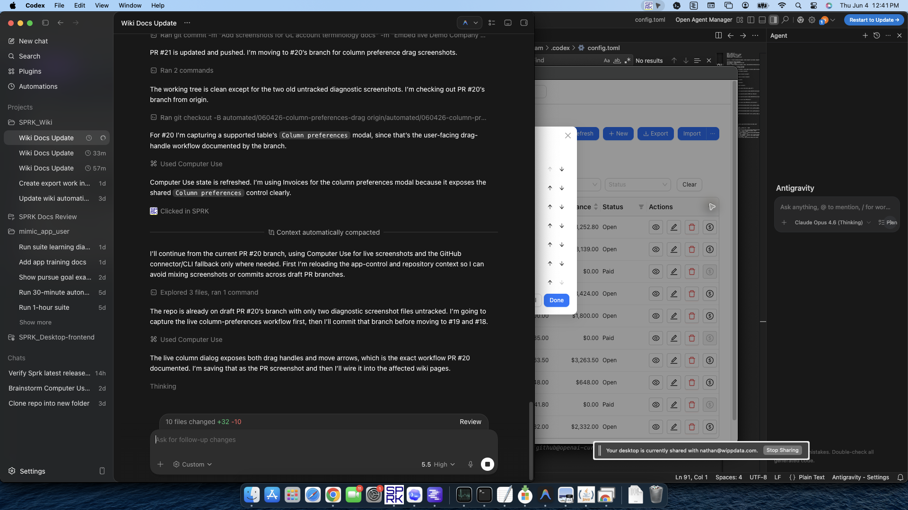

# Use Grid Edit for Bulk Record Maintenance

Use Grid Edit when you need to clean up repeated list data faster than opening one drawer at a time.

## Purpose

Use this workflow when you want to make the same kind of change across several records, especially after an import or during list cleanup.

## Prerequisites

- You can open a supported list page such as `Items`.
- The active company shown in the sidebar is the company you intend to review before you make changes.
- You understand which fields should be reviewed carefully before applying bulk edits.

## Steps

1. Open a supported list page such as `Items`.
2. Choose how you want the page to open:
   - Use `Preferences` if you want supported pages to start in Grid Edit mode automatically.
   - Or open the page normally and use the page's `More` menu to enable Grid Edit when needed.
3. Review the table before editing:
   - Confirm you are on the correct list page.
   - Confirm the visible columns match the fields you want to review.
4. Click directly into the cells you want to update.
5. Make the repeated edits you need across the grid.
6. Watch the changed-cell counter while you work so you know whether there are unapplied edits.
7. Review the edited cells before you continue.
8. Select `Apply Changes` only after the grid reflects the final values you intend to keep.
9. If you want to change which columns stay visible or where they appear, open `Column preferences`:
   - Turn optional columns on or off as needed.
   - Drag a column's reorder handle when you want to move it into place quickly.
   - Use the move-up and move-down controls when you prefer button controls or need a steadier one-step move.
   - Leave required columns visible when SPRK keeps them protected.
10. Use the page's `More` menu to leave Grid Edit mode when you want to return to the standard row-action view.

## Expected Result

You can review and apply repeated list updates from one table instead of opening each record individually. Current general ledger impact as of 2026-06-02:

- Entering or reviewing draft grid changes does not post to the general ledger by itself.
- Applying list edits updates the saved record data for that page, not a new journal-entry workflow.
- The accounting impact still depends on the fields and downstream workflows tied to the records you changed.

## Common Mistakes

- Using Grid Edit for broad cleanup without first confirming you are on the correct page and company context.
- Applying several edits at once without reviewing the changed-cell count and final cell values.
- Assuming every list page exposes the same columns or the same editing depth.
- Forgetting that column preferences affect how the list is displayed, not the underlying accounting logic.
- Assuming drag reordering is available on every table; use the visible `Column preferences` controls for the page you are on.

## Related Articles

- [Use the Preferences tab](../preferences-and-personalization/use-the-preferences-tab.md)
- [Understand personalization boundaries and saved behavior](../preferences-and-personalization/understand-personalization-boundaries-and-saved-behavior.md)
- [Manage items for invoicing](../sales-and-receivables/manage-items-for-invoicing.md)
- [Manage customers](../sales-and-receivables/manage-customers.md)
- [Manage vendors](../expenses-and-payables/manage-vendors.md)
- [Work with checks](../expenses-and-payables/work-with-checks.md)
- [Review and classify bank transactions](../banking-and-cash-management/review-and-classify-bank-transactions.md)

## Info

- App sections: `items`, `customers`, `vendors`, `checks`, `banking`, `preferences`
- Last validated: 2026-06-04
- Screenshot status: `captured`
