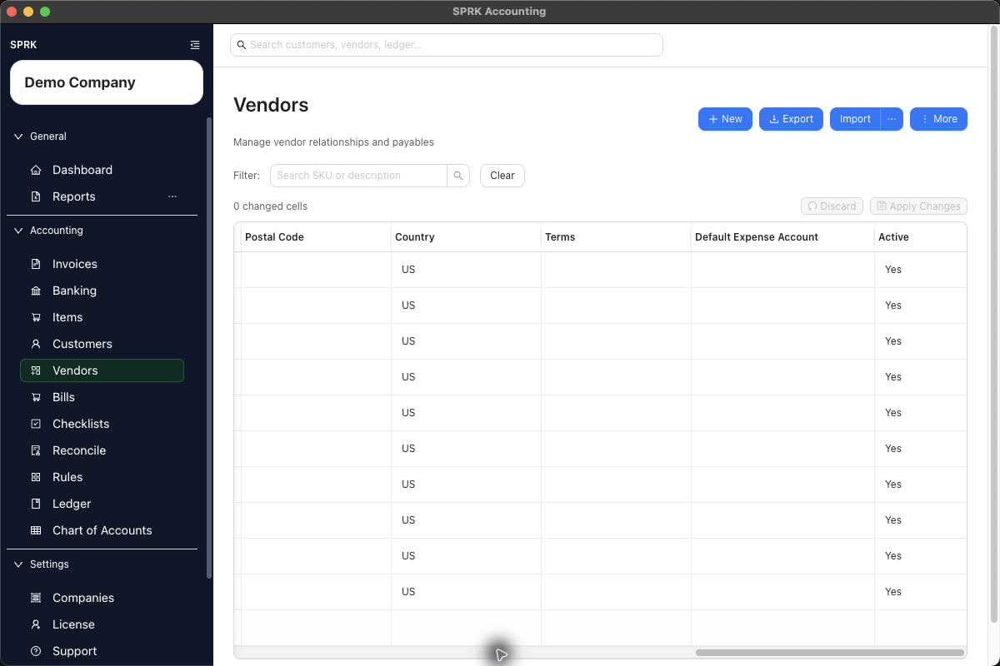

# Expenses and Payables

Set up vendors, enter bills, work with checks, and review accounts payable before reporting, including reusable vendor expense defaults.

## In This Section

- [Manage vendors](./manage-vendors.md)
- [AP review workflow](./ap-review-workflow.md)
- [Set up vendor default expense accounts](./set-up-vendor-default-expense-accounts.md)
- [Create and manage bills](./create-and-manage-bills.md)
- [Work with checks](./work-with-checks.md)
- [Review common payables workflows](./review-common-payables-workflows.md)
