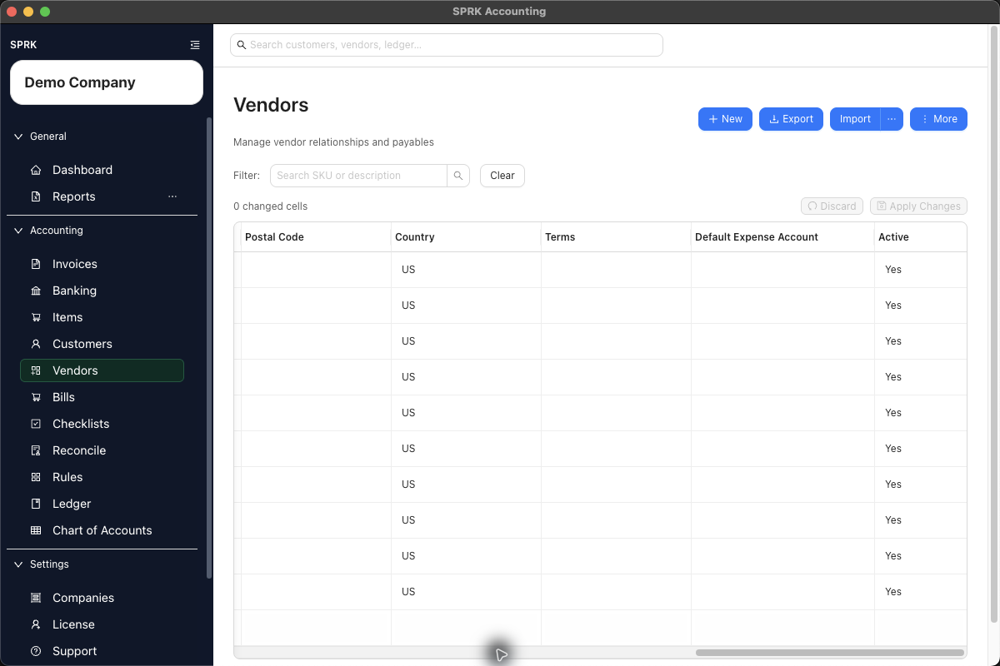

# Vendors, bills, and checks

Set up vendors, enter bills, record payments, and manage checks.

## Start here

- [Choose a bill task](./create-and-manage-bills.md)
- [Manage vendors](./manage-vendors.md)
- [Set vendor default expense accounts](./set-up-vendor-default-expense-accounts.md)

## Common tasks

- [Create a bill](./create-bills.md)
- [Record a bill payment](./record-bill-payments.md)
- [Work with checks](./work-with-checks.md)
- [Import bills](./import-bills.md)

## Review or fix something

- [Review bills and vendor balances](./ap-review-workflow.md)
- [Void or correct a bill](./void-or-correct-bills.md)
