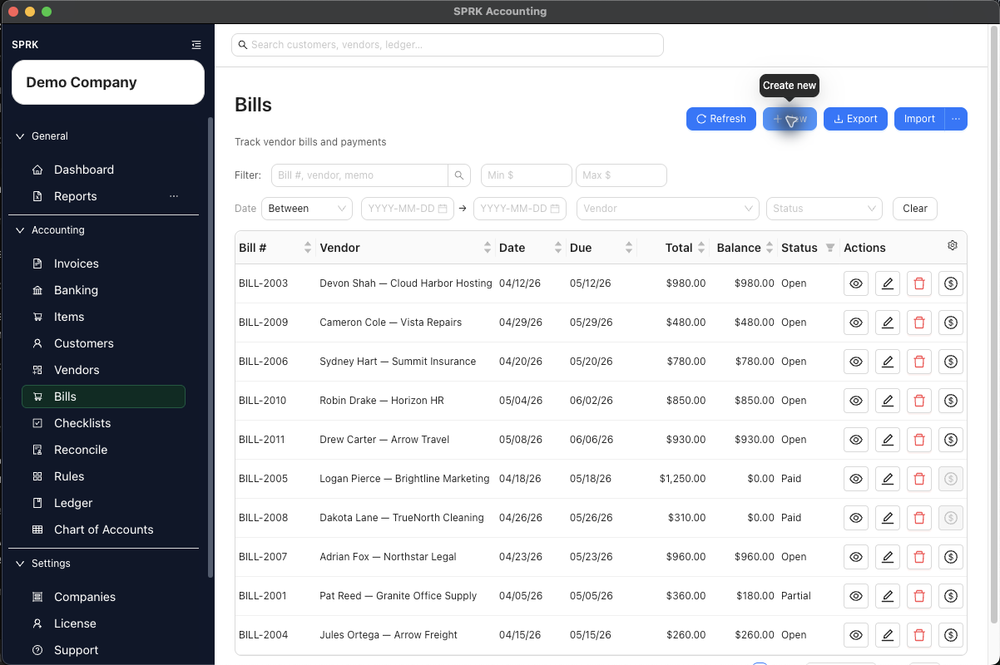

# Review Bills and Vendor Balances

<!-- Screenshot status: Review needed -->

Review vendor balances, unpaid bills, checks, payables aging, and expenses before reporting.

## When to use this

Use this review before month-end reporting, before paying vendors, or when payables or expense totals do not look right.

## Before you start

- The correct company is active.
- Vendor records are set up.
- Bills, checks, and vendor payments for the period have been entered.

## Steps

1. Review vendor records for duplicate or incomplete names.
2. Review vendor default expense accounts for recurring vendors.
3. Open the bills list and review open, paid, voided, or recently entered bills.
4. Confirm bills are coded to the right vendor, date, due date, expense account, and amount.
5. Review checks and payment records that should reduce vendor balances.
6. Run `Payables Aging` if available.
7. Run `Income Statement` and review expense totals for the period.
8. Run `General Ledger` or `Account Detail` when an expense or AP balance needs supporting detail.
9. Correct bill or payment issues in the payables workflow before using journal entries.
10. Use journal entries for accountant adjustments that do not belong to a vendor bill, check, or payment workflow.

## What happens next

AP review helps confirm that vendor balances, bill status, payment records, AP aging, and expense reporting agree before reports are finalized.

## If something looks wrong

| What You See | What To Check | What To Do Next |
|---|---|---|
| A vendor balance is being cleared with a journal entry | Whether bill payment status explains the balance | Review the bill and payment workflow before posting an adjustment |
| A bank withdrawal appears to prove a bill was paid | Whether the bill payment is recorded against the vendor bill | Match the bank activity only after the payable workflow is correct |
| Payables aging looks incomplete | Whether bills and payments have all been entered | Complete source activity before relying on the aging report |
| Vendor defaults are being applied broadly | Whether any purchases need a different expense account | Review unusual purchases before applying defaults |
| AP totals look wrong | Whether the active company is the one under review | Switch to the correct company before continuing |

## Related

- [Manage vendors](./manage-vendors.md)
- [Set up vendor default expense accounts](./set-up-vendor-default-expense-accounts.md)
- [Create and manage bills](./create-and-manage-bills.md)
- [Work with checks](./work-with-checks.md)
- [Review common payables workflows](./review-common-payables-workflows.md)
- [Review financial results inside the product](../reports-and-financial-review/review-financial-results-inside-the-product.md)
