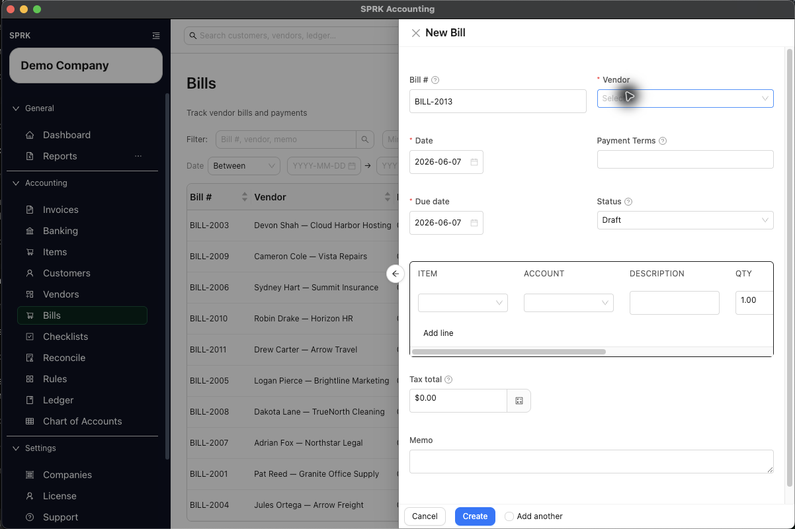

# Create and Manage Bills

Enter vendor bills, decide whether they stay in draft or post to Accounts Payable, and record bill payments from the Bills page.

## Purpose

Use this workflow when you need to enter a vendor bill, recognize the payable, and record payment against the bill from inside SPRK.

## Prerequisites

- A vendor record exists.
- The expense or other posting accounts for the bill lines are available.
- Your company has an Accounts Payable account configured.
- If you plan to record payment, the cash or bank account you want to pay from is available.

## Steps

1. Open `Bills`.
2. Select `New`.
3. Complete the bill header:
   - `Bill #`
   - `Vendor`
   - `Date`
   - `Due date`
   - `Status`
   - `Terms`, if needed
4. Add one or more bill lines.
5. For each line, choose the `Account` that should receive the expense or other debit.
6. Complete the line description, quantity, unit cost, and review the calculated amount.
7. Add `Tax total` or `Memo` if needed.
8. Decide how the bill should be saved:
   - `Draft` stores the bill without posting Accounts Payable.
   - `Open` stores the bill and posts the payable based on the current bills workflow.
9. Save the bill.
   - If you edit and save a bill that has already posted, SPRK can show `Save Posted Bill` before it changes the posting.
   - Review the available strategy before continuing: `Post adjustment journal entry`, `Reverse and repost`, or `Edit existing journal entry`.
   - Adjustment dates can use `Today`, `Original posting date`, or `Custom date`.
   - Reversal dates can use `Original posting date`, `Today`, or `Custom date`; repost dates can use `Document date`, `Today`, or `Custom date`.
10. Review the bill list to confirm the expected `Status`, `Total`, and `Balance`.
11. When you are ready to record payment, use the dollar action for the bill.
12. In `Record payment`, complete:
   - `Payment date`
   - `Amount`
   - `Paid from`
   - `Reference #`, if needed
   - `Memo`
13. Record the payment and confirm the updated balance and status in the bill list.

## Banking Match Path

When the vendor payment first appears as a pending money-out row in `Banking`, use `Match bank transaction` when available. SPRK can suggest open bills, show the candidate number, vendor, dates, open amount, bank amount, and difference, then use `Pay Bill & Confirm` or `Pay Partial & Confirm` when the bank amount is eligible. Overpayments are not actionable from that Banking match path.

## Expected Result

The bill is saved and appears in the bill list. Current general ledger impact as of 2026-05-02:

- Saving a bill as `Draft` does not post a journal entry.
- Saving a bill as `Open`, or updating a bill from a non-open status to `Open`, posts one recognition entry:
  - Debit each bill line `Account` for that line amount.
  - Credit `Accounts Payable` for the total bill amount.
- Recording a bill payment posts a separate payment entry:
  - Debit `Accounts Payable`.
  - Credit the selected `Paid from` account.
- Full payment changes the bill to `Paid`. A smaller payment leaves the bill as `Partial`.
- Saving changes to an already posted bill follows the posted-save strategy you choose when SPRK prompts. `Edit existing journal entry` can be unavailable when company policy or prior adjustment history does not allow it.

## Common Mistakes

- Leaving a bill in `Draft` when you expected the payable to post.
- Choosing the wrong expense account on the bill line and then assuming SPRK will correct the ledger impact later.
- Assuming a vendor default expense account replaces bill-line account review. Bill lines still need direct review before you open the bill.
- Recording a payment without checking the remaining balance first.
- Entering a payment amount larger than intended. Review overpayments carefully before recording them.
- Assuming delete or void behavior reverses prior ledger impact automatically. This article documents bill creation and payment behavior only.
- Treating `Save Posted Bill` as a routine draft save. It is an audit-sensitive choice about how SPRK should preserve or adjust the posted entry.

## Related Articles

- [Manage vendors](./manage-vendors.md)
- [Set up vendor default expense accounts](./set-up-vendor-default-expense-accounts.md)
- [Work with checks](./work-with-checks.md)
- [Review common payables workflows](./review-common-payables-workflows.md)

## Info

- App sections: `bills`
- Last validated: 2026-06-01
- Screenshot status: `captured`
