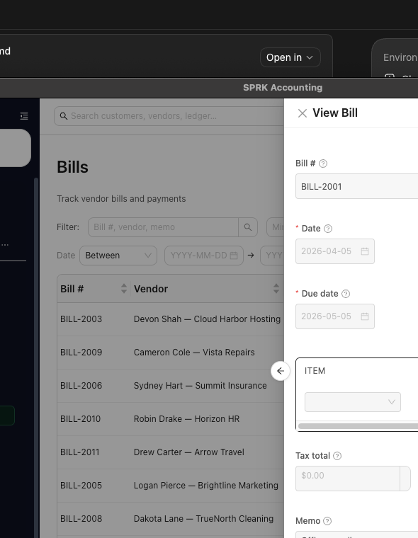
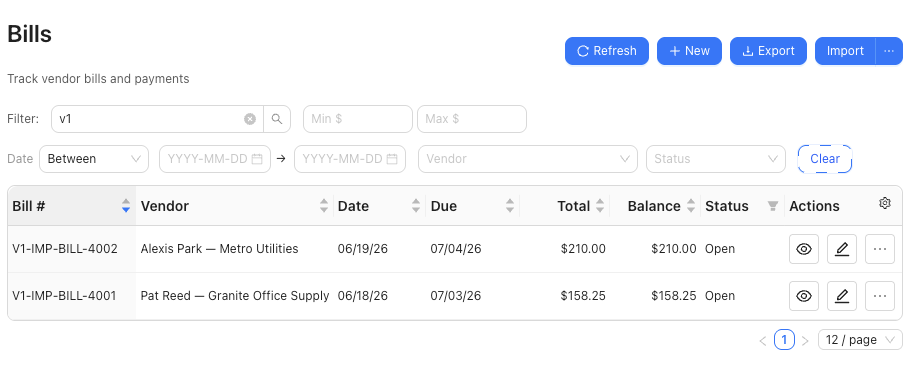

# Create and Manage Bills

Enter vendor bills, decide whether they stay in draft or post to Accounts Payable, and record bill payments from the Bills page.

## When To Use This

Use this workflow when you need to enter a vendor bill, recognize the payable, and record payment against the bill from inside SPRK.

## Before You Start

- A vendor record exists.
- The expense or other posting accounts for the bill lines are available.
- Your company has an Accounts Payable account configured.
- If you plan to record payment, the cash or bank account you want to pay from is available.

## Steps

1. Open `Bills`.
2. Select `New`.
3. Complete the bill header:
   - `Bill #`
   - `Vendor`
   - `Date`
   - `Due date`
   - `Status`
   - `Terms`, if needed
4. Add one or more bill lines.
5. For each line, choose the `Account` that should receive the expense or other debit.
6. Complete the line description, quantity, unit cost, and review the calculated amount.
7. Add `Tax total` or `Memo` if needed.
8. Decide how the bill should be saved:
   - `Draft` stores the bill without posting Accounts Payable.
   - `Open` stores the bill and posts the payable based on the current bills workflow.
9. Save the bill.
   - If you edit and save a bill that has already posted, SPRK can show `Save Posted Bill` before it changes the posting.
   - Review the available strategy before continuing: `Post adjustment journal entry`, `Reverse and repost`, or `Edit existing journal entry`.
   - Adjustment dates can use `Today`, `Original posting date`, or `Custom date`.
   - Reversal dates can use `Original posting date`, `Today`, or `Custom date`; repost dates can use `Document date`, `Today`, or `Custom date`.
10. Review the bill list to confirm the expected `Status`, `Total`, and `Balance`.
11. When you are ready to record payment, use the dollar action for the bill.
12. In `Record payment`, complete:
   - `Payment date`
   - `Amount`
   - `Paid from`
   - `Reference #`, if needed
   - `Memo`
13. Record the payment and confirm the updated balance and status in the bill list.
14. To review later, use the row action menu for `View payment history` or `View linked journal entries`.

## Available Bill Actions

The row action menu changes based on the bill's status, balance, and posting history. Use the visible actions on the bill row rather than assuming every bill supports the same correction path. Common actions include recording a payment, matching a payment, viewing linked journal entries, viewing payment history, voiding eligible posted bills, and deleting eligible draft records.

If you need to correct a posted bill or bill payment, prefer the supported correction action SPRK shows for that record. Do not delete a source record just to force the ledger to match.

## Void an Eligible Bill

Use `Void bill` when a posted bill should be reversed while preserving the original bill and posting history.

1. Open the bill row action menu.
2. Choose `Void bill` only when the action is enabled.
   - The action can appear on posted-like bills.
   - It is enabled only when the bill is still `Open` and its full balance still equals its total.
   - Draft, partial, paid, and already voided bills are not valid void targets.
3. In the `Void bill` modal, choose the void posting date:
   - `Today`
   - `Original bill date`
   - `Custom date`
4. Enter a reason.
5. Confirm `Void bill` after reviewing the bill and date.

## Banking Match Path

When the vendor payment first appears as a pending money-out row in `Banking`, use `Match bank transaction` when available. SPRK can suggest open bills, show the candidate number, vendor, dates, open amount, bank amount, and difference, then use `Pay Bill & Confirm` or `Pay Partial & Confirm` when the bank amount is eligible. Overpayments are not actionable from that Banking match path.

## What Happens Next

The bill is saved and appears in the bill list.

- Saving a bill as `Draft` does not post a journal entry.
- Saving a bill as `Open`, or updating a bill from a non-open status to `Open`, posts one recognition entry:
  - Debit each bill line `Account` for that line amount.
  - Credit `Accounts Payable` for the total bill amount.
- Recording a bill payment posts a separate payment entry:
  - Debit `Accounts Payable`.
  - Credit the selected `Paid from` account.
- Full payment changes the bill to `Paid`. A smaller payment leaves the bill as `Partial`.
- Saving changes to an already posted bill follows the posted-save strategy you choose when SPRK prompts. `Edit existing journal entry` can be unavailable when company policy or prior adjustment history does not allow it.
- Viewing payment history or linked journal entries does not post by itself.
- A successful `Void bill` posts a reversal journal entry, sets the bill status to `Void`, zeroes the bill balance, and records void details instead of deleting the bill.
- If a bill has active payments, SPRK blocks voiding or recognition-journal reversal until those payments are reversed or unapplied.
- Reversing a bill-payment journal through a supported source-document confirmation can deactivate the payment application and reopen the bill balance.

## If Something Looks Wrong

- Leaving a bill in `Draft` when you expected the payable to post.
- Choosing the wrong expense account on the bill line and then assuming SPRK will correct the ledger impact later.
- Assuming a vendor default expense account replaces bill-line account review. Bill lines still need direct review before you open the bill.
- Recording a payment without checking the remaining balance first.
- Entering a payment amount larger than intended. Review overpayments carefully before recording them.
- Assuming delete or correction behavior reverses prior ledger impact automatically. Review the visible action and its confirmation before continuing.
- Trying to delete a posted bill. Only draft bills with no posted ledger impact can be deleted; posted bills need void or correction workflows.
- Trying to void a partially paid or paid bill directly. Reverse or unapply active payments first.
- Treating `Save Posted Bill` as a routine draft save. It is an audit-sensitive choice about how SPRK should preserve or adjust the posted entry.

## Business Scenario: Bill Review, Payment Trail, And Grouped Import

Use this scenario to train staff on bill detail review, bill action menus, payment history, linked journals, and the grouped-line CSV import claim for vendor bills.

- Sample files:
  - [13-ap-vendor-bill-payment.csv](../sample-files/v1-validation/13-ap-vendor-bill-payment.csv)
  - [14-bill-import-grouped-lines.csv](../sample-files/v1-validation/14-bill-import-grouped-lines.csv)
- Evidence:

Validation note: the grouped bill import walkthrough passed in SPRK v0.3.57. The screenshot shows the two expected open bills created from [14-bill-import-grouped-lines.csv](../sample-files/v1-validation/14-bill-import-grouped-lines.csv).

## Related

- [Manage vendors](./manage-vendors.md)
- [Set up vendor default expense accounts](./set-up-vendor-default-expense-accounts.md)
- [Work with checks](./work-with-checks.md)
- [Review common payables workflows](./review-common-payables-workflows.md)
- [Review document payment history and linked journals](../ledger-and-chart-of-accounts/review-document-payment-history-and-linked-journals.md)
