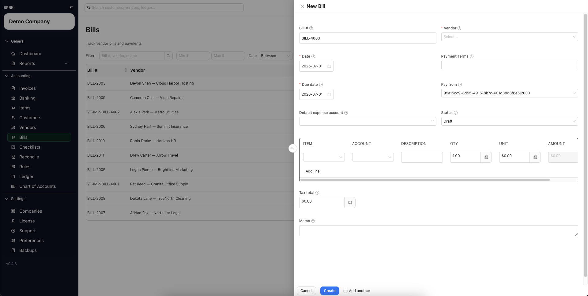

# Create a Bill

<!-- Screenshot status: Review needed -->

Enter a vendor bill and choose whether it should stay open or be recorded as paid now.

## When to use this

- You need to enter a vendor bill.
- You need the bill to stay in `Draft`, move to `Open`, or be recorded as paid immediately.
- You need to review vendor, due date, `Pay from`, and line accounts before saving.

## Before you start

- A vendor record exists.
- The expense or other posting accounts for the bill lines are available.
- You know whether `Pay from` should use an Accounts Payable control account or a cash, bank, or credit-card settlement account.
- If you plan to record payment later, the cash or bank account you want to pay from is available.

## Steps

1. Open `Bills`.
2. Select `New`.
3. Complete the bill header:
   - `Bill #`
   - `Vendor`
   - `Pay from`
   - `Default expense account`
   - `Date`
   - `Due date`
   - `Status`
   - `Terms`, if needed
4. Choose `Pay from` carefully:
   - Use an Accounts Payable control account when you will pay the vendor later.
   - Use a cash, bank, or credit-card settlement account only when the bill is being recorded as paid immediately.
   - These are two different choices: open payable or paid now.
5. Add one or more bill lines.
6. For each line, choose the `Account` that should receive the expense or other debit.
   - `Default expense account` fills blank line accounts when the drawer supports that fallback.
   - The line-level `Account` is the posting source for that line.
7. Complete the line description, quantity, unit cost, and review the calculated amount.
8. Add `Tax total` or `Memo` if needed.
9. Decide how the bill should be saved:
   - `Draft` stores the bill without posting Accounts Payable.
   - `Open` stores the bill and posts the payable when `Pay from` is an Accounts Payable control account.
   - Choosing a settlement account in `Pay from` can route the bill through the paid-now path instead of leaving an open payable.
10. Save the bill.
11. Review the bill list to confirm the expected `Status`, `Total`, and `Balance`.

## What Happens When You Save

- Saving a bill as `Draft` does not post a journal entry.
- Saving a bill as `Open`, or updating a bill from a non-open status to `Open`, posts the bill recognition entry when `Pay from` is an Accounts Payable control account.
- Saving a paid-now bill with a cash, bank, or credit-card settlement account in `Pay from` posts directly between the bill line accounts and that settlement account.
- Line-level `Account` values control the expense or debit side of the bill posting.

## If something looks wrong

| What You See | What To Check | What To Do Next |
|---|---|---|
| The bill stayed in `Draft` | Whether `Status` was set to `Draft` before saving | Edit the bill and choose the intended workflow status before saving again |
| The bill did not stay open as a payable | Whether `Pay from` used a settlement account instead of an Accounts Payable control account | Use the payables route when the vendor is still owed |
| The bill posts to the wrong expense account | Line-level `Account` values | Correct line accounts before saving or use a posted correction path if already posted |
| Vendor defaults seem to have chosen the account | The bill line accounts | Review every line account before opening the bill |
| A posted-save prompt appears | Whether the bill has already posted | Review the posted-save strategy before changing the bill |

## Related

- [Create and manage bills](./create-and-manage-bills.md)
- [Record bill payments](./record-bill-payments.md)
- [Void or correct bills](./void-or-correct-bills.md)
- [Manage vendors](./manage-vendors.md)
- [Set up vendor default expense accounts](./set-up-vendor-default-expense-accounts.md)
