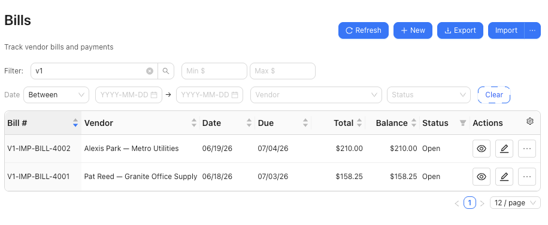

# Import Bills

Import grouped vendor bill rows from a spreadsheet or CSV after reviewing vendor, line, and account-routing details.

## When To Use This

- You already have grouped vendor bill rows in a spreadsheet or CSV.
- You want SPRK to create bill documents after preview.
- You need to review whether imported bills should stay open or be treated as paid-now.

## Before You Start

- Confirm the active company.
- Confirm vendors and line accounts are ready for the file.
- Review whether `Pay from` should route each bill to Accounts Payable or a settlement account.
- Keep the original file available until import results have been reviewed.

## Steps

1. Open the bill import path from `Bills`.
2. Choose the bill file.
3. Review the preview before confirming.
4. Check grouped document fields such as:
   - `Vendor Name`
   - `Due Date`
   - `Account ID`
   - `Memo`
   - `Status`
   - `Terms`
   - `Currency`
   - `Tax Total`
   - `Amount`
   - `Line Amount`
5. Review account-routing headers when the file includes them:
   - `Pay from`
   - `Default Expense Account`
   - `Line Account`
6. Confirm that each bill has a vendor, at least one line, valid line account details, positive quantities, and a non-duplicate bill number.
7. Confirm the import only after warnings and routing choices have been reviewed.

## What Happens When You Import

SPRK creates bill documents from grouped rows after preview. `Pay from` follows the same routing rule as the bill drawer: an Accounts Payable control account keeps the imported bill on the accrual path, while a non-control cash, bank, or credit-card settlement account imports as paid-now. `Default Expense Account` fills blank line accounts; `Line Account` remains the posting source of truth.

Imports that try to mix payables control routing and settlement-account routing for the same bill are rejected instead of silently guessing the posting path.

## If Something Looks Wrong

| What You See | What To Check | What To Do Next |
|---|---|---|
| The preview does not group lines as expected | Bill number, vendor, and line fields | Fix the file before confirming |
| The file leaves a vendor unresolved | Vendor name or vendor identifier in the file | Add or correct the vendor before import |
| A bill routes as paid-now | The `Pay from` account | Use an Accounts Payable control account when the bill should remain open |
| A line posts to the wrong account | `Line Account` and fallback `Default Expense Account` | Correct the account values before confirming |
| The import reports duplicate bill numbers | Existing bill numbers and file bill numbers | Resolve duplicate numbers before confirming |

## Practice And Examples

- Practice file: [bill-import-grouped-lines.csv](../sample-files/practice/bill-import-grouped-lines.csv)

The grouped-line import example shows open bills created from [bill-import-grouped-lines.csv](../sample-files/practice/bill-import-grouped-lines.csv).

## Related

- [Create bills](./create-bills.md)
- [Before you import](../company-setup-and-migration/before-you-import.md)
- [Manage vendors](./manage-vendors.md)
- [Set up vendor default expense accounts](./set-up-vendor-default-expense-accounts.md)
