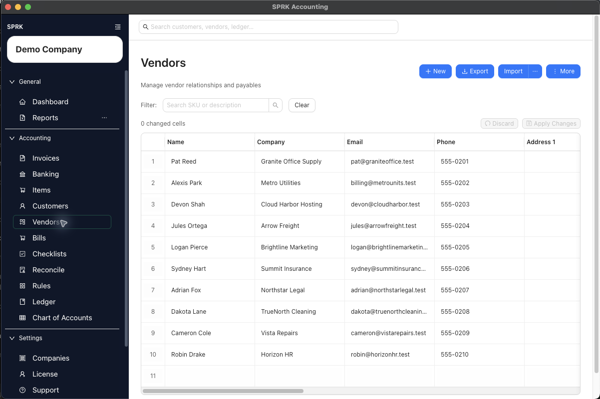

# Manage Vendors

Create and maintain vendor records so bills, checks, and vendor reporting use the right payee information.

## Purpose

Use this workflow when you need a clean vendor record before entering bills, printing or tracking checks, classifying repeat bank activity, or reviewing vendor-specific activity.

## Prerequisites

- You can open the `Vendors` page.
- You know the vendor name you want to use.
- If you plan to reuse an expense default later, you know which expense account should usually be associated with this vendor.

## Steps

1. Open `Vendors`.
2. Select `New` to create a vendor, use the row actions to view or edit an existing one, or use `More` > `Enable Grid Mode` when repeated vendor cleanup will be faster in a table.
3. Enter the vendor details that matter for your process:
   - `Name` is required.
   - `Company`, `Email`, and `Phone` support payables communication and lookup.
   - Address fields help complete the payee record when needed.
   - `Default Expense Account` can help supported check and banking workflows start from a reusable category.
   - `Active` controls whether the record stays available for normal use.
4. Save the vendor.
5. Use the Vendors page search when you need to find the record later by name, company, email, or phone.
6. If you import vendors, review any mapped default expense accounts before you rely on those records in live workflows.
7. Use the vendor row `Register` action when you need activity history tied to that vendor.
8. If you update several vendor fields at once, use Grid Edit or a saved Grid Edit default on supported pages to reduce repeated drawer work, then review the changed-cell count before selecting `Apply Changes`.

## Expected Result

The vendor is available for bill entry, check tracking, supported banking classification, and vendor lookup. Creating or editing a vendor record does not create a general ledger transaction by itself.

Clean, unique active vendor names also improve vendor-aware bank-import review when that workflow is available. Spreadsheet imports can resolve exact active vendor IDs and uniquely matched active vendor names during preview; unresolved imported names remain available for review or vendor creation from the import preview.

## Common Mistakes

- Skipping vendor setup and typing payee names differently across bills and checks.
- Treating Vendors as only a contact list. It also supports reusable setup defaults and vendor-level register review.
- Assuming a saved vendor default expense account automatically classifies every future payable workflow.
- Leaving common vendor names ambiguous and then expecting every bank import row to resolve automatically.
- Assuming vendor maintenance posts accounting activity. The vendor record is reference data until you enter a transaction such as a bill.

## Related Articles

- [Set up vendor default expense accounts](./set-up-vendor-default-expense-accounts.md)
- [Create and manage bills](./create-and-manage-bills.md)
- [Work with checks](./work-with-checks.md)
- [Review common payables workflows](./review-common-payables-workflows.md)
- [Use grid edit for bulk record maintenance](../dashboard-and-navigation/use-grid-edit-for-bulk-record-maintenance.md)

## Info

- App sections: `vendors`
- Last validated: 2026-06-17
- Screenshot status: `captured`
