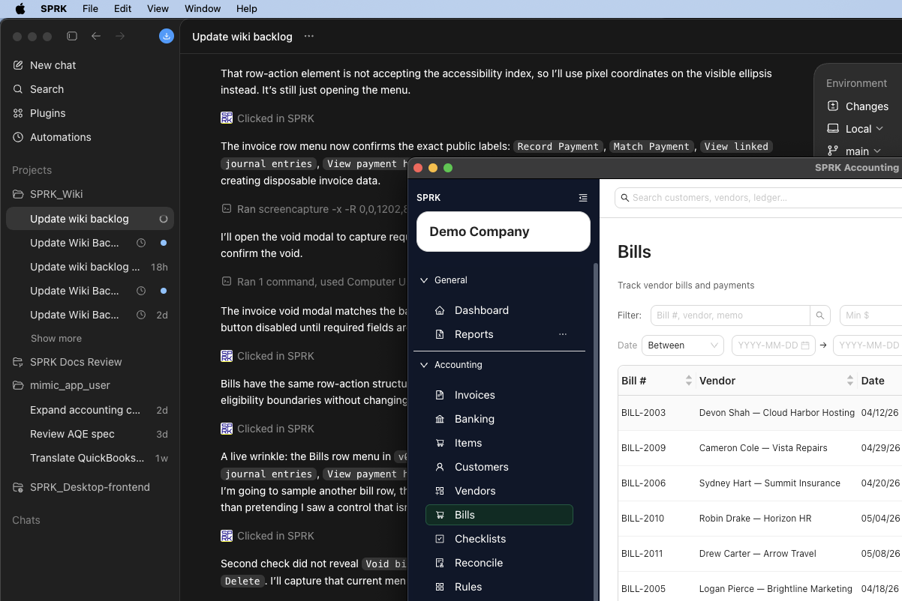

# Record a Bill Payment

<!-- Screenshot status: Review needed -->

Record payments against open vendor bills and review payment history after the bill balance changes.

<!-- Last validated against SPRK source: 2026-08-27 -->

## When to use this

- An open bill is ready to be paid.
- You need to record a full or partial payment.
- You need to review bill payment history or linked journals after payment.

## Before you start

- Confirm the active company.
- Confirm the bill is open or partial and has a remaining balance.
- Confirm the `Paid from` account is available.
- If the payment first appeared in Banking, decide whether the bank row should be matched instead of manually recording a second payment.

## Steps

1. Open `Bills`.
2. Find the bill.
3. Review the bill status, total, balance, vendor, and due date.
4. Open `More` for the bill and select `Record Payment`.
5. In `Record payment`, complete:
   - `Payment date`
   - `Amount`
   - `Paid from`
   - `Reference #`, if needed
   - `Memo`
6. Record the payment.
7. Confirm the updated balance and status in the bill list.
8. Use `View payment history` or `View linked journal entries` when you need later review.

## What Happens When You Record Payment

Recording a bill payment posts a separate payment entry. SPRK debits the payable account carried by the open bill and credits the selected `Paid from` account. Full payment changes the bill to `Paid`; a smaller payment leaves the bill as `Partial`.

## If something looks wrong

| What You See | What To Check | What To Do Next |
|---|---|---|
| The payment amount is larger than expected | Bill balance and payment amount | Correct the amount before recording |
| The wrong account will be credited | `Paid from` | Choose the correct cash, bank, or credit-card account |
| A bank withdrawal already exists | Whether the payment should be matched from Banking | Use the bank match path instead of recording a duplicate payment |
| The bill still shows a balance | Whether the payment was partial | Review payment history and record additional payment only if needed |
| Payment history looks like an edit screen | Whether you are trying to correct payment activity | Use the supported correction action instead of editing history directly |

## Related

- [Create bills](./create-bills.md)
- [Match bank transactions](../banking-and-cash-management/match-bank-transactions.md)
- [Review document payment history and linked journals](../ledger-and-chart-of-accounts/review-document-payment-history-and-linked-journals.md)
- [Review common payables workflows](./review-common-payables-workflows.md)
