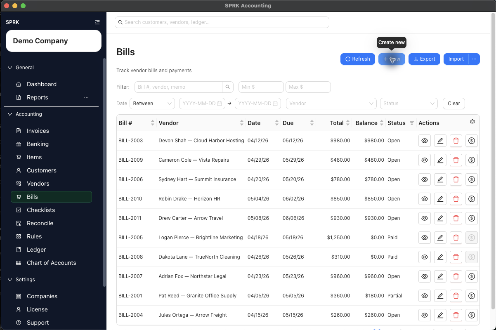
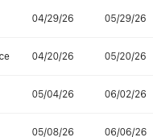

# Review Common Payables Workflows

Use a simple decision path to move from vendor setup to bill recognition, payment, and check tracking without mixing up the accounting effect.

## When To Use This

Use this article when you want a quick way to choose the right payables workflow before entering data in the wrong place.

## Before You Start

- You have an active company selected.
- You know whether your next step is setup, payable recognition, payment, or check tracking.

## Steps

1. Start with `Vendors` if the payee does not exist yet or if you want to save a reusable `Default Expense Account` before later transactions.
2. Use `Bills` when you need SPRK to track an amount owed to a vendor.
3. Save the bill as `Draft` if you are still reviewing it, or `Open` if you want SPRK to recognize the payable.
4. Return to `Bills` and use `Record payment` when you are paying an existing bill from a bank or cash account.
5. Use `View payment history` and `View linked journal entries` from the bill row menu to trace payment applications and posting history before changing a bill.
6. Use `Void bill` for an eligible open bill that should be reversed without deleting the source record. Reverse or unapply active payments first if the bill is partial or paid.
7. Use `Checks` when you need to maintain a check record and its status, especially for matching and reconciliation work.
8. If you classify bank transactions from imported activity, remember that vendor defaults can also help supported banking workflows start with a category suggestion.
9. If you are unsure whether a step affects the ledger, verify it before saving:
   - Vendor setup: no journal entry
   - Bill opened: debits line accounts and credits Accounts Payable
   - Bill payment: debits Accounts Payable and credits the selected payment account
   - Bill void: posts a reversal and keeps the original bill history
   - Check record activity: operational tracking only in the current documented flow

## What Happens Next

You can choose the right payables page quickly and avoid confusing master-data setup, payable recognition, payment posting, check-status tracking, and supported reuse of vendor defaults.

## If Something Looks Wrong

- Using `Checks` when the real task is to reduce an open bill balance.
- Entering a bill as `Open` before verifying the account coding.
- Assuming vendor setup, bill entry, and check tracking all create the same accounting result.
- Assuming a vendor default expense account means every downstream workflow will auto-fill without review.
- Treating linked journal review as deletion or unposting.
- Treating bill void as deletion. Voiding preserves the bill and creates reversal history.
- Assuming every payable record supports the same correction action. Open the row menu and use the action SPRK shows for that bill, payment, or check.

## Business Scenario: Payables Correction Boundary

Use this scenario to train reviewers on bill payment review, linked journal review, and why void/correction actions depend on the bill's current status and balance.

- Sample file: [15-bill-void-correction-boundary.csv](../sample-files/v1-validation/15-bill-void-correction-boundary.csv)
- Evidence:

The walkthrough confirmed that bill payment history and linked journals are visible from the bill action menu, and that the void path is not always enabled for partially paid or otherwise ineligible bills.

## Related

- [Manage vendors](./manage-vendors.md)
- [Set up vendor default expense accounts](./set-up-vendor-default-expense-accounts.md)
- [Create and manage bills](./create-and-manage-bills.md)
- [Work with checks](./work-with-checks.md)
- [Review document payment history and linked journals](../ledger-and-chart-of-accounts/review-document-payment-history-and-linked-journals.md)
