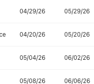

# Void or Correct Bills

Choose the supported bill correction path before changing a posted, paid, partial, or void-sensitive bill.

## When To Use This

- A bill needs correction after it has moved beyond simple draft entry.
- You need to decide whether to edit, pay, reverse payment, void, or review linked journals.
- You need to preserve bill and posting history while correcting the vendor record.

## Before You Start

- Confirm the active company and bill number.
- Review bill status, total, balance, due date, and payment history.
- Review linked journal entries before changing a posted bill.
- If the bill has active payments, reverse or unapply payments first where SPRK requires that guardrail.

## Steps

1. Open `Bills`.
2. Find the bill.
3. Review the row action menu and choose the visible action that matches the correction:
   - Use `Edit` for supported field changes.
   - Use the dollar action for payment.
   - Use `View payment history` or `View linked journal entries` when you need review before changing the bill.
   - Use `Void bill` only when it is visible and enabled.
4. For an eligible bill void, confirm the bill is `Open` and its full balance still equals its total.
5. Do not use the void path for draft, partial, paid, or already voided bills.
6. In the `Void bill` modal, choose the void posting date:
   - `Today`
   - `Original bill date`
   - `Custom date`
7. Enter a reason.
8. Confirm `Void bill` after reviewing the bill and date.

## What Happens When You Void or Correct

A successful `Void bill` posts a reversal journal entry, sets the bill status to `Void`, zeroes the bill balance, and records void details instead of deleting the bill. Saving changes to an already posted bill follows the posted-save strategy you choose when SPRK prompts. If a bill has active payments, SPRK blocks voiding or recognition-journal reversal until those payments are reversed or unapplied.

## If Something Looks Wrong

| What You See | What To Check | What To Do Next |
|---|---|---|
| `Void bill` is unavailable | Bill status, balance, and active payments | Use the visible correction action or clear required payment activity first |
| The bill is partial or paid | Payment history and payment applications | Reverse or unapply payments where SPRK requires it before voiding recognition |
| A draft bill needs removal | Whether the bill has posted ledger impact | Use the draft action available for that bill instead of a void workflow |
| A posted-save prompt appears | The posted-save strategy and date choices | Choose the strategy that matches the intended correction |
| The correction would duplicate another adjustment | Existing linked journals and payment history | Stop and review the source workflow before confirming |

## Related

- [Create bills](./create-bills.md)
- [Record bill payments](./record-bill-payments.md)
- [Review common payables workflows](./review-common-payables-workflows.md)
- [Common accountant corrections](../ledger-and-chart-of-accounts/common-accountant-corrections.md)
