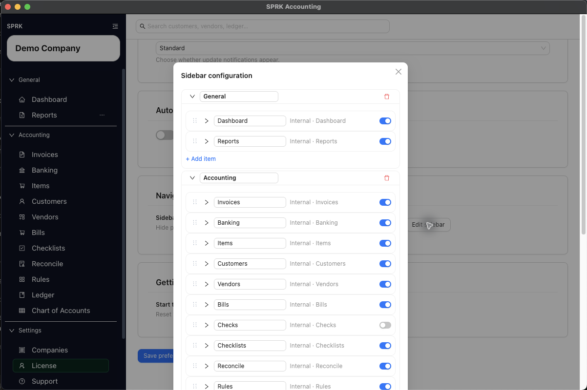

# Work With Checks

Add `Checks` to the sidebar when it is hidden, then create, update, match, unmatch, void, and delete checks while understanding what the current check workflow does and does not post to the ledger.

## When To Use This

Use this workflow when you need to make the `Checks` page available in your sidebar, track a check, keep its status current, and connect it to related bank activity during reconciliation work.

## Before You Start

- You can open `Preferences` if `Checks` is not already visible in your sidebar.
- A bank account exists for the check.
- You know the payee, date, and amount you want to record.

## Steps

1. If `Checks` is not visible in the left sidebar, open `Preferences`.
2. In the `Navigation` card, select `Edit sidebar`.
3. Add or show `Checks` in the sidebar menu, then save the sidebar configuration.
4. Return to the sidebar and open `Checks`.
5. Select `New`.
6. Complete the check fields:
   - `Vendor`, if you want to reuse a saved vendor record.
   - `Bank Account`
   - `Check Number`, if used
   - `Date`
   - `Payee`
   - `Amount`
   - `Offset Account`
   - `Memo`
   - `Status`
7. If the selected vendor already has a saved default expense account and `Offset Account` is still blank, review the filled account before you continue.
8. Save the check as `Draft` if it is not ready to issue yet, or as `Issued` when it should be treated as an active check record.
9. Use the row actions later as needed:
   - `View` to review the record
   - `Edit` to update a draft or issued check
   - `Match` to connect the check to a bank line
   - `Unmatch` to remove that connection when allowed
   - `Clear` to finalize a check that is already matched to a bank transaction
   - `Void` to mark the check voided
   - `Delete` to remove a draft check
10. Review the `Status`, `Bank`, and `Memo` columns in the list after each action.
11. Use `More` > `Enable Grid Mode` when several check-list corrections or repeated field updates are easier to review in one table, then review the changed-cell count before selecting `Apply Changes`.

## What Happens Next

`Checks` is available from the sidebar, and the check is stored so it can move through draft, issued, matched, cleared, voided, or deleted states based on the current workflow.

## GL Impact

- Adding or showing `Checks` in the sidebar is a navigation preference only. It does not create, edit, delete, or repost accounting transactions.
- Creating or editing a check record does not post a separate journal entry in the current `Checks` workflow.
- Saving a check as `Draft` or `Issued` changes check tracking status only. It does not reduce cash, record an expense, or pay a bill in the general ledger by itself.
- Matching or unmatching a check links or removes the relationship between the check and a bank transaction. The match action can change operational status, but it does not create its own new journal entry.
- `Clear` requires an existing matched bank transaction and is separate from the earlier `Match` step. Clearing moves the matched bank row to a confirmed or cleared state instead of acting like delete or void.
- Clearing a matched check can reuse an existing linked journal entry, or create one at clear time when the check has an offset account and has not posted yet.
- Confirming a matched bank transaction from the Banking workflow is another downstream path that can post to the general ledger and clear the linked check.
- Void and delete actions update the check record and matching state, not a separate check-specific posting flow.

## If Something Looks Wrong

- Looking for `Checks` in the default sidebar without first adding or showing it from sidebar customization.
- Assuming the `Checks` page is the same as recording a bill payment.
- Treating `Draft` and `Issued` as interchangeable when other team members rely on status.
- Accepting a filled `Offset Account` without confirming it still matches the purpose of this check.
- Trying to delete a non-draft check. The current workflow only allows draft checks to be deleted.
- Assuming voiding a check is the same as clearing it through reconciliation.

## Related

- [Customize the sidebar](../preferences-and-personalization/customize-the-sidebar.md)
- [Set up vendor default expense accounts](./set-up-vendor-default-expense-accounts.md)
- [Create and manage bills](./create-and-manage-bills.md)
- [Review common payables workflows](./review-common-payables-workflows.md)
- [Manage vendors](./manage-vendors.md)
- [Review and classify bank transactions](../banking-and-cash-management/review-and-classify-bank-transactions.md)
- [Use grid edit for bulk record maintenance](../dashboard-and-navigation/use-grid-edit-for-bulk-record-maintenance.md)
