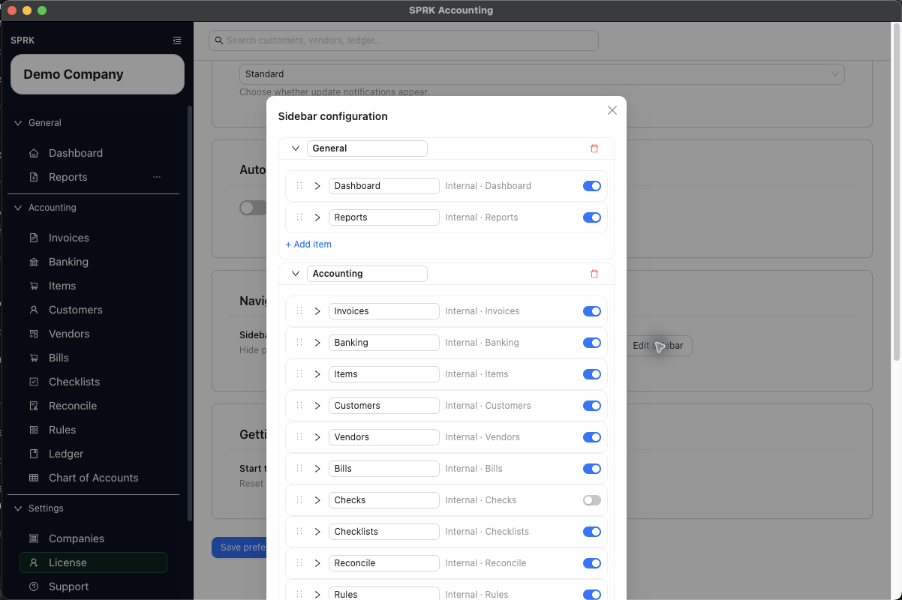
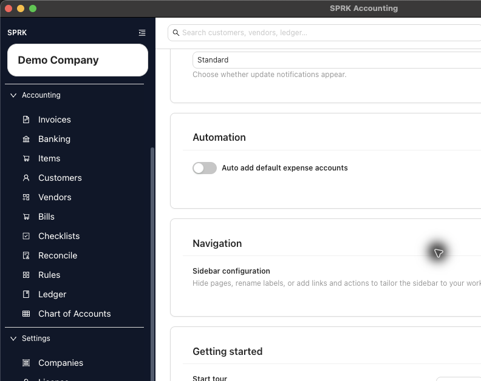

# Work With Checks

Add `Checks` to the sidebar when it is hidden, then record and manage checks without losing the posting trail.

<!-- Last validated against SPRK source: 2026-08-27 -->

## When To Use This

Use this workflow when you need to make the `Checks` page available in your sidebar, track a check, keep its status current, and connect it to related bank activity during reconciliation work.

## Before You Start

- You can open `Preferences` if `Checks` is not already visible in your sidebar.
- A bank account exists for the check.
- You know the payee, date, and amount you want to record.

## Steps

1. If `Checks` is not visible in the left sidebar, open `Preferences`.
2. In the `Navigation` card, select `Edit sidebar`.
3. Add or show `Checks` in the sidebar menu, then save the sidebar configuration.
4. Return to the sidebar and open `Checks`.
5. Select `New`.
6. Complete the check fields:
   - `Vendor`, if you want to reuse a saved vendor record.
   - `Bank Account`
   - `Check Number`, if used
   - `Date`
   - `Payee`
   - `Amount`
   - `Offset Account`
   - `Memo`
   - `Status`
7. If the selected vendor already has a saved default expense account and `Offset Account` is still blank, review the filled account before you continue.
8. Save the check as `Draft` if it is not ready to post. Save it as `Issued` only when the check should post to the ledger.
9. Use the row actions later as needed:
   - `View` to review the record
   - `Edit` to update a draft or issued check
   - `Match` to connect the check to a bank line
   - `Unmatch` to remove that connection when allowed
   - `Clear` to finalize a check that is already matched to a bank transaction
   - `Void` to mark the check voided
   - `Delete` to remove a draft check
10. Review the `Status`, `Bank`, and `Memo` columns in the list after each action.
11. Use `More` > `Enable Grid Mode` when several check-list corrections or repeated field updates are easier to review in one table, then review the changed-cell count before selecting `Apply Changes`.

## What Happens Next

`Checks` is available from the sidebar, and the check is stored so it can move through draft, issued, matched, cleared, voided, or deleted states based on the current workflow.

## GL Impact

- Adding or showing `Checks` in the sidebar is a navigation preference only. It does not create, edit, delete, or repost accounting transactions.
- Saving a check as `Draft` does not post to the ledger.
- Saving it as `Issued` posts a journal entry when the check has both a `Bank Account` and an `Offset Account`: SPRK debits the offset account and credits the bank account.
- A check cannot use an Accounts Payable control account, another bank account, cash account, or credit-card account as its `Offset Account`. Use the bill-payment or transfer workflow when that is the accounting event.
- After a check has posted, changing protected posting fields requires a correction workflow rather than silently rewriting the entry.
- Matching or unmatching a check links or removes the relationship between the check and a bank transaction. The match action can change operational status, but it does not create its own new journal entry.
- `Clear` requires an existing matched bank transaction and is separate from the earlier `Match` step. Clearing moves the matched bank row to a confirmed or cleared state instead of acting like delete or void.
- Clearing a matched check can reuse an existing linked journal entry, or create one at clear time when the check has an offset account and has not posted yet.
- Confirming a matched bank transaction from the Banking workflow is another downstream path that can post to the general ledger and clear the linked check.
- Voiding a posted issued check reverses its linked journal entry, removes an eligible bank match, and keeps the check as `Voided` history. A cleared check cannot be voided from this action.
- `Delete` is available only for an unposted draft. It is not a substitute for voiding an issued check.

## If Something Looks Wrong

| What You See | What To Check | What To Do Next |
|---|---|---|
| A bill is already recorded in Accounts Payable | Whether this check is paying that bill | Use `Bills` > `More` > `Record Payment` instead of posting a second expense through `Checks` |
| `Void` is unavailable | Whether the check is already `Cleared` | Review the reconciliation and use the supported correction path for cleared activity |

## Practice And Examples

Use the practice file and screenshot to identify where a hidden `Checks` page can be made visible before check tracking.

- Practice file: [check-match-clear-void.csv](../sample-files/practice/check-match-clear-void.csv)

When `Checks` is hidden, make the page visible from Preferences before managing checks.

## Related

- [Customize the sidebar](../preferences-and-personalization/customize-the-sidebar.md)
- [Set up vendor default expense accounts](./set-up-vendor-default-expense-accounts.md)
- [Create and manage bills](./create-and-manage-bills.md)
- [Review common payables workflows](./review-common-payables-workflows.md)
- [Manage vendors](./manage-vendors.md)
- [Review and classify bank transactions](../banking-and-cash-management/review-and-classify-bank-transactions.md)
- [Use grid edit for bulk record maintenance](../dashboard-and-navigation/use-grid-edit-for-bulk-record-maintenance.md)
